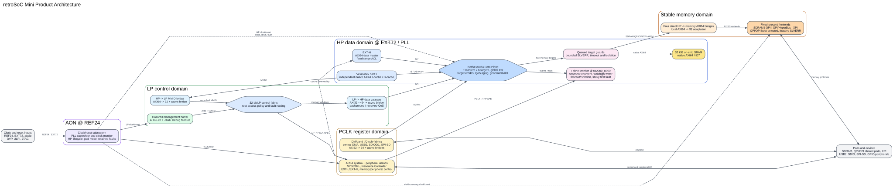

# retroSoC

[](https://github.com/retroSoC/retroSoC/actions/workflows/quality.yml)
[](https://github.com/retroSoC/retroSoC/actions/workflows/regression-ihp130.yml)
[](https://github.com/retroSoC/retroSoC/actions/workflows/regression-gf180.yml)
[](https://github.com/retroSoC/retroSoC/actions/workflows/regression-ics55.yml)
[](https://github.com/retroSoC/retroSoC/actions/workflows/regression-sky130.yml)
[](https://github.com/retroSoC/retroSoC/actions/workflows/nightly.yml)

retroSoC is a fully open-source RISC-V SoC project. The repository brings together
SystemVerilog RTL, a freestanding embedded C SDK and applications, simulation, synthesis,
static timing analysis, reproducible dependencies, and release packaging. It is licensed
under the [Mulan Permissive Software License, Version 2](LICENSE).



## Highlights

- A fixed Hazard3 management core with a permanent JTAG Debug Module, plus
  software-selected user-core and user-IP extension slots, including PicoRV32
  at user-core slot C5.
- A documented [Tiny/Mini/Std/Pro product direction](docs/soc-family-positioning.md)
  anchored by Mini and a trusted Hazard3 management model. The higher Linux,
  graphics, AI, and RV64 configurations are roadmap targets, not supported
  build profiles.
- A standard five-pad JTAG Debug Transport Module for the Hazard3 management
  core, with a reproducible Verilator, OpenOCD, and GDB acceptance flow.
- Configurable GF180, SKY130, IHP130, and ICS55 implementation targets with
  open-source CI coverage.
- A memory-mapped peripheral subsystem with GPIO, UART, timers, PWM, I2C, I2S, PS2,
  WS2812, SPI/QSPI, SDIO, PSRAM/OPI-PSRAM, SDRAM, DMA, LCD, RTC, watchdog, RNG, and CRC
  support. Available interfaces depend on the selected SoC configuration.
- A standalone RISC-V runtime, HAL, board support, middleware, and `benchmark`, `bringup`,
  `coremark`, `debug`, and `shell` applications.
- Open-source behavioral simulation with Icarus Verilog and Verilator, synthesis with
  Yosys, netlist simulation with Icarus Verilog, and timing analysis with OpenSTA.
- Checksum-verified dependency and toolchain locks, structured flow results, warning
  baselines, metrics collection, SBOM generation, and checksummed release packages.

## Repository Layout

| Path | Contents |
| --- | --- |
| [`rtl/`](rtl) | SoC RTL, CPU integration, peripherals, interfaces, testbenches, and technology wrappers. |
| [`crt/`](crt) | Freestanding RISC-V startup code, linker scripts, runtime library, core services, and HAL headers. |
| [`app/`](app) | Applications, board support, media, middleware, networking, ports, and benchmarks. |
| [`configs/`](configs) | Versioned build profiles for CI, nightly, and cluster flows. |
| [`pdk/`](pdk) | PDK setup entry points and technology-specific integration. |
| [`syn/`](syn) and [`sta/`](sta) | Synthesis and static timing analysis flows. |
| [`scripts/`](scripts) and [`quality/`](quality) | Build helpers, regression orchestration, checks, warning baselines, and metric policy. |
| [`.github/`](.github) | GitHub automation, Dependabot configuration, and CI/release workflows; see [`GUIDE.md`](.github/GUIDE.md). |
| [`docs/`](docs) | Engineering workflow and release-process documentation. |

## Supported Configurations

The committed profiles are the supported starting points. They select an ISA,
PDK, application, linker layout, and optional features as one reproducible
configuration. The management core is fixed to Hazard3. The user-extension
fabric exposes stable C0-C5 user-core slots and software selects one active
user core.

| Profile | ISA | Application | Coverage |
| --- | --- | --- | --- |
| [`configs/ci/ihp130.mk`](configs/ci/ihp130.mk) | RV32IM | `bringup` | Pull-request open-source regression: firmware, Verilator, Icarus, Yosys, Icarus netlist simulation, and OpenSTA. |
| [`configs/ci/gf180.mk`](configs/ci/gf180.mk) | RV32IM | `bringup` | Pull-request firmware, RTL simulation, Yosys, and Icarus netlist coverage. |
| [`configs/ci/ics55.mk`](configs/ci/ics55.mk) | RV32IM | `bringup` | Pull-request firmware, RTL simulation, Yosys, Icarus netlist simulation, and OpenSTA core timing coverage. |
| [`configs/ci/sky130.mk`](configs/ci/sky130.mk) | RV32IM | `bringup` | Pull-request firmware, RTL simulation, Yosys, and Icarus netlist coverage. |
| [`configs/ci/ihp130-shell.mk`](configs/ci/ihp130-shell.mk) | RV32IM | `shell` | Pull-request firmware build with CSR support enabled. |
| [`configs/ci/ihp130-debug.mk`](configs/ci/ihp130-debug.mk) | RV32IM | `debug` | Verilator remote-bitbang acceptance of the Hazard3 JTAG DTM, Debug Module, OpenOCD, and GDB. |
| [`configs/benchmark/ihp130-hazard3-coremark.mk`](configs/benchmark/ihp130-hazard3-coremark.mk) | RV32IM | `coremark` | Fixed four-iteration SRAM CoreMark quick measurement, recorded by nightly IHP130 regression. |
| [`configs/cluster/ics55.mk`](configs/cluster/ics55.mk) | RV32IM | `bringup` | Compatibility profile for site-specific ICS55 runs. |

CI Verilator firmware simulations explicitly select the `ci_smoke`
application, which checks UART, archinfo APB readback, and test-status
completion without the verbose startup report. The profiles retain `bringup`
as their default for manual diagnostics. To run the full report in Verilator,
use:

```sh
make CONFIG=configs/ci/ihp130.mk APP=bringup SIMU=VERILATOR SOC_SIM_TIME=300 firmware sim
```

## Prerequisites

The open-source development environment contains the exact Ubuntu 22.04 tool bundles, Python
quality tools, compiler, formatters, simulators, synthesis, STA, and formal tools used by the
current regression. It does not contain PDKs, managed RTL, or application archives; those remain
checkout-local inputs installed and verified through the existing setup targets. Linux x86_64 is
the supported host for the full native environment. On macOS, use Docker with linux/amd64
emulation. Nix support is Linux x86_64 only.

Choose one of the following installation methods. Each uses the locked versions in
[config/dependencies.lock.json](config/dependencies.lock.json) and creates or reuses the local
cache at .cache/retrosoc/development.

### Nix

Install Nix with flakes enabled, then run the development application from the repository root.
It builds a Linux FHS environment and invokes the same locked bootstrap script as Docker and the
manual method.

~~~sh
nix run .#dev -- make setup-regression
nix run .#dev -- make CONFIG=configs/ci/ihp130.mk SIMU=IVERILOG doctor
nix run .#dev -- make regress-pr
~~~

Use nix run .#dev without a command to open an interactive shell. The pinned nixpkgs revision is
recorded in flake.lock and cross-checked against the dependency lock.

### Docker

Build the local image once. The base image is immutable by digest and the image bootstrap installs
the same locked tools into an image-local cache. Mount the checkout so generated files, PDKs, and
managed sources remain on the host volume.

~~~sh
docker build --tag retrosoc-dev --file docker/Dockerfile .
docker run --rm --init --platform linux/amd64 --user "$(id -u):$(id -g)" -it \
  -v "$PWD:/workspace/retrosoc" retrosoc-dev \
  make setup-regression
docker run --rm --init --platform linux/amd64 --user "$(id -u):$(id -g)" -it \
  -v "$PWD:/workspace/retrosoc" retrosoc-dev \
  make regress-pr
~~~

### Manual Installation

On Ubuntu 22.04, install the host packages used by CI, then run the shared bootstrap script. It
downloads only checksum-verified tool bundles and Python packages pinned by the repository.

~~~sh
sudo apt-get update
sudo apt-get install --no-install-recommends --yes \
  bzip2 ca-certificates ccache clang-format-14 g++ git libfl2 libgoogle-perftools4 \
  libunwind8 make mold numactl python3 python3-pip python3-venv xz-utils zlib1g
python3 scripts/development_environment.py bootstrap
source .cache/retrosoc/development/activate.sh
make setup-regression
make CONFIG=configs/ci/ihp130.mk SIMU=IVERILOG doctor
~~~

Run python3 scripts/development_environment.py check after a lock update or when diagnosing a
local tool issue. The lock file also pins external RTL, PDK, benchmark, and application sources.
Their setup scripts verify full Git revisions or SHA-256 checksums before use. See the
[engineering workflow](docs/engineering.md#reproducible-inputs) for the dependency update
procedure.

## Quick Start

Start with the CI-verified IHP130 `bringup` profile. `setup` retrieves the pinned
source dependencies, and `doctor` reports any missing local executables or setup inputs.

```sh
make CONFIG=configs/ci/ihp130.mk setup
make CONFIG=configs/ci/ihp130.mk SIMU=IVERILOG doctor
make CONFIG=configs/ci/ihp130.mk firmware
make CONFIG=configs/ci/ihp130.mk SIMU=IVERILOG sim
```

Select the interactive shell application without editing source files:

```sh
make CONFIG=configs/ci/ihp130-shell.mk firmware
```

## Common Flows

All commands use a committed profile. `make config` prints the effective configuration and
variant identifier; `make help` lists all available targets. Netlist simulation and timing
analysis consume the Yosys netlist, so run the synthesis command first. The CI-proven netlist
regression uses the assembly self-test image:

Verilator simulations run for 180 seconds by default. Set `SOC_SIM_TIME` explicitly only when
an exploratory local run needs a different limit.

VCS flow commands use `bsub -Is` by default: this includes parse-time Python helpers used to
calculate the variant and dependency-lock digest, generated-flow Python helpers, VCS, `simv`, and
Verdi. In a licensed local VCS environment, run without LSF submission using `VCS_USE_LSF=NO`; an
explicit `VCS_RUNNER` takes precedence when a site-specific queue or wrapper is required:

```sh
make CONFIG=configs/ci/ihp130.mk SIMU=VCS VCS_USE_LSF=NO sim
make CONFIG=configs/ci/ihp130.mk SIMU=VCS VCS_RUNNER='bsub -q vcs -Is' sim
```

```sh
make CONFIG=configs/ci/ihp130.mk SIMU=IVERILOG RTL_SIM_TIMEOUT=5200000 sim-asm
make CONFIG=configs/ci/ihp130.mk SYNTH=YOSYS synth
make CONFIG=configs/ci/ihp130.mk SIMU=IVERILOG \
  SIM_FIRMWARE_NAME=retrosoc_asm \
  RTL_SIM_TIMEOUT=5200000 netsim
```

| Goal | Command |
| --- | --- |
| Icarus behavioral simulation | `make CONFIG=configs/ci/ihp130.mk SIMU=IVERILOG sim` |
| Verilator behavioral simulation | `make CONFIG=configs/ci/ihp130.mk SIMU=VERILATOR sim` |
| Hazard3 JTAG debug acceptance | `make CONFIG=configs/ci/ihp130-debug.mk SIMU=VERILATOR debug-sim` |
| Assembly self-test with Icarus | `make CONFIG=configs/ci/ihp130.mk SIMU=IVERILOG RTL_SIM_TIMEOUT=5200000 sim-asm` |
| Yosys synthesis | `make CONFIG=configs/ci/ihp130.mk SYNTH=YOSYS synth` |
| Icarus netlist simulation after synthesis | `make CONFIG=configs/ci/ihp130.mk SIMU=IVERILOG netsim` |
| OpenSTA core timing analysis after synthesis | `make CONFIG=configs/ci/ihp130.mk STA=OPENSTA sta` |
| Strict Verilator RTL lint | `make CONFIG=configs/ci/ihp130.mk SIMU=VERILATOR HAVE_SVA=YES check-rtl-lint` |
| Hazard3 CoreMark quick report | `make CONFIG=configs/benchmark/ihp130-hazard3-coremark.mk SIMU=VERILATOR coremark-report` |
| IHP130 fast smoke suite | `make regress-smoke` |
| Pull-request regression suite | `make regress-pr` |
| Nightly regression suite | `make regress-nightly` |
| Format C, Makefile, and RTL sources | `make format` |
| Check C, Makefile, and RTL formatting | `make format-check` |
| Script and policy checks | `make sw-policy-check sw-host-test` |

`make regress-smoke` builds the IHP130 firmware, compiles the Verilator SVA
configuration, and runs the Icarus assembly self-test. It runs strict RTL lint
before those flows and omits synthesis,
timing, and netlist simulation for fast feedback. `make regress-pr` runs the
supported IHP130, GF180, ICS55, and SKY130 PR matrices in sequence, including
slow-corner OpenSTA core timing analysis for each PDK.

Build outputs are isolated below `build/<profile>-<YYYY-MM-DD-HH-MM>-<config-hash>/`. Each variant keeps its
firmware, generated sources, simulator output, synthesis and timing reports, manifest, warning
analysis, and metrics separate from other configurations. Use `make clean` to remove the
selected backend, `make clean-all` to remove all build output, and `make purge-cache` to remove
download and compiler caches.

`BUILD_TIMESTAMP` defaults to the local build-start time. Set it explicitly when separate Make
commands must reuse one variant:

```sh
export BUILD_TIMESTAMP=2026-07-21-10-39
make CONFIG=configs/ci/ihp130.mk firmware
make CONFIG=configs/ci/ihp130.mk SIMU=IVERILOG sim
```

## Reproducibility And CI

[`config/dependencies.lock.json`](config/dependencies.lock.json) is the source of truth for
external repositories, application archives, and Ubuntu 22.04 toolchain bundles. The lock digest
is part of each build variant, and every download is checksum verified. GitHub Actions pins its
actions by commit, validates the lock and engineering scripts, and runs pull-request and nightly
regression matrices.

Every EDA command is recorded with a log and a machine-readable result JSON. The regression
policy checks warning deltas against committed baselines and collects metrics for later gate
promotion. Tags matching `v*` produce a flattened SystemVerilog export, source archive, build
manifest, dependency lock, CycloneDX SBOM, and `SHA256SUMS`. Run `make package` to create the
same local deliverables under `dist/<variant>/`.

See [`docs/engineering.md`](docs/engineering.md) for supported-flow details, artifact layout,
warning and metric policy, CI behavior, and release contents.

## Contributing And Security

- Read [`CONTRIBUTING.md`](CONTRIBUTING.md) before submitting changes.
- Report vulnerabilities according to [`Security.md`](Security.md).
- Review retained third-party notices in [`NOTICE`](NOTICE) and
  [`ATTRIBUTIONS.md`](ATTRIBUTIONS.md).
- The project is distributed under [Mulan PSL v2](LICENSE).
