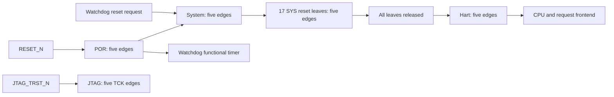

# Tiny R2-P2 reset distribution and clock feasibility

This is the implementation record boundary for
[TINY-R2-P2](tiny-soc.md#tiny-r2-p2---reset-distribution-and-cpusram-clock-feasibility).
Results and remaining gates belong in the [verification ledger](tiny-soc-verification.md).
The starting revision is `f06c039e790e38ccaf336ff21b68619010e7cc9e`.
Use `configs/ci/ihp130-tiny.mk`, TINY, IHP130, 24 MHz/no PLL. Higher rates
below are analysis constraints, not executable profiles or qualified clocks.

## Reset ownership

`tiny_reset_tree` reuses the locked Common `rst_sync`. Every chain has five
stages and asserts asynchronously. Cold release traverses POR, system and
the leaf chains. All 17 leaf resets must be released before the core/debug
wrapper starts its own five-edge hart release. The nominal cold sequence is
POR at edge 5, system at edge 10, leaves at edge 15 and hart at edge 20.
These counts are behavioral sequencing, not a metastability or physical-skew
bound. A stopped clock never completes a release.



Leaf zero belongs to the fabric, APB bridge, error responders and common tick.
Leaves 1 through 16 follow the existing `soc_topology.json` APB target order:
GPIO, UART0, UART1, TIMER0, TIMER1, I2C0, I2C1, XPI, DMA, SYSCTRL, CLINT,
SRAM, ARCHINFO, PWM, RTC and WDG. Generated APB interfaces and each IP's
explicit reset input use the same leaf. AXI interface reset arrays retain
their existing owner/target order. All clocks still use SYS; reset partitioning
does not add a clock domain, divider, clock gate or SRAM CDC.

The watchdog functional timer stays on POR reset; its APB state uses the WDG
leaf. A watchdog request therefore survives the system reset it triggers.
Hart-only debug reset keeps its existing accepted-transfer drain and leaves
other clients running. The shared core/debug/reset wrappers add only the
`ResetSyncStages` RTL parameter: default 3 preserves Mini behavior, while Tiny
selects 5 for hart, JTAG and DMI release. There is no new software ABI.

Common FIFO payload storage, pointer/count/empty behavior, flush precedence
and warm-flush handshakes are unchanged. The FIFO's mixed asynchronous-control
process already omits payload clearing; P2 does not rewrite that managed
process or claim to have removed a payload clear. Local reset loads are
partitioned instead. Empty-read masking and stale-data isolation are exercised
with directed cases and an independent queue scoreboard.

Main SRAM payload is not reset. The existing SRAM protocol fixture now also
holds a read response, resets the controller, checks that the stale response
is cancelled and verifies the previously written word after release. Crypto
is not integrated in the selected Tiny baseline; its six private-bank and
physical FIFO erasure contracts remain unchanged. CPU release does not wait
for Crypto READY or external AUDIO/PIXCLK clocks.

Leaf synchronizer instances have narrow `keep`/`keep_hierarchy` attributes to
prevent synthesis from merging identical reset drivers. The feasibility audit
requires 17 distinct instances and driver identities. These attributes do not
create a timing exception or establish a routed reset tree.

## Reproducible analysis

Before changing RTL, the implementation captured clean source, tools and inputs
and ran fresh firmware, balanced Yosys synthesis and core STA. The baseline is
`build/ihp130-tiny-2026-10-06-09-33-19f1e9c571ee/`; its
`meta/tiny-r2-p2/baseline-artifacts.json` binds the netlist, config, SDC,
commands/results and archived source. The preceding P1 timing numbers remain
separately attributed even when numerically equal.

Use a new timestamp/variant for a candidate. With `APP=ci_smoke`, build firmware
first, capture its inputs, then run fresh synthesis and STA:

```sh
source .cache/retrosoc/development/tiny-r2-p1/activate.sh
export BUILD_TIMESTAMP=$(date +%Y-%m-%d-%H-%M)
make CONFIG=configs/ci/ihp130-tiny.mk SOC=TINY PDK=IHP130 APP=ci_smoke firmware
tiny_candidate_root=$(make -s CONFIG=configs/ci/ihp130-tiny.mk SOC=TINY PDK=IHP130 APP=ci_smoke config | awk '$1 == "VARIANT_ROOT" {print $2}')
python3 scripts/tiny_r2_feasibility.py --variant-root "$tiny_candidate_root" capture
make -j1 CONFIG=configs/ci/ihp130-tiny.mk SOC=TINY PDK=IHP130 APP=ci_smoke SYNTH=YOSYS STA=OPENSTA synth sta
python3 scripts/tiny_r2_feasibility.py --variant-root "$tiny_candidate_root" run \
  --baseline-root build/ihp130-tiny-2026-10-06-09-33-19f1e9c571ee
```

The runner creates unique attempts below `meta/tiny-r2-p2/`. It rejects missing
or stale captures, synthesis older than the capture, incomplete native flows,
changed artifacts, and missing audit markers. Every point retains the exact
command, libraries, analysis SDC, metrics, reset loads/endpoints, net capacitance,
CPU and SRAM input/return paths, clock binding, constraint violations and
coverage report. Direct load counts exclude the output driver itself; a
structural all-arcs endpoint count is a different measure.
Native max/min WNS includes asynchronous recovery/removal checks. Separate
`sys-setup.rpt` and `sys-hold.rpt` report the SYS data-path slacks; neither
relabels a recovery violation as a data setup result.

Both actual netlists are analyzed at SYS24/96/192/240 MHz (periods
41.666666667/10.416666667/5.208333333/4.166666667 ns) in slow, typical and fast
views. The 24 MHz SDC is retained byte-for-byte; other points replace only its
single SYS clock period. Existing uncertainty, clock grouping and port/reset
exceptions are retained. CPU and all 32 main-SRAM A_CLK loads share the same
SYS driver. No profile, PLL or main-SRAM divider changes result from this sweep.
The current peripherals also share SYS. This sweep does not model the later
R2-P7 SYS/MEM/PCLK partition or the future four 32 KiB SRAM frontends; its
failures and path measurements belong to the actual current netlist.

The fast SRAM view is 1.32 V/-55 C, paired with the actual standard-cell and
IO fast -40 C views. Typical uses 1.20 V/25 C and slow uses 1.08 V/125 C.
The locked SRAM libraries provide setup/hold, clock-to-output and pulse-width
arcs but no explicit minimum-period entry. Missing characterization, table
extrapolation and uncovered checks remain gaps; nonnegative reported slack
does not establish a qualified maximum frequency. These ideal-clock,
unextracted analyses exclude CTS, routing, package and board effects.

## Functional and compatibility acceptance

Run focused tests and policy before the wider regression. Required fixtures
must actually execute with the selected tools; a missing tool or skipped
fixture cannot satisfy a gate.

```sh
python3 -m pytest -q tests/test_tiny_r2_p2.py tests/test_tiny.py \
  tests/test_mgmt_debug.py tests/test_i2c.py tests/test_clock_reset_domains.py \
  'tests/test_onchip_ram.py::test_onchip_ram_axi4_capacity_protocol_and_performance[128]'
make CONFIG=configs/ci/ihp130-tiny.mk SOC=TINY PDK=IHP130 rtl-format-check rtl-style-check rtl-readiness-check
ruff check .
python3 -m pytest -q
python3 scripts/regress.py --root . --suite pr --soc TINY --pdk IHP130 --dry-run
python3 scripts/regress.py --root . --suite nightly --soc TINY --pdk IHP130 --dry-run
python3 scripts/regress.py --root . --suite pr --soc TINY --pdk IHP130
make CONFIG=configs/ci/ihp130-debug.mk SOC=MINI PDK=IHP130 SIMU=VERILATOR debug-sim
```

The additional Mini command checks existing shared-wrapper compatibility;
it is not a Tiny external-JTAG qualification or a new product rollout.
Its locked OpenOCD is restored separately under
`.cache/retrosoc/development/tiny-r2-p2-debug`; select that executable explicitly
without changing the P1 environment. Dependency versions remain unchanged.

For matched-binary workloads, follow the [P1 runbook](tiny-soc-r2-baseline.md)
with a new variant and explicitly select the original
`image-ozwo38_b/tiny_baseline.hex`. Both simulators perform three cold starts.
Compare the measured windows separately from the intentionally longer reset
startup. Icarus has a 14400-second per-run wall budget and is polled every
30 minutes. Command success, valid TEST_STATUS, `SIM_TEST_PASS Tiny`, complete
records and absence of forbidden errors remain mandatory; UART alone cannot pass.

P2 acceptance requires functional evidence, mapped reset partitioning and
source-bound attempted frequency results with explicit gaps. Warning and
metrics policies are unchanged. Failed timing remains failed, and neither
this phase nor its safe-frequency functional branch qualifies a physical
operating point or authorizes R2-P3 and later work.
