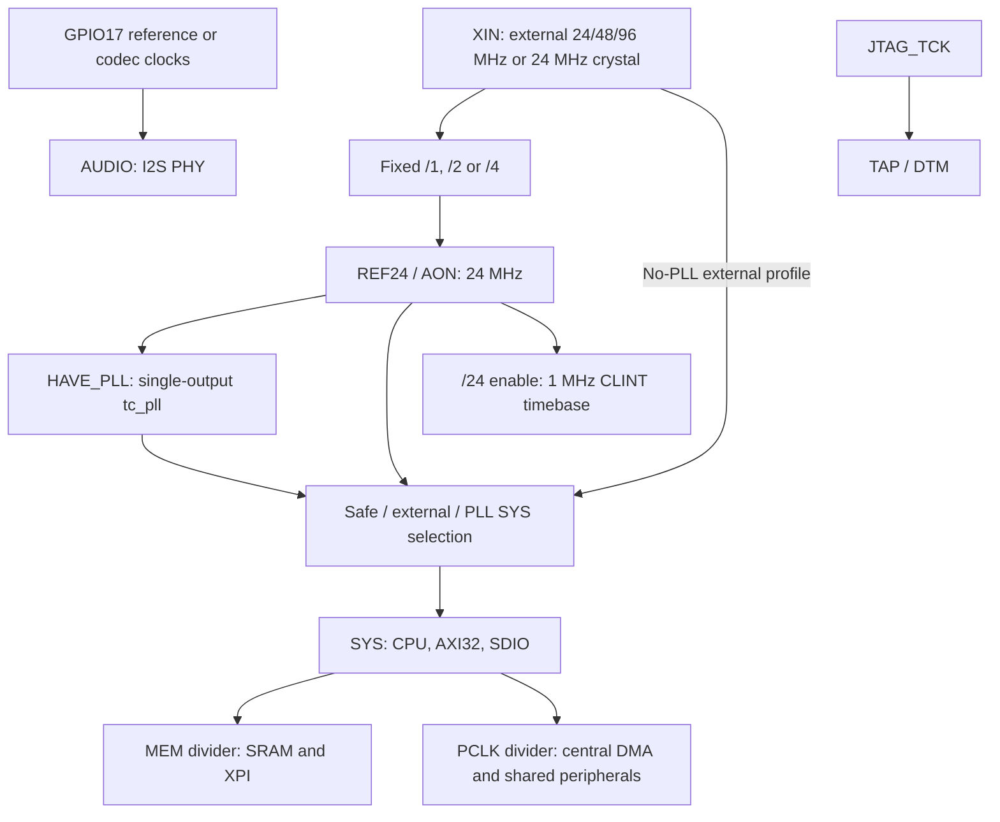
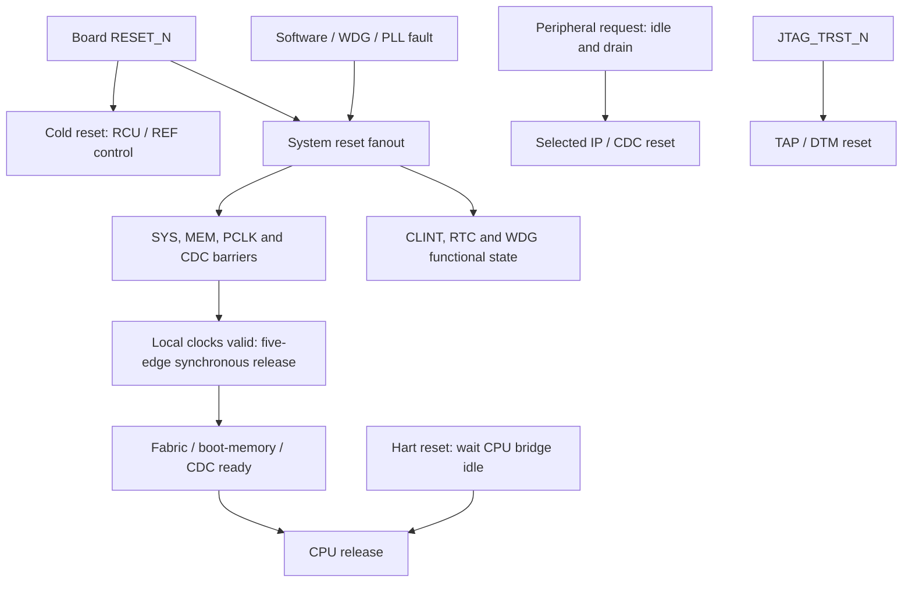

# retroSoC Tiny Gen1 Product, Shared IP and Clock/Reset Contract

## Purpose and research boundary

This contract freezes the shared-IP and clock/reset design approved on
2026-09-30 for Target SoCs: `TINY`, feature slug `tiny-soc`. It preserves the
QFN64 package and pad allocation approved on 2026-09-26, adds RNG, CRC,
WS2812, Crypto and a Tiny-specific RCU, and expands central DMA to eight
channels. It supersedes the earlier 144 MHz target with a maximum SYS/processor
target of 96 MHz without PLL and 240 MHz with PLL. Both variants boot from a
24 MHz reference-derived safe clock. No independent safety RC is added.

This is a specification freeze, not evidence of implemented or qualified
96/240 MHz silicon. Mini is a compatibility consumer of shared IP, not an
additional product rollout; Std/Pro integration is outside this change.

Tiny owns its integration in `rtl/tiny`; Mini remains a separate product. The
committed `configs/ci/ihp130-tiny.mk` profile still describes the initial
2026-09-25 implementation: 24 MHz external clock, no PLL, two UARTs and two I2C
controllers. Its RTL, canonical maps, SDK, configuration, generated datasheet
and verification evidence remain the executable baseline until separate
integration work updates them. The baseline sections below retain that
contract and must not be read as the new Gen1 integration or clock qualification.

Product RTL, address/pin/topology inputs and filelists remain under `rtl/tiny`;
the SDK and application composition retain their existing `crt/` and `app/`
ownership. P7-P9 below must implement and validate the target separately.
The current profile still selects four DMA channels and forbids PLL/non-24-MHz
Tiny configurations. New configurations require explicit platform enablement.

### Commercial references and reuse boundary

The following primary references were reviewed during the 2026-09-30 research.
Vendor frequencies, power figures and security qualifications are not Tiny
PPA or signoff evidence; no proprietary implementation is copied.

| Reference | Relevant architecture and delivery | Selected reuse / boundary |
| --- | --- | --- |
| [RP2350 hardware APIs](https://www.raspberrypi.com/documentation/pico-sdk/hardware.html) and [datasheet](https://pip-assets.raspberrypi.com/categories/1214-rp2350/documents/RP-008373-DS-2-rp2350-datasheet.pdf?disposition=inline) | Maintained reference/system-clock services, peripheral resets and a Hazard3-capable MCU. The published datasheet describes safe mux/divider ordering and independent clock sources. | Separate reference timekeeping from processor clocks, acknowledge clock changes, and reset peripherals explicitly. Tiny does not inherit RP2350's internal oscillators, power domains or automatic recovery. Its 96 MHz XIN receiver needs its own qualification. |
| [STM32H573 datasheet](https://www.st.com/resource/en/datasheet/stm32h573vi.pdf) | DS14121 Rev 5 describes a 250 MHz MCU with domain prescalers, clock gating, reset control, configurable CRC, RNG and crypto accelerators; the product is in volume production. | Share peripheral software contracts while keeping product clock/reset control separate. Do not import TrustZone, protected-key, independent-watchdog-clock or TRNG certification claims. |
| [GD32F450 datasheet](https://gd32mcu.com/data/documents/datasheet/GD32F450xx_Datasheet_Rev2.3.pdf) | Rev 2.3 describes 200 MHz AHB domains, 50/100 MHz APB domains and RCU-managed clocks/resets. | Use explicit domain ceilings and dividers rather than assigning the processor frequency to every peripheral. No analog macro, process-specific voltage or measured PPA is reused. |

The [RP2350](https://www.raspberrypi.com/products/rp2350/) is a Hazard3-based MCU
reference for software, SRAM, and deterministic I/O. Its dual-core, security,
USB, and PIO features are not Tiny requirements. The
[CAST SRAM controller](https://www.cast-inc.com/peripherals/memory-controllers/sram-ctrl)
illustrates native AXI synchronous SRAM and documented verification delivery;
no commercial implementation or qualification is reused.

## Requirements and non-goals

- TINY-001: one Hazard3 hart, RV32IMC with A disabled, mandatory debug support;
  existing RV32IM firmware remains the default compiler target.
- TINY-002: native 32-bit AXI4 data and APB4 control. The CPU's native AHB-Lite
  terminates at a direct AXI adapter. No RIB/RIBP source or interface is part of
  Tiny's compilation or elaboration closure.
- TINY-003: 128 KiB technology-backed SRAM, XPI NOR boot, no external RAM
  dependency. Reset vector is `0x00000000`; SRAM begins at `0x30000000`.
- TINY-004: 32 bidirectional user GPIO, one UART, one I2C controller, one
  full-duplex I2S controller, one SDIO host, two general timers, CLINT, eight
  central DMA channels, four PWM outputs, RTC, watchdog, RNG V2, CRC V2,
  WS2812, Crypto V2, Tiny RCU/SYSCTRL and architecture info. UART1 and I2C1
  are absent from the Gen1 target.
- TINY-005: retain `HAVE_PLL` as the single PLL build selector. With no PLL,
  use an external XIN clock up to 96 MHz; with PLL, use a 24 MHz reference and
  the single-output PLL interface for a maximum 240 MHz SYS/processor target.
  Both variants start on REF24 and retain a 1 MHz CLINT timebase. MEM and
  PCLK have separate 120 MHz and 60 MHz target ceilings. None is a qualified
  operating frequency until the corresponding physical evidence passes.
- TINY-006: Tiny must build independently of MPW, HP CPU generation and
  multimedia inputs. Shared SDK APIs retain the `rs_` namespace.
- TINY-007: no wireless IP, radio-specific host integration, or wireless stack.
- TINY-008: QFN64 has exactly 64 perimeter terminals: 32 user GPIO, six
  dedicated boot XPI pins, five dedicated JTAG pins, five clock/system-control
  pins and 16 power/ground pins. The exposed pad (EP) is separate from these
  64 terminals. Boot XPI and JTAG do not consume the 32 user GPIO.
- TINY-009: all digital interfaces use one 3.3 V IO supply; IHP130 Core power
  is planned at 1.2 V from an external regulator. The clock analog supply and
  return must meet the selected oscillator/PLL macro requirements. Position
  labels on supply pins do not create independently powered IO banks.
- TINY-010: GPIO retains the `ALT_ENABLE`/`ALT_SELECT` model with GPIO, ALT0
  and ALT1 modes. The Gen1 table below defines the logical mapping. UART/I2C
  alternate input locations must have one selected route, never an OR of
  competing inputs. I2C must preserve open-drain drive and input readback.
- TINY-011: reset must leave user GPIO as high-impedance inputs with alternate
  functions disabled, preserve dedicated boot/debug access, and meet the
  system-control and board-bias requirements below.
- TINY-012: SDIO supports 3.3 V, 1-bit/4-bit operation; 1.8 V switching is not
  a Gen1 requirement. I2S targets master/slave operation, separate transmit and
  receive data, optional MCLK output and an external audio-reference input.
  SDIO/I2S peripheral inputs bypass ordinary GPIO debounce/filter logic;
  their controllers own interface sampling and clock-domain crossings.
- TINY-013: shared peripherals MUST retain the common IP specification,
  Mini-compatible base addresses, register ABI and driver source. Product
  configuration supplies pins, IRQs, DMA assignments and actual clock rates.
  Tiny RCU/SYSCTRL is product-specific and MUST NOT inherit Mini LP/HP controls.
- TINY-014: add the four shared peripherals at the addresses below; place
  Tiny RCU control in the existing SYSCTRL window, not a second overlapping
  decoder. Preserve the common SYSCTRL terminal-test and fault-reporting entrypoints.
- TINY-015: eight-channel central DMA MUST preserve Crypto channels 4/5 and
  request IDs 12/13. The AXI32 fabric MUST admit CPU, central DMA and the SDIO
  host's private DMA master, with bounded software waits and defined errors.
- TINY-016: WS2812 MUST use GPIO26 ALT0 without adding a pad or removing its
  ALT1 I2C0_SCL route. Other package pins and alternate-function assignments
  remain as listed below.
- TINY-017: clock changes MUST drain accepted traffic and use safe-source,
  divider, lock and acknowledgement sequencing. Actual clock-rate reporting
  and shared-driver timing must agree after each completed change.
- TINY-018: resets MUST assert asynchronously and release on five valid local
  clock edges, with CDC restart barriers and CPU-last boot release. A stopped
  audio clock or software-initialized Crypto READY MUST NOT block CPU startup.
- TINY-019: no independent safety RC, backup clock or automatic recovery from
  XIN loss is provided. Restore the external source and apply RESET_N to
  recover. A PLL-only fault may recover through REF24 while XIN remains valid.
- TINY-020: preserve RNG qualification/fail-closed behavior and Crypto V2
  initialization, invalidation and verified physical erasure. Crypto's six
  private SRAM banks MUST NOT reduce the 128 KiB software-visible SRAM.

Deferred: RV32 A atomics, RTOS ports, authenticated boot, retention/power gating,
independent sleep clock, 256-512 KiB SRAM, USB, standalone general SPI, CAN, ADC,
multimedia accelerators and other PDK qualification. I2S and SDIO are Gen1
requirements awaiting integration, not deferred product features. XPI retains
four chip selects: CS0_N is dedicated to boot NOR, while CS1_N through CS3_N
use GPIO29 through GPIO31. Additional XPI device configurations still require
their own qualification.

## QFN64 package and power planning

QFN64 with EP is the selected package. A 9 x 9 mm body with 0.5 mm pitch is the
preferred outline, subject to die dimensions, pad ring, bond-wire clearance and
the package supplier's drawing. This is a package planning baseline, not a
signed-off bonding diagram. The table uses top-view terminal numbering; a
reviewed physical-order change must preserve the logical GPIO function mapping.

### Terminal budget

| Category | Count | Signals or supplies |
| --- | ---: | --- |
| User GPIO | 32 | GPIO0 through GPIO31 |
| Dedicated boot XPI | 6 | XPI_SCK, XPI_CS0_N, XPI_D0 through XPI_D3 |
| Dedicated JTAG | 5 | TCK, TMS, TDI, TDO, TRST_N |
| Crystal | 2 | XIN, XOUT |
| System control | 3 | RESET_N, BOOT_MODE, TEST_MODE |
| IO supply | 4 | VDDIO_A through VDDIO_D |
| IO return | 4 | VSSIO_A through VSSIO_D |
| Core supply | 3 | VDDCORE_A through VDDCORE_C |
| Core return | 3 | VSSCORE_A through VSSCORE_C |
| Clock analog supply/return | 2 | AVDD_CLK, AVSS_CLK |
| Perimeter total | 64 | 48 signal terminals and 16 power/ground terminals |
| Exposed pad | Separate | EP, intended GND connection pending package confirmation |

### Power and electrical requirements

| Group | QFN pins | Planned connection |
| --- | --- | --- |
| VDDIO_A/B/C/D | 1, 17, 33, 49 | Same 3.3 V IO rail |
| VSSIO_A/B/C/D | 2, 18, 34, 50 | GND, distributed IO return |
| VDDCORE_A/B/C | 9, 31, 47 | Same 1.2 V Core rail for IHP130 |
| VSSCORE_A/B/C | 10, 32, 48 | GND, distributed Core return |
| AVDD_CLK | 53 | Voltage and filtering defined by the oscillator/PLL macro |
| AVSS_CLK | 54 | Ground/return connection defined by the clock macro |
| EP | Center, unnumbered | Intended GND; die attach, substrate and internal connection require confirmation |

GPIO, XPI and JTAG all use the same digital IO voltage. A/B/C/D are physical
position labels, not independent voltage banks; mixed 1.8 V/3.3 V bank use is
outside this contract. Gen1 assumes no internal LDO and allocates no VCAP,
VBAT or 32.768 kHz crystal terminals. RTC/watchdog presence does not imply a
backup power domain or timekeeping with the system clock stopped.

EP supplements the perimeter grounds and must not replace them. The clock
macro is planned to require no external loop-filter terminals; macro selection
must confirm that assumption before the package is signed off. Sixteen power
and ground pins are a budget, not proof of 96/240 MHz operation. Qualification
must cover Core/SRAM current, simultaneous IO switching, pad drive/load,
bond-wire/package parasitics, voltage drop and electromigration.

Board planning may start with 100 nF near each digital VDD terminal plus bulk
decoupling per rail; final values and placement require regulator and power
network analysis. Clock-supply decoupling follows the selected macro. Pad drive
strength is a technology selection and does not imply software-programmable
drive-strength control in the current GPIO ABI.

### Perimeter pin assignment

| Pin | Name | Pin | Name |
| ---: | --- | ---: | --- |
| 1 | VDDIO_A | 33 | VDDIO_C |
| 2 | VSSIO_A | 34 | VSSIO_C |
| 3 | XPI_CS0_N | 35 | GPIO12 |
| 4 | XPI_SCK | 36 | GPIO13 |
| 5 | XPI_D0 | 37 | GPIO14 |
| 6 | XPI_D1 | 38 | GPIO15 |
| 7 | XPI_D2 | 39 | GPIO16 |
| 8 | XPI_D3 | 40 | GPIO17 |
| 9 | VDDCORE_A | 41 | GPIO18 |
| 10 | VSSCORE_A | 42 | GPIO19 |
| 11 | GPIO26 | 43 | GPIO20 |
| 12 | GPIO27 | 44 | GPIO21 |
| 13 | GPIO28 | 45 | GPIO22 |
| 14 | GPIO29 | 46 | GPIO23 |
| 15 | GPIO30 | 47 | VDDCORE_C |
| 16 | GPIO31 | 48 | VSSCORE_C |
| 17 | VDDIO_B | 49 | VDDIO_D |
| 18 | VSSIO_B | 50 | VSSIO_D |
| 19 | GPIO0 | 51 | GPIO24 |
| 20 | GPIO1 | 52 | GPIO25 |
| 21 | GPIO2 | 53 | AVDD_CLK |
| 22 | GPIO3 | 54 | AVSS_CLK |
| 23 | GPIO4 | 55 | XIN |
| 24 | GPIO5 | 56 | XOUT |
| 25 | GPIO6 | 57 | RESET_N |
| 26 | GPIO7 | 58 | BOOT_MODE |
| 27 | GPIO8 | 59 | TEST_MODE |
| 28 | GPIO9 | 60 | JTAG_TCK |
| 29 | GPIO10 | 61 | JTAG_TMS |
| 30 | GPIO11 | 62 | JTAG_TDI |
| 31 | VDDCORE_B | 63 | JTAG_TDO |
| 32 | VSSCORE_B | 64 | JTAG_TRST_N |

Boot Flash occupies pins 3-8, SDIO occupies pins 19-24, I2S occupies pins
35-40 including its optional reference input, and clock analog/control signals
occupy pins 53-59. Both PLL variants retain pins 53-56 as AVDD_CLK, AVSS_CLK,
XIN and XOUT. External-clock mode disables XOUT drive without deleting the
pad or changing the package numbering. Clock supply voltage and bypass-input
electrical limits require the selected macro/Pad binding.

## Gen1 GPIO alternate functions

Every row supports ordinary bidirectional GPIO mode. `Reserved` means no
assigned alternate function; it does not remove the GPIO capability. This
table supersedes the legacy Mini-derived Tiny routing for the Gen1 target,
but is not yet implemented by the current Tiny canonical maps.

| GPIO | QFN pin | ALT0 | ALT1 | Direction or use |
| --- | ---: | --- | --- | --- |
| GPIO0 | 19 | SDIO_CLK | Reserved | Clock output |
| GPIO1 | 20 | SDIO_CMD | Reserved | Bidirectional command |
| GPIO2 | 21 | SDIO_D0 | Reserved | Bidirectional data 0 |
| GPIO3 | 22 | SDIO_D1 | Reserved | Bidirectional data 1 |
| GPIO4 | 23 | SDIO_D2 | Reserved | Bidirectional data 2 |
| GPIO5 | 24 | SDIO_D3 | Reserved | Bidirectional data 3 |
| GPIO6 | 25 | Reserved | Reserved | GPIO input for SD_CD_N |
| GPIO7 | 26 | Reserved | Reserved | GPIO output for SD_PWR_EN |
| GPIO8 | 27 | UART0_TX | PWM0 | Default UART TX |
| GPIO9 | 28 | UART0_RX | PWM1 | Default UART RX |
| GPIO10 | 29 | I2C0_SCL | PWM2 | Default open-drain I2C clock with readback |
| GPIO11 | 30 | I2C0_SDA | PWM3 | Default open-drain I2C data with readback |
| GPIO12 | 35 | I2S_BCLK | Reserved | Master output or slave input |
| GPIO13 | 36 | I2S_LRCLK | Reserved | Master output or slave input |
| GPIO14 | 37 | I2S_DOUT | Reserved | Audio data output |
| GPIO15 | 38 | I2S_DIN | Reserved | Audio data input |
| GPIO16 | 39 | I2S_MCLK | Reserved | Optional audio master-clock output |
| GPIO17 | 40 | I2S_REFCLK_IN | Reserved | External audio-reference input |
| GPIO18 | 41 | PWM0 | Reserved | Default PWM channel 0 output |
| GPIO19 | 42 | PWM1 | Reserved | Default PWM channel 1 output |
| GPIO20 | 43 | PWM2 | Reserved | Default PWM channel 2 output |
| GPIO21 | 44 | PWM3 | Reserved | Default PWM channel 3 output |
| GPIO22 | 45 | PWM_FAULT | Reserved | PWM fault input |
| GPIO23 | 46 | PWM_SYNC | Reserved | PWM synchronization input |
| GPIO24 | 51 | PWM_CAP0 | UART0_TX | PWM capture 0 or alternate UART TX |
| GPIO25 | 52 | PWM_CAP1 | UART0_RX | PWM capture 1 or alternate UART RX |
| GPIO26 | 11 | WS2812_OUT | I2C0_SCL | LED output or alternate open-drain I2C clock with readback |
| GPIO27 | 12 | Reserved | I2C0_SDA | Alternate open-drain I2C data with readback |
| GPIO28 | 13 | CLKOUT | Reserved | Divided clock observation output |
| GPIO29 | 14 | XPI_CS1_N | Reserved | Second XPI chip select |
| GPIO30 | 15 | XPI_CS2_N | Reserved | Third XPI chip select |
| GPIO31 | 16 | XPI_CS3_N | Reserved | Fourth XPI chip select |

UART and I2C alternate locations connect to the same UART0 and I2C0 instances.
Repeated PWM names are routes for the same four channels, not extra channels.
UART RX and both I2C input paths require explicit, exclusive routing; the
selection controls and conflict/error behavior are deferred integration ABI.
I2C SCL and SDA must use bidirectional pads with low-drive/release behavior and
external pull-ups, including SCL input readback. Peripheral inputs use the raw
pad path, with sampling and CDC inside the receiving controller rather than
the ordinary GPIO debounce/filter path described in [GPIO](gpio.md).

PWM_CAP0/1 belong to the PWM capture interface. They are not capture pins for
Tiny's two general timers. GPIO6/7 are software GPIO assignments, not extra
SDIO protocol ports. This package table assigns no UART RTS/CTS pins; the old
GPIO0/1 flow-control routes must not be inferred from the legacy mapping.

### Concurrent default usage

| Function | GPIO allocation | Count |
| --- | --- | ---: |
| 4-bit SDIO | GPIO0-5 | 6 |
| Full-duplex I2S with MCLK | GPIO12-16 | 5 |
| UART0 | GPIO8-9 | 2 |
| I2C0 | GPIO10-11 | 2 |
| Total | Non-overlapping default routes | 15 |
| Remaining user GPIO | 32 minus 15 | 17 |

Adding SD card detection/power control on GPIO6/7 and four PWM outputs on
GPIO18-21 uses 21 GPIO in total, leaving 11. External audio reference, PWM
fault/sync/capture and extra XPI chip selects consume additional GPIO when
enabled. The product claim is 32 user-programmable GPIO plus independent boot
Flash and five-wire JTAG, with simultaneous default SDIO/I2S/UART/I2C routing;
it is not 32 unused GPIO after all peripherals are enabled.

Adding WS2812 on GPIO26 to the four default interfaces uses 16 GPIO and
leaves 16. Including SD card detection/power and four PWM outputs uses 22 and
leaves 10. WS2812 and the alternate I2C SCL route on GPIO26 are mutually
exclusive; the default I2C route on GPIO10/11 remains available.

## Shared IP and product-specific integration

The selected hierarchy is `retrosoc_tiny` plus a Tiny-owned RCU/SYSCTRL,
three-master AXI32 fabric, domain bridges, SRAM/XPI, shared peripherals and
product pad routing. `retrosoc_tiny_asic` owns the unchanged QFN64 pad budget.
Common provides register, FIFO, synchronizer, handshake, clock and reset
primitives; Mini product RTL is not a dependency of Tiny's source closure.

### Address and interrupt allocations

These are target allocations, not a statement that the current Tiny maps
already decode them. Every listed control window is 4 KiB. Shared peripheral
offsets, access/reset semantics and `rs_` HAL interfaces remain those of the
linked common contract; do not generate a second set of IP registers.

| IP | Base | CPU IRQ bit | Contract / integration |
| --- | --- | ---: | --- |
| RNG V2 | `0x20001000` | 16 | [RNG V2](../../rtl/managed/clusterip/rng/doc/datasheet.md), qualified-source handshake and shared HAL |
| CRC V2 | `0x20006000` | None | [CRC V2](../../rtl/managed/clusterip/crc/doc/datasheet.md), PIO or fixed-DATA central DMA |
| WS2812 | `0x10008000` | 17 | [WS2812](ws2812.md), 24-bit GRB, 16-word FIFO, GPIO26 ALT0 |
| Crypto V2 | `0x1000C000` | 23 | [Crypto](crypto.md), AES/SHA/RSA, central DMA channels 4/5 |
| Tiny RCU/SYSCTRL | `0x1000B000` | 31 | Tiny-owned control bank; one decoder, shared legacy terminal/fault entrypoints |
| I2S | `0x10007000` | 8 | [I2S](i2s.md), common host ABI and audio CDC; Tiny DMA channels 6/7 |
| SDIO0 | `0x1000F000` | 10 | [SDIO](sdio.md), one host and its private AXI32 DMA master |
| Central DMA | `0x1000A000` | 20 | [DMA V2](dma.md), eight channels and supported request discovery |

Mini's RCU has no separate MMIO region: its software controls are in SYSCTRL
at `0x1000B000`. Tiny retains this base and uses the private bank below for
clock/reset control. An RCU symbol may alias SYSCTRL in software metadata but
MUST NOT create overlapping address-map entries or another APB target.

CLINT remains at `0x10020000`, GPIO/data and GPIO/admin at `0x10000000` and
`0x10014000`, and the other retained peripherals keep their existing Mini
base addresses. Retain CPU IRQ bits 0/1 for CLINT, 2 UART0, 3/4 timers,
7 I2C0, 9 XPI, 11 PWM, 13 RTC, 14 watchdog and 18 GPIO. Removed UART1 and
I2C1 windows have no successful decode, and their IRQ bits 26/19 are zero.
All other unallocated IRQ bits are zero. CRC has no fabricated interrupt or
private DMA request; software finishes the CRC session after DMA completion.

### DMA and bus behavior

| Central DMA channel | Tiny default owner |
| ---: | --- |
| 0 | UART0 |
| 1 | I2C0 |
| 2 | General memory transfers |
| 3 | Serialized bulk clients: XPI, WS2812 and CRC |
| 4 | Crypto input |
| 5 | Crypto output |
| 6 | I2S transmit |
| 7 | I2S receive |

Retain Crypto request IDs 12/13 and I2S request IDs 1/2. Channel ownership is
product integration data, not a different DMA register ABI. In particular,
Tiny channel 6 is not Mini's HP-boot reservation. Shared drivers use product
assignments rather than assuming all products give the bulk channel to I2S.
Channel 3 clients must serialize ownership and fail boundedly when unavailable.

Retain the common DMA direct/TCD ABI, 32-bit Tiny datapath, at-most-16-beat
memory bursts, completion/error/W1C and abort-drain behavior. Replace the
baseline's blanket Tiny stream rejection with truthful endpoint capabilities;
omitted I2C1/DVP requests remain unsupported. Enable Crypto and I2S streams in
PCLK, without adding CDC inside either shared stream contract. Existing
request thresholds and cross-domain XPI completion/request signals require
proper synchronization/handshake at the product boundary.

CPU and the two DMA masters share Tiny's globally active read-or-write
transaction contract. Extend round-robin ownership to all three masters;
preserve accepted W ownership through B and read ownership through RLAST.
Keep aligned 1/2/4-byte memory accesses, 1-16-beat INCR memory transfers,
single-beat FIXED/INCR MMIO, 4 KiB/target boundaries and existing SLVERR/DECERR
drain rules. Register slices/CDC must preserve this subset, not silently admit
Mini's wider buses or greater outstanding counts.

### Shared software and storage

Shared IP keeps one specification, register definition pair and driver
implementation. Product configuration supplies base/IRQ/channel/pin routing,
supported endpoints and committed clock rates. Keep public SDK headers under
`<retrosoc/...>` and bounded `rs_status_t` interfaces. Hardware/software parity
remains handwritten and tested; no register generator or Tiny driver copies
are introduced.

Tiny RCU/SYSCTRL gets its own specification section and product-selected
driver backend. A generic platform clock service may dispatch to different
backends, but shared peripheral drivers MUST NOT read Mini LP/HP RCU registers
or encode Tiny-specific clock/reset commands. Unsupported modes are rejected
before MMIO where capabilities are known. The firmware composition selects
only its product backend and actual peripherals.

Crypto V2 retains AES-128/192/256 ECB/CBC/CTR, SHA-224/256, raw RSA-2048,
PIO/stream behavior, common register version, constant initialization and
verified zeroization. Instantiate six private `tc_sram_1024x32` banks,
24 KiB in addition to the 128 KiB user SRAM. Do not alias the private banks
into user SRAM or claim authenticated boot, key isolation, masking or security
certification from accelerator presence.

RNG V2 consumes qualified, conditioned 32-bit words through its existing
ready/valid interface. A source must hold data, qualification and fault state
stable under backpressure. A separate source clock requires CDC outside the
controller. The deterministic regression source remains `qualified=0`;
security-facing reads retain the shared HAL's unsupported/fail-closed result
until a physical source and its qualification are supplied.

## Gen1 clock, reset and board requirements

### Sources, domains and operating profiles

`HAVE_PLL=YES` emits the existing `HAVE_PLL` condition and instantiates the
single-output `tc_pll` boundary. Do not add a second Tiny-specific PLL-presence
macro or assume an extra 96/48 MHz PLL output. `HAVE_PLL=NO` removes the PLL
and reports its profiles unsupported. A physical PLL configuration requires
a qualified backend; a behavioral model is not an analog implementation.

Without PLL, the supported external XIN inputs are 24, 48 and 96 MHz. Fixed
input dividers 1, 2 and 4 respectively produce REF24. A 24 MHz crystal mode,
where the selected oscillator binding supports it, cannot exceed 24 MHz
without PLL. With PLL, XIN/XOUT use a 24 MHz crystal or XIN uses an external
24 MHz reference. Input kind and frequency are fixed by the canonical build
profile and board design, not guessed at runtime. A 96 MHz external input
requires a qualified bypass receiver, not an assumed crystal-pad bandwidth.
The clock-input/oscillator front end must start without CPU software and must
not wait for digital reset release to become usable. In crystal mode, the
qualified macro/reference-ready startup condition precedes digital release;
five synchronizer edges alone do not establish crystal amplitude/stability.



The raw-XIN fast path is selected only in the no-PLL external-input profile.
The fixed REF24 divider runs independently of SYS selection. AON is a clock
and reset-management domain, not a separate power or backup domain. It MUST
remain clocked while XIN runs and MUST NOT be software-gated.

| Domain | Consumers | Safe boot | No-PLL fast | PLL I/O | PLL peak |
| --- | --- | ---: | ---: | ---: | ---: |
| AON / REF24 | RCU, CLINT, ArchInfo; RTC/WDG functional clocks | 24 MHz | 24 MHz | 24 MHz | 24 MHz |
| SYS | CPU/AHB adapter, AXI32 fabric, SDIO including its APB and private DMA | 24 MHz | 96 MHz | 192 MHz | 240 MHz |
| MEM | Main SRAM and XPI, including their control interfaces | 24 MHz | 96 MHz | 96 MHz | 120 MHz |
| PCLK | Eight-channel DMA, GPIO, UART0, I2C0, timers, PWM, RNG, CRC, WS2812, Crypto, I2S host; RTC/WDG APB | 24 MHz | 48 MHz | 48 MHz | 60 MHz |
| AUDIO | I2S audio PHY and existing audio-side FIFOs | External | External | External | External |
| JTAG | TAP/DTM | Separate TCK | Separate TCK | Separate TCK | Separate TCK |

The no-PLL fast row assumes XIN=96 MHz; XIN=48 MHz produces SYS/MEM/PCLK of
48/48/48 MHz, and XIN=24 MHz produces 24/24/24 MHz. For the selected SYS rate,
MEM divides by 1 up to 120 MHz and otherwise by 2. PCLK divides by 1 up to
60 MHz, by 2 up to 120 MHz, and otherwise by 4. Raw illegal dividers are not
software-programmable. The approved PLL profiles are 192 and 240 MHz, using
existing `tc_pll` selectors 5 and 7; additional PLL rates require a reviewed
profile extension, not an undocumented register value.

CLINT's counter/control stays in AON with a synchronous 1 MHz tick enable.
Its timebase does not change or lose ticks during SYS transitions. CLINT
interrupt levels cross into SYS through synchronizers. RTC and watchdog
functional clocks also use REF24, with their shared host/functional CDC
contracts retained. They are independent of PLL frequency, but not of XIN.
There is no backup supply, independent sleep clock or reference-loss watchdog.
Keep the separate 10 MHz JTAG TCK constraint until separately qualified.

SDIO remains a single-clock shared IP in SYS. Its clock equation is
`SDCLK = SYS / (2 * half_period)`: half-periods 1, 2 and 3 produce 48, 48 and
40 MHz at SYS96, SYS192 and SYS240 respectively. Initialization must not exceed
400 kHz; corresponding half-periods are 120, 240 and 300 (30 at safe boot).
The card's enabled mode and board/Pad limits may require lower rates. Do not
claim exact 48 MHz at SYS240 or introduce a fractional SD clock in this phase.
XPI's MEM clock is not its serial SCK: the controller must use a separate
NOR/Pad-qualified divisor, including a conservative safe-clock boot profile.

GPIO17 supplies the external I2S master reference; slave mode receives codec
BCLK/LRCLK. For 48 kHz stereo/32-bit slots, BCLK is 3.072 MHz and 256fs MCLK
is 12.288 MHz; neither follows from integer division of SYS96/192/240.
The existing shared [I2S block](i2s.md) is master-only. Slave-mode support
requires a common-IP extension and common driver contract, not a Tiny-only
register reinterpretation. Missing audio clocks must cause bounded operation
failure, never prevent CPU boot or hold an APB transaction indefinitely.

### CDC, clock reporting and gating

| Crossing | Required mechanism |
| --- | --- |
| Central DMA PCLK AXI to SYS | Complete AXI channel CDC with preserved payload/ordering and reset barriers |
| SYS to SRAM/XPI MEM | AXI request/response CDC; control access uses the MEM-domain APB endpoint |
| SYS control to PCLK/AON/MEM APB | Stable full request/response handshakes, byte strobes and propagated errors |
| Crypto/I2S host streams to central DMA | Same PCLK; no added internal stream CDC |
| I2S host to AUDIO | Shared IP configuration handshake and warm-flush sample FIFOs |
| JTAG to debug logic | Existing Hazard3 DMI asynchronous bridge and debug-reset handshake |
| IRQ/status, XPI DMA request/completion | Level synchronizers or acknowledged event/snapshot transfer; no raw pulse or multi-bit sampling |

Use the approved Common FIFO, request/acknowledge and reset-barrier utilities
at product boundaries. After unilateral reset, stale requests, responses and
FIFO words MUST NOT become transactions in the restarted session. Clock
relationships, generated clocks and CDC/RDC exceptions must be recorded in
Tiny's clock/reset inventory, not inherited from Mini's LP/HP topology.

Rate registers report the committed nominal rates derived from the known input
profile, not an unqualified frequency measurement. Shared UART/I2C/WS2812
timing APIs continue receiving the correct peripheral `source_clock_hz`.
The shared PWM `CLOCK_HZ` register currently returns its static `PCLK_HZ`
parameter. Before variable-PCLK operation is enabled, extend the shared IP's
integration interface to report the committed PCLK rate at the same offset
and with the same meaning. Supply the value atomically in the PCLK domain;
adapt existing Mini consumers and validate their behavior. Use the locked
dependency maintenance flow; do not hand-edit managed PWM or fork its driver.

Only the CPU leaf may stop automatically for WFI; AXI, AON and required DMA
clocks remain running. Pending interrupts and debug requests ungate the CPU.
Per-IP gates require a completed idle/drain handshake, and their APB front-end
must remain reachable to return PSLVERR for accesses while gated/reset.
Do not gate an active serial transfer, DMA transaction, RNG handshake or
Crypto load/verify/scrub. RTC/WDG functional clocks and boot infrastructure
are not ordinary software-gate targets.

### Clock transition and failure protocol

1. The product clock service runs from SRAM and disables/quiesces all
   frequency-sensitive clients. DMA streams, SDIO/XPI, UART/I2C, I2S/PWM,
   WS2812, CRC sessions, RNG source handshakes and Crypto maintenance must
   be idle. Pending GPIO/filter use must be made safe by its owner.
2. Accept and acknowledge the RCU command before blocking new AXI admissions.
   Drain accepted reads, writes, APB responses and CDC traffic. Busy or drain
   timeout leaves the committed profile/gates unchanged and records an error.
   Blocked, not-yet-accepted CPU fetches or master requests may remain VALID
   with stable payload; they are not outstanding transactions to drain. Do not
   deadlock by requiring a blocked request to retire before switching clocks.
3. Switch SYS to REF24 while both mux inputs run. Program conservative
   divisors before increasing any source frequency; all transient MEM/PCLK
   frequencies must remain below their ceilings.
4. Reconfigure the PLL only from the safe path, and wait for qualified lock
   and clock activity with a bounded REF24 timeout. Select the target only
   after the source is valid. No command relies on a stopped SYS clock to finish.
5. Commit the selected profile, MEM/PCLK rates and shared clock-reporting
   state together, then unblock transactions. Software reprograms dependent
   timing before re-enabling the clients.

BUSY distinguishes the transition interval from a committed operating point.
No client may configure timing from rate readbacks while BUSY is set. If PLL
programming has started and lock fails, complete the fallback to the entire
safe 24/24/24 MHz profile, report the failed request and publish safe rates;
do not report the requested profile or a mixture of old/new divisors.

The Common safe-clock mux guarantees handover only for continuously running
inputs. Unexpected PLL loss or a clock stuck high/low requires asynchronous
reset of the affected data domains before forcing/resetting the mux to REF24.
Record the cause, restart through the full reset sequence and invalidate
interrupted work. This is not transparent live recovery. If XIN itself stops,
REF24/AON and watchdog also stop: no internal timeout or autonomous fallback
is guaranteed. Restore the source and assert/release external RESET_N.

### Reset tree and release ordering



| Source | Scope | State and recovery boundary |
| --- | --- | --- |
| External RESET_N | Cold RCU/control and all functional domains | Board holds reset until supplies/input are stable; no qualified internal POR is assumed |
| Software system reset / watchdog | CPU, fabric, MEM/PCLK and CLINT/RTC/WDG functional state | Preserve RCU reset causes and separate debug state; return clock/gate configuration to safe boot; no RTC retention claim |
| PLL loss/stall | Whole affected system/CDC session | Asynchronous safety reset before forced safe-source recovery; partial transfers are invalidated |
| Debug hart reset | CPU only | Wait for the CPU adapter's accepted transfer to retire; leave other DMA/peripherals operating |
| Peripheral reset / gating | Selected IP and associated CDC endpoints | Quiesce associated DMA and accepted accesses first; busy timeout reports failure |
| JTAG_TRST_N | TAP/DTM | Not a system reset or an application pinmux control |

Use asynchronous assertion and five valid destination-clock edges for each
reset synchronizer's release. On system reset, force pad-safe states and
block new traffic; release REF24/RCU, then validated SYS/MEM/PCLK domains and
their bus/reset barriers, and only then release the CPU. Keep a missing-clock
AUDIO domain in reset without blocking the CPU or the I2S host register bank.
Source/destination reset acknowledgements must prevent stale CDC data from
crossing a new session. External reset must not depend on a clock edge to assert.

The CPU must be able to initialize Crypto after boot. Therefore CPU release
does not wait for Crypto READY, table loading or an external audio clock.
Main SRAM is not cleared by reset. Crypto immediately revokes keys/results and
valid state, then completes its shared physical scrub/readback on running
PCLK before initialization or successful erasure reporting. Keep its clock
enabled throughout scrub. A reset-done indication is not a Crypto ZEROIZED
or READY indication. A cold/system reset may interrupt accepted work; a
graceful peripheral reset may not abandon an accepted bus transaction.

Warm reset preserves debug configuration separately, but debug system-bus
requests into reset domains must be cancelled/reported as errors, not replayed
into the new session. Retained debug state must not wait forever for an AXI
response that system reset deliberately discarded.

### Reset states and external bias

| Pin or group | Required reset/startup behavior | Board or integration requirement |
| --- | --- | --- |
| GPIO0-31 | Input, high impedance, alternate functions disabled | Software initializes each peripheral route |
| XPI_CS0_N | Inactive high before boot access | External pull-up prevents unintended NOR selection |
| XPI_SCK, XPI_D0-3 | Deterministic states from the boot state machine | Must not depend on GPIO software initialization |
| RESET_N | Active until supplies are stable | External pull-up; POR/reset circuit depends on selected implementation |
| BOOT_MODE | External pull-down selects 0 | 0 means normal XPI boot; nonzero behavior is deferred |
| TEST_MODE | External pull-down selects 0 | Reserved for manufacturing test, not ordinary GPIO |
| JTAG | Dedicated debug access remains available | Application pinmux must not disconnect the debug path |
| GPIO7 / SD_PWR_EN | External pull-down keeps card power disabled | Drives a load-switch enable, never the SD card supply directly |

The current IHP GPIO binding provides no internal pull-up/down capability;
required reset, boot, test and bus bias must not rely on internal resistors.
BOOT_MODE does not imply an implemented UART download ROM or recovery loader.
The detailed strap-sampling, test-entry, boot signal levels and reset timing
belong to the subsequent integration contract.

## Tiny RCU register and software contract

Tiny owns a control bank at offsets `0x100..0x15C` within SYSCTRL
`0x1000B000`. This allocation is specific to Tiny; the same peripheral base
does not imply that Mini RCU register offsets or drivers are compatible.
Retain the existing Tiny fault/performance, RTC-wake and `TEST_STATUS` offsets
and semantics outside the bank. Legacy Mini PLL/LP/HP controls remain
unsupported; do not redirect their writes into the new Tiny commands.

All bank registers are 32-bit and word-aligned. Writes require full PSTRB and
zero reserved bits. Unmapped, misaligned, direction-invalid or unsupported
accesses return PSLVERR without applying the requested state change. Staging
writes and new commands while BUSY are rejected. Clear registers are W1C;
concurrent hardware events win over software clear. The bank is in AON,
reachable through an acknowledged APB bridge while the system is running.

| Offset | Register | Access / cold reset | Meaning |
| --- | --- | --- | --- |
| `0x100` | `RCU_ID` | RO / `0x54524355` | Tiny RCU identity (`TRCU`) |
| `0x104` | `RCU_VERSION` | RO / `0x00010000` | Tiny control ABI 1.0 |
| `0x108` | `RCU_CAPABILITY` | RO / build-dependent | Supported profiles `[3:0]`; PLL present bit 8; external input bit 9; crystal input bit 10; gating/reset bits 11/12; independent safety-clock bit 13 is zero |
| `0x10C` | `CLOCK_REQUEST` | RW / 0 | Staged profile `[1:0]` |
| `0x110` | `CLOCK_CURRENT` | RO / 0 | Committed profile `[1:0]` |
| `0x114` | `RCU_COMMAND` | WO / 0 | One-hot clock apply bit 0, gate apply bit 1, peripheral reset bit 2, system reset bit 3 |
| `0x118` | `RCU_STATUS` | RO / safe boot | BUSY bit 0; safe source bit 1; qualified PLL lock bit 2; PLL selected bit 3; fault-present bit 4; active command `[11:8]` |
| `0x11C` | `TIMEOUT_REF_CYCLES` | RW / 240000 | Nonzero reference-cycle budget per bounded handshake/lock phase; default 10 ms |
| `0x120` | `GATE_REQUEST` | RW / 0 | Staged target gate mask; CPU bit arms WFI gating |
| `0x124` | `GATE_STATUS` | RO / 0 | Actual peripheral gates and actual CPU-leaf gated state |
| `0x128` | `RESET_REQUEST` | RW / 0 | Staged peripheral target mask; CPU bit is invalid |
| `0x12C` | `RESET_DONE` | RO / 0 | Last completed peripheral reset mask; cleared when a new reset request is accepted |
| `0x130` | `RESET_CAUSE` | RW1C / 1 | Sticky external, software, watchdog, PLL-fault, hart-debug and peripheral-reset causes in bits 0-5 |
| `0x134` | `RCU_FAULT` | RW1C / 0 | Configuration, quiesce timeout, PLL lock timeout, PLL loss/stall and CDC timeout in bits 0-4 |
| `0x138` | `RCU_IRQ_STATE` | RW1C / 0 | Command-complete bit 0 and fault bit 1 |
| `0x13C` | `RCU_IRQ_ENABLE` | RW / 0 | Enables for the two IRQ-state bits; reduction OR drives CPU IRQ31 |
| `0x140` | `XIN_HZ` | RO / profile input | Configured nominal input frequency |
| `0x144` | `REF_HZ` | RO / 24000000 | REF24 frequency |
| `0x148` | `SYS_HZ` | RO / 24000000 | Committed SYS frequency |
| `0x14C` | `MEM_HZ` | RO / 24000000 | Committed MEM frequency |
| `0x150` | `PCLK_HZ` | RO / 24000000 | Committed peripheral frequency |
| `0x154` | `CLINT_HZ` | RO / 1000000 | CLINT tick rate |
| `0x158` | `TARGET_CAPABILITY` | RO / `0x00003FFF` | Implemented gate targets; reset excludes CPU bit 0 |
| `0x15C` | `CLKOUT_CONTROL` | RW / 0 | Source `[2:0]`; half-period divisor `[23:8]`; output is off after reset |

Clock profile 0 is SAFE24. Profile 1 is external XIN at its declared frequency
and is available only without PLL in external-input mode. Profiles 2/3 are
PLL192/PLL240 and require the corresponding qualified backend capability.
Bits 0-3 of RCU_CAPABILITY
identify these profiles; bit 0 is always set. Absent/unsupported PLL requests
fail validation; an enabled physical PLL profile with a missing macro must
fail setup/elaboration rather than silently synthesize a bypass model.
Bits 9/10 describe the fixed input mode, with exactly one set. Behavioral
profiles may advertise simulated PLL functionality, but their technology
identity and manifest must identify the model rather than physical qualification.

The target-mask bits are Tiny integration identifiers, not Mini register ABI:
0 CPU, 1 GPIO, 2 UART0, 3 I2C0, 4 timer0, 5 timer1, 6 PWM, 7 I2S, 8 SDIO,
9 central DMA, 10 WS2812, 11 RNG, 12 CRC and 13 Crypto. Other bits are reserved.
CPU gating means permission to gate only while WFI/idle with no pending IRQ or
debug request; it is not an immediate software stop. RCU/REF24, AXI, main
SRAM, XPI, CLINT, ArchInfo and RTC/WDG functional clocks cannot be gated or
individually reset through these masks. System reset owns their reset.

GATE_APPLY commits all selected gate changes only after the corresponding
idle/drain checks; a timeout preserves the previous gate configuration.
PERIPHERAL_RESET requires a nonzero supported mask and ungated targets.
After draining associated DMA and accesses, hold each local reset for at
least five running local cycles and apply the five-edge release/barrier
sequence. RESET_DONE acknowledges the reset sequence, not Crypto erasure or
software initialization. System reset is acknowledged before it takes effect;
it may terminate work, so software must quiesce clients when preservation is
required. Hardware watchdog and PLL-fault recovery can preempt an operation.

Command completion sets IRQ_STATE bit 0; rejected configuration, timeout or
clock fault sets RCU_FAULT and IRQ_STATE bit 1. System warm reset retains
RESET_CAUSE, RCU_FAULT and the fault IRQ-state bit, clears IRQ_ENABLE and
in-progress/completion state, and restores safe clock/gate settings. Cold
reset restores the table values. RCU_STATUS is derived from current state;
software must inspect BUSY and the fault/current-profile readbacks rather
than treating a completed request as necessarily successful.

CLKOUT sources 0-4 mean off, REF24, SYS, MEM and PCLK. Other values are invalid.
An enabled output requires a nonzero half-period divisor and a resulting
frequency no greater than the 24 MHz planning limit, subject to Pad signoff.
Change source/divisor only while the output is disabled and RCU is idle;
CLOCK_APPLY requires CLKOUT disabled. GPIO28 ALT0 remains the only route.

The product-selected Tiny backend must expose bounded clock-profile,
clock-snapshot, gate, peripheral-reset, reset-cause and fault operations using
`rs_status_t`. It checks capabilities before MMIO and distinguishes invalid,
unsupported, busy, timeout and hardware-error results. Keep register fields
in matching handwritten SVH/C definitions with parity tests. Generic shared
peripheral HALs receive product clock/routing context rather than this bank's
offsets. A running hardware clock is still required for any software timeout.

## Deferred physical and shared-IP prerequisites

Addresses, DMA/IRQ assignments and the clock/reset behavior above are frozen
targets. Implementation and physical acceptance remain P7-P9 work. The
following prerequisites are not evidence of completed platform support:

| Item | Required follow-up and boundary |
| --- | --- |
| Clock and Pad technology | Qualify the 96 MHz XIN bypass receiver, 24 MHz oscillator and single-output PLL, lock/fault behavior, supplies, generated clocks and all domain ceilings. Current IHP130 has no qualified PLL binding for this target. |
| Shared PWM clock reporting | Upgrade through the locked upstream flow, preserving CLOCK_HZ meaning and common HAL, and adapt/test existing consumers before variable PCLK is enabled. |
| I2S slave extension | Freeze the common IP/driver extension before implementing slave mode. P7 may integrate the existing master path; no completed slave-mode or full Gen1 release claim follows from that subset. |
| Alternate input routing | Preserve the P5 exclusive UART/I2C route requirement. Product route-register encoding and conflict reporting must be frozen before those remaps are implemented; no OR of competing pad inputs is allowed. |
| Boot and manufacturing test | Nonzero BOOT_MODE behavior, detailed strap sampling and TEST_MODE manufacturing entry remain a separate contract; no UART download ROM is implied. |
| Entropy and security | Supply and characterize the physical entropy source before qualified RNG use; crypto acceleration does not establish secure boot or side-channel certification. |
| Package and physical release | Confirm EP connection, analog supply/loop-filter assumptions, outline/bonding, IO drive/load, power integrity and PVT/post-layout timing without changing the QFN64 pad budget. |

These deferred items do not reopen the selected external-clock source,
eight-channel DMA, single-output PLL or external-reset recovery decisions.
Do not clone common IP registers into Tiny to bypass an unmet shared-IP
prerequisite. Historical or standalone results remain scoped to their own
revision, configuration and product.

## Existing 24 MHz implementation baseline

The following architecture, DMA/IRQ allocation, register values and lifecycle
describe the committed initial implementation only. They remain useful for
reproducing existing evidence; Gen1 integration changes require the separate
contract freeze above.

### Architecture and interfaces

`retrosoc_tiny` integrates the CPU, two-master fabric, SRAM, XPI and one APB
island. `retrosoc_tiny_asic` owns technology pads; `retrosoc_tiny_tb` owns device
models and terminal verdicts. Product maps, filelists and bindings belong to
Tiny; reusable core/debug, memory and bus utilities belong to shared RTL IP.

AXI has 32-bit addresses/data and one-bit ID/USER. CPU and DMA share one
globally active read or write transaction. Round-robin ownership changes only
after B or RLAST handshake; accepted W traffic cannot change owners. Backpressure
must preserve VALID payloads. Memory accepts naturally aligned 1/2/4-byte INCR
transactions of 1–16 beats within a target and 4 KiB page. MMIO accepts one-beat
FIXED/INCR accesses. Unsupported size/burst/lock/alignment or crossing returns
SLVERR; absent regions return DECERR. Rejected reads return the advertised
number of response beats; rejected writes drain their accepted data before B.

APB uses full setup/access phases, PSTRB and PSLVERR. Registers retain their
existing IP offset, access and reset contracts. A missing peripheral has no
successful decode. GPIO alternate functions retain the selected Mini mappings;
unsupported alternate functions drive neither pads nor peripheral requests.
UART TX/RX and XPI have dedicated pins.

### DMA and interrupt contract

DMA retains the V2 manual register ABI, direct and TCD modes, 32-bit transfers,
up-to-16-beat memory bursts and existing completion/error/W1C/abort semantics.
Four channels are available: 0 UART0, 1 I2C0, 2 I2C1, 3 bulk/XPI. UART1 uses
PIO/IRQ. Stream endpoints and requests for omitted devices are unsupported and
must fail validation rather than wait indefinitely. Capability discovery and
SDK range checks must agree with hardware.

CLINT software/timer occupy core bits 0/1. Reused external sources keep Mini
core-bit numbering: UART0 2, timer0 3, timer1 4, I2C0 7, XPI 9, PWM 11,
RTC 13, watchdog 14, GPIO 18, I2C1 19, DMA 20, UART1 26. The vector has 32
bits (30 Hazard3 external inputs); all omitted sources are zero.

### Register and software ABI

Tiny maps reuse the addresses of implemented Mini peripherals, Flash alias and
XPI aperture. Generated outputs contain address/IRQ/capability metadata and
linker regions, not new generated IP register definitions. SVH/C register pairs
remain handwritten and checked for parity. Hardware identity must describe Tiny,
one MCU hart, 128 KiB SRAM and actual capabilities.

Tiny SYSCTRL preserves fault capture, performance enable/clear and TEST_STATUS
at the existing offsets. The first full-word TEST_STATUS write with bit 31 set
is sticky until system reset; bit 0 is pass and bits 15:8 are the result code.
Unsupported Mini lifecycle/clock controls fail safely; they do not enable HP or
user-core behavior. Unavailable IP drivers are omitted from the Tiny firmware composition.
Unsupported SYSCTRL lifecycle/PLL operations and DMA channel/endpoint requests
return an error before MMIO. GPIO alternate modes follow the Tiny pin map.

The `bringup` and `ci_smoke` applications select product-specific entrypoints.
Startup skips PSRAM setup on Tiny and uses `ld2_all_sram`: code/data copy from
Flash into SRAM, with SRAM BSS and stack. IRQ/CSR support is enabled. Public
headers remain under `<retrosoc/...>`; retired `tiny*.h` paths are not restored.

### Clock, reset and lifecycle

External reset is asynchronously asserted and synchronously released. Watchdog
reset restarts the system. Debug hart reset waits for the CPU AXI adapter to
be idle; it must not abandon an accepted transaction. JTAG and asynchronous
external inputs retain the approved Common synchronizer/handshake boundaries.
There is no cross-domain system bus or dynamic clock switching in this baseline.
RTC/WDG run at the configured system frequency and provide no independent
deep-sleep guarantee. SRAM contents are not initialized by reset.

### Errors, observability and security

Decode/protocol faults complete with AXI errors and feed sticky SYSCTRL fault
information. DMA records errors and supports bounded software waits and abort.
Counters and terminal-test status permit firmware and simulation diagnosis.
Watchdog provides whole-system recovery from a nonresponsive target; this
baseline makes no unrestricted AXI liveness, secure-boot, production-entropy,
isolation, or safety-certification claim.

## Development order and acceptance

TINY-P0 through TINY-P4 retain their original IDs/titles and apply to the
initial 24 MHz implementation approved on 2026-09-25. They do not establish
completion of the QFN64 Gen1 target or waive the recorded timing gaps.
TINY-P5 records the 2026-09-26 product/package refreeze. TINY-P6 below is the
2026-09-30 shared-IP and clock/reset refreeze that supersedes its 144 MHz and
four-channel target assumptions. All phases target TINY; changes to shared
consumers require Mini compatibility validation, not a Mini feature rollout.

### TINY-P0 — Freeze Tiny MCU Contract

Record the initial MCU requirements here and update document indexes. Acceptance:
reviewable specification, valid links and `git diff --check`.

### TINY-P1 — Product Selection and Shared Infrastructure

Add SOC=TINY, the committed profile, dependency selection and shared build/IP
boundaries. Preserve Mini defaults. Acceptance: configuration/generator tests,
dependency lock validation, no implicit Tiny dependency on Mini product RTL.

### TINY-P2 — AXI4/APB4 Tiny RTL

Implement the 24 MHz baseline hierarchy and contracts. Acceptance: lint, standalone AXI,
APB, memory, reset and IRQ checks; no RIB/RIBP in the resolved source closure.

### TINY-P3 — SDK Boot and System Verification

Implement generated capabilities, SRAM-only startup, HAL selection and firmware.
Acceptance: both simulators boot through pin-level NOR and emit SIM_TEST_PASS;
test SRAM boundaries, DMA, peripherals, IRQ, disabled A, C instructions and debug.

### TINY-P4 — IHP130 Qualification and Documentation

Add Tiny to IHP130 regression without replacing Mini coverage. Run format/style,
lint, software policy/host tests, Ruff, Pytest, firmware and supported regressions.
Run Yosys, Icarus netlist and OpenSTA; archive macro mapping, area, cell count,
24 MHz timing and warnings under the configuration's build variant. Check docs
and example commands. Record unrun/failed gates explicitly; do not promote
warning baselines or metrics policy as part of this feature.

### TINY-P5 - QFN64 Gen1 Product and Package Refreeze

This is the historical 2026-09-26 package-only milestone; P6 supersedes its
frequency/DMA assumptions and closes the new shared-IP and RCU contracts.

Freeze TINY-004/005 and the added package, power, pinmux, clock and reset
requirements, preserve the existing implementation/evidence boundary, and
update document indexes and product positioning. This phase changes the
product's specified external interface but makes no RTL, mapping JSON, SDK,
build-configuration, generated-datasheet or register-ABI change.

Acceptance: all perimeter numbers 1-64 occur exactly once; all 32 GPIO match
their package pins and ALT0/ALT1 assignments; the budget is 48 signals plus
16 power/ground terminals with EP separate; the four default interfaces use
15 distinct GPIO and leave 17. Verify reset/power constraints, deferred ABI
items, historical evidence labels, links and commands, then run
`git diff --check`. No new hardware acceptance result is claimed by this
documentation phase. The next stage is Gen1 integration-contract freeze,
followed by separately approved RTL/SDK and physical-qualification phases.

### TINY-P6 - Shared IP and Clock/Reset Contract Refreeze

Freeze TINY-004/005 and TINY-013 through TINY-020, the common addresses and
HAL boundary, eight-channel DMA, GPIO26 ALT0, Tiny RCU bank, clock profiles,
CDC/reset ownership and failure/recovery behavior. Preserve P0-P5 headings,
the perimeter pin table and the historical 24 MHz evidence. Update indexes,
product positioning, subsystem guidance and shared-IP integration notes.

Acceptance is documentation-only: verify the common bases against Mini,
RCU-bank alignment/non-overlap and reset/command semantics, 64 unique package
pins, 32 matching GPIO rows, 16 power/ground terminals, the one added WS2812
alternate function, all profile/divider arithmetic, links and commands, and
`git diff --check`. No RTL, firmware, profile, dependency, warning baseline,
metric policy or generated datasheet changes belong to P6.

### TINY-P7 - Shared IP and Eight-Channel DMA Integration

Start from the committed IHP130 Tiny profile at its 24 MHz safe clock. Add the
four shared peripheral instances, eight-channel DMA and common streams,
three-master AXI32 integration, address/IRQ/capability generation, Crypto's
private banks/initialization, common HAL composition and GPIO26 WS2812 route.
Integrate existing I2S master and SDIO contracts with their target routes;
unresolved shared I2S slave and alternate-input-remap extensions retain their
explicit prerequisite boundaries above. Do not advertise unimplemented modes.
Tiny's new dynamic RCU bank/clock domains belong to P8; P7 software must not
pretend those controls already exist.

This phase changes implemented addresses, DMA count/ownership, IRQs, pad
routing and capabilities. Keep the safe-clock reference profile, source
isolation, 128 KiB user SRAM and shared register/HAL parity. Update Tiny setup
selection through the dependency helpers; do not directly patch managed IP.
Validate generator/address/pin tests, shared register parity, host software,
peripheral vectors, RNG qualification rejection, Crypto boot scrub/init and
PIO/DMA, CRC/WS fixed-MMIO DMA, I2S duplex streams and SDIO master contention.
Run affected firmware in both RTL simulators with strict SIM_TEST_PASS
verdicts, software/style/quality gates and the affected Mini shared paths.

### TINY-P8 - Tiny RCU and Dual-Mode Clock/Reset Integration

Depends on P7 and the common PWM clock-reporting upgrade. Implement the
Tiny-owned RCU/SYSCTRL bank/backend, REF24 normalization, safe boot, no-PLL
96 MHz and single-output PLL192/240 behavior, MEM/PCLK dividers, clock-rate
commit, domain bridges, gates and reset/CDC barriers. Maintain handwritten
RCU register parity and unchanged shared peripheral drivers. This phase
changes register ABI, clocks, reset ownership and CDC/RDC behavior.

Add explicit committed configurations for the new functional cases through
the existing configuration flow; they do not exist merely because this
specification names them. Exercise PLL behavior with the supported behavioral
technology model. Real PLL and STA configurations require a qualified macro,
clock Pad and timing model; do not simply remove unsupported-flow guards.
Keep the original 24 MHz case as a regression and evidence baseline.

Acceptance covers the clock/reset matrix in the verification record: safe
boot at all declared inputs, legal/illegal requests, busy/refused changes,
lock timeout, stopped-high/low PLL, externally stopped XIN, WFI/debug wake,
gated/reset MMIO errors, partial resets, missing AUDIO clocks, preserved CLINT
ticks during clock changes, Crypto scrub and accurate peripheral timing at
PCLK24/48/60. Run both simulators, focused protocol/formal checks, shared
software parity/host tests, source/style checks and affected Mini regressions.

### TINY-P9 - Gen1 Verification and Physical Qualification

Depends on P7/P8 and the required physical inputs. Qualify both no-PLL and
PLL targets using reviewed source revisions and explicit profiles. Complete
Tiny firmware/regression, synthesis/netlist/STA, CDC/RDC, Pad and package
constraints, power/reset distribution and relevant PVT/post-layout checks.
Verify the main SRAM and six private Crypto macros without changing warning
or metric policy to accept a failure. Entropy qualification is required before
security-facing RNG capability is asserted.

Report coverage separately for the 24 MHz baseline, no-PLL 96 MHz and PLL
192/240 MHz profiles and for the affected common-IP consumers. A missing
PLL macro, failed timing result or unimplemented prior Gen1 requirement is a
named delivery gap, not a passing qualification. P9 cannot imply complete
Gen1/slave-audio/boot-mode support while those prerequisites remain open.

## Verification requirements for the refreeze

The [verification record](tiny-soc-verification.md) separates the new required
matrix from historical executed results. It must cover:

- Exact Mini-compatible common addresses, target IRQs, reserved-region errors,
  eight-channel capabilities, handwritten register parity and common HAL use.
- Unchanged QFN64 perimeter/power counts and safe reset states; one new
  WS2812 ALT0 route; default interface concurrency and GPIO26 ALT0/ALT1 exclusion.
- Three-master arbitration, admitted-transaction drain, CDC backpressure,
  reset barriers, simultaneous Crypto input/output and I2S TX/RX DMA, and
  serialized channel-3 clients with bounded failure/recovery.
- Clock source/divider arithmetic, no-PLL rejection of PLL operations,
  stable 1 MHz CLINT time, no partial profile commit, loss/timeout handling,
  and unchanged-source safe recovery when a switch cannot complete.
- Cold, warm, hart and peripheral resets; gated/absent-clock behavior,
  CPU-last release, no wait for software Crypto initialization, and no stale
  keys/results/CDC data or premature physical-erasure acknowledgement.
- Correct UART/I2C/PWM/WS2812 timing and clock reporting at PCLK24/48/60;
  SDIO 400 kHz initialization and 48/48/40 MHz target cases; independent audio.

Directed/formal results do not replace physical clock-tree/reset-tree timing,
IO electrical, PLL, entropy, power or package evidence. Keep these gates tied
to the actual profile, macro/library corner, source revision and build variant.

## Baseline reproducible commands and evidence

These commands and numerical values apply only to the initial 24 MHz/no-PLL
implementation. Use the committed profile, and preserve one `BUILD_TIMESTAMP`
when commands must share artifacts:

```sh
make CONFIG=configs/ci/ihp130-tiny.mk setup doctor
make CONFIG=configs/ci/ihp130-tiny.mk firmware sim
make CONFIG=configs/ci/ihp130-tiny.mk SIMU=IVERILOG firmware sim
make CONFIG=configs/ci/ihp130-tiny.mk SYNTH=YOSYS synth
make CONFIG=configs/ci/ihp130-tiny.mk SIMU=IVERILOG netsim-boot
make CONFIG=configs/ci/ihp130-tiny.mk STA=OPENSTA sta
make CONFIG=configs/ci/ihp130-tiny.mk metrics package
python3 scripts/regress.py --root . --suite pr --pdk IHP130 --soc TINY --dry-run
```

`netsim-boot` runs the dedicated `app/asm/tiny_boot.S` gate-level image. It checks
pin-level NOR boot, both ends of physical SRAM, a byte-lane write, UART and the
SYSCTRL terminal result. It requires `SIM_TEST_PASS`; this is separate from the
complete SDK/IRQ/DMA/watchdog acceptance in both RTL simulators. `netsim` retains
the full firmware option. The shared SRAM IP's capability register describes
the IP's native superset; end-to-end requests must obey Tiny's narrower fabric
contract above.

Tiny uses two-cycle AHB ERROR completion so Hazard3 can trap AXI failures. The
shared core/bridge parameters retain Mini's existing default behavior. Tiny
baseline ArchInfo reports SOC_ID `0x54494e59`, topology `0x20200001`, and FEATURES0
`0x00007ffe`: bits 1/2 SRAM interface/macro, 3 AXI, 4 APB, 5 DMA, 6 UART,
7 I2C, 8 PWM, 9 RTC, 10 watchdog, 11 GPIO, 12 CLINT, 13 timers and 14 XPI.
Bit 0 (PLL) is zero; this is not the new Gen1 target capability bitmap.
Tiny FAULT_DETAIL contains the raw AXI response (2/3),
FAULT_STATUS reason is 1 for decode and 2 for slave/protocol errors,
and FAULT_MASTER uses 0 for CPU and 1 for DMA; no RIB encoding is exported.
The public watchdog API is `rs_watchdog_*` with `rs_status_t` and bounded waits.

The [verification record](tiny-soc-verification.md) distinguishes successful
functional checks from missing reference inputs and physical closure. The
baseline remains `prototype`: negative pre-layout reset-fanout timing must not
be presented as a qualified 24 MHz implementation, and provides no evidence
of a 96/240 MHz Gen1 operating point.

## Commercial delivery gaps

Current-revision verification and physical reports govern readiness. Reusable
VIP, coverage closure, full CDC/RDC, DFT/MBIST, PVT/MMMC, post-layout timing,
power characterization, regulatory and silicon qualification remain separate.
Gen1 additionally requires P7/P8 implementation, shared PWM reporting and I2S
extension closure, oscillator/PLL and 96 MHz XIN characterization, package/
bonding and power-integrity review, pad-level I2S/SDIO/WS2812 validation and
96/240 MHz processor, MEM120 and PCLK60 timing evidence before these targets
may be advertised as supported operating conditions. The current IHP130 PLL
binding and PLL OpenSTA profile remain qualification prerequisites. Do not
claim new measurements or change policy based on the product target alone.

## Implementation handoff

The first implementation step is the P7 preflight below. P6 freezes the
specification; it does not start implementation or mark P7-P9 complete.

```text
Use $retrosoc-feature-implementation in preflight mode for feature tiny-soc.
Target SoCs: TINY.
Phase: TINY-P7 - Shared IP and Eight-Channel DMA Integration.
Specification: docs/ip/tiny-soc.md; evidence: docs/ip/tiny-soc-verification.md.
Start from configs/ci/ihp130-tiny.mk, PDK IHP130, at the existing 24 MHz safe-clock baseline. Map the frozen shared-IP addresses/ABI/HAL, eight DMA channels, three AXI32 masters, Crypto private banks and GPIO26 ALT0 to repository sources. Preserve QFN64, 32 GPIO, user SRAM and shared-IP ownership; identify the documented I2S/remap prerequisites and do not claim unsupported modes. Keep Tiny RCU/dual-clock implementation in P8, validate affected Mini consumers, and retain the existing warning/metric policy. Do not assume a 96 MHz or qualified PLL profile already exists. Produce the single-phase preflight and validation mapping before RTL/HAL implementation.
```
