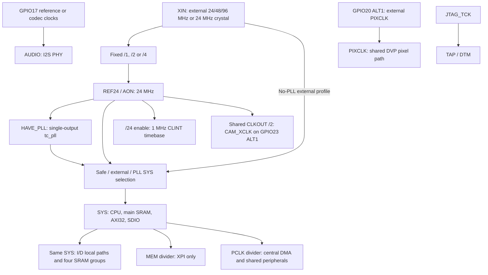
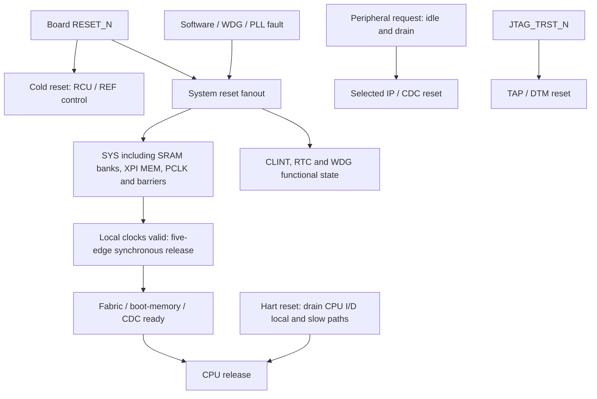

# retroSoC Tiny Gen1 Product, Performance and Clock/Reset Contract

## Purpose and research boundary

The 2026-10-07 refreeze selects **ICS55 as the default target PDK with
`HAVE_PLL=YES`** and moves blocking post-synthesis timing acceptance to the
complete-product final qualification campaign. The
[platform and timing policy](#ics55-default-platform-and-final-timing-gate-2026-10-07)
below supersedes earlier target-PDK and intermediate timing-gate wording.
It does not relabel historical IHP130 results or make the planned ICS55 profile
executable. This refreeze includes locked PLL acquisition, not RTL integration.

The R2 portion of this contract freezes the performance-only design approved
on 2026-10-04 for Target SoCs: `TINY`, feature slug `tiny-soc`. It preserves the QFN64
package and pad allocation approved on 2026-09-26, the shared peripherals
approved on 2026-09-30, and the DVP/XPI-framebuffer contract of 2026-10-01.
R2 adds independent CPU I/D local paths, four independently arbitrated main
SRAM groups, per-target concurrency and bounded data-movement policies.
CPU and the actual main-SRAM macros share SYS at the same active frequency.
No pad, peripheral, user-SRAM capacity, DMA channel or external AXI owner is
added by that performance refreeze. `R2` identifies the development-roadmap
revision, not an IP ABI version.

The separately approved 2026-10-04 [PIO-lite extension](piolite.md), feature
slug `piolite`, adds a programmable I/O block to the future standard Tiny
product. It preserves QFN64, all existing ALT0/ALT1 assignments, the 128 KiB
main SRAM, eight-channel DMA target and three external AXI owners. Its
`PIOLITE-P0` through `PIOLITE-P5` phases remain separate from the unchanged R2
phase sequence. PIO-lite is required by the extended product target but is
not implemented or qualified by this documentation freeze.

The separately approved 2026-10-04 [SPI extension](spi.md), feature slug
`spi`, adds SPI0 to the future standard Tiny product. Its master-only
8/16-bit engine and display transaction service use existing GPIO alternates,
PCLK and borrowed central-DMA channels. `SPI-P0` through `SPI-P5` preserve
all legacy, R2 and PIO-lite phase IDs/titles. This is documentation approval;
SPI0, DMA V2.2 pacing and the display application remain unimplemented.

The separately approved 2026-10-05 [PPALite extension](ppalite.md), feature
slug `ppalite`, adds camera-inline Y extraction, RGB565 ordering, fixed pixel/
line sampling and row packing to the future standard product. RAW bypass and
PROCESS share existing DVP_RX11/DMA2 after the DVP CDC FIFO; no Pad, pinmux,
memory capacity, DMA request/channel or AXI master is added. Its independent
`PPALITE-P0..P5` gates preserve all previous phases. Implementation and source,
application and physical qualification remain pending.

The clock contract retains the 96 MHz no-PLL and 192/240 MHz PLL targets,
now requiring the main SRAM to qualify at those same rates. Both variants
boot from REF24. XPI remains in the divided MEM domain with a 120 MHz ceiling;
Crypto's private SRAM remains in PCLK. No independent safety RC is added.

This is a specification freeze, not evidence of implemented or qualified
96/240 MHz silicon. Mini is a compatibility consumer of shared IP, not an
additional product rollout; Std/Pro integration is outside this change.

Tiny owns its integration in `rtl/tiny`; Mini remains a separate product. The
committed `configs/ci/ihp130-tiny.mk` profile still describes the initial
2026-09-25 implementation: 24 MHz external clock, no PLL, two UARTs and two I2C
controllers. Its RTL, canonical maps, SDK, configuration, generated datasheet
and verification evidence remain the executable baseline until separate
integration work updates them. The baseline sections below retain that
contract and must not be read as the new Gen1 integration or clock qualification.

Product RTL, address/pin/topology inputs and filelists remain under `rtl/tiny`;
the SDK and application composition retain their existing `crt/` and `app/`
ownership. The R2 phase identifiers remain `TINY-R2-P0` through `TINY-R2-P11`;
the current product execution order is defined by the 2026-10-07 policy below.
Legacy `TINY-P0`
through `TINY-P12` keep their original headings and evidence in the archive;
their former non-monotonic schedule is not the current execution plan.
The current profile still selects four DMA channels and forbids PLL/non-24-MHz
Tiny configurations. New configurations require explicit platform enablement.
PIO-lite integration in `PIOLITE-P3` requires the applicable accepted R2-P6
DMA/shared-integration and R2-P7 RCU functionality. `PIOLITE-P5` may share a
physical run with R2-P11 only on the same PIO-inclusive source revision and
configuration, with both contracts' evidence requirements satisfied.
SPI integration in `SPI-P3` likewise requires accepted R2-P6 frozen GPIO/DMA
integration and R2-P7 clock/reset behavior. Camera/PSRAM application
qualification in `SPI-P4` requires R2-P8/R2-P9. Final standard-product
qualification must identify the same SPI- and PIO-inclusive source,
configuration and netlist; an earlier R2 or PIO-only result is insufficient.
PPALite's full qualification extends that same-source requirement to the
processor and its route/source guards. PPALITE-P3 depends on applicable R2-P6/P7;
camera/memory acceptance uses R2-P8/P9, and preview uses the relevant SPI stages.
Earlier R2, PIO or SPI results cannot qualify newly added PPALite logic.

## ICS55 default platform and final timing gate (2026-10-07)

This approved refreeze applies to Tiny and its SPI, PIO-lite and PPALite
integration contracts. It adds ICS55 platform enablement to the former
performance-only scope; unrelated SoCs and PDK rollouts remain excluded.

- TINY-052: the default **target** is TINY/ICS55, `HAVE_PLL=YES`, 128 KiB main
  SRAM and SAFE24 boot. The planned committed entrypoint is
  `configs/ci/ics55-tiny.mk`; it does not exist yet. The current executable
  entrypoint remains `configs/ci/ihp130-tiny.mk`, IHP130, 24 MHz/no PLL.
  IHP130 remains an explicit compatibility option, not the future default.
  Mini profiles and defaults are unchanged.
- TINY-053: before final complete-product qualification, post-synthesis timing
  closure is **observational, not a phase-completion gate**. Negative WNS/TNS,
  setup/hold, recovery/removal, minimum-period/pulse-width and electrical
  constraint violations do not alone block functional implementation phases.
  Retain applicable synthesis, mapping, netlist-function and protocol checks,
  STA attempts, exact inputs, reports and failure attribution. Missing timing
  views remain `NOT_RUN`/unsupported evidence; script errors, unconstrained
  paths and failed timing must never be relabeled as passing analysis.
- TINY-054: timing closure remains mandatory in the final complete-product
  campaign on the same SPI/PIO-lite/PPALite-inclusive source, configuration,
  PDK and netlist. Qualify each advertised point with characterized libraries,
  CTS/reset distribution, extracted PVT/MMMC, CDC/RDC, IO/board/package and
  power evidence. An unsupported point is a delivery gap, not a waiver or
  completion of the full target. Earlier functional high-rate simulations
  are permitted but are not physical operating-frequency claims.
- TINY-055: acquire the single-output integration of the locked OpenECOS
  `PLL_TOP` described below. `HAVE_PLL=YES` means macro presence, not selection
  at reset, qualified lock or qualified timing. Missing macro views must not
  silently synthesize a bypass. The default PLL-present design boots on REF24
  and enables fast operation only through the accepted lifecycle protocol.

The execution order is ICS55 platform enablement, remaining Tiny foundation
through R2-P10, SPI-P1..P4, PIOLITE-P1..P4, PPALITE-P1..P4, then one final
campaign combining **TINY-R2-P11, SPI-P5, PIOLITE-P5 and PPALITE-P5**. Their
individual checklists remain mandatory; none is an early physical prerequisite
for the other features' functional phases. Existing phase IDs and titles,
including titles containing `IHP130`, are preserved as historical identifiers;
their active target is now default ICS55 and explicitly selected IHP130
compatibility. Evidence is never transferable between PDKs. No earlier phase
is automatically reopened, passed or advanced by this policy.

QFN64, every IO/power terminal, the main-SRAM aperture and 128 KiB capacity,
Crypto's six private banks, boot/debug and register ABI remain unchanged.
The default main-SRAM binding is 32 `ics55_ecos_sram_1024x32_m8` macros from
the existing locked SRAM releases; IHP130 retains its 32 corresponding macros.
CPU and actual main SRAM share SYS at the same active frequency. There is no
half-rate SRAM fallback or minimum-period waiver via bus wait states.
Higher PCLK/SYS functional profiles require implemented clock/platform support,
not an intermediate physical signoff. Hardware frequency claims still require
the final campaign. This policy does not relax functional correctness,
reset/CDC protocols, real-time service budgets, source qualification or Tiny's
strict command/TEST_STATUS/SIM_TEST_PASS/forbidden-error verdict rules.
Warning baselines, global metric policy and RTL maturity labels are unchanged.

### Locked ICS55 PLL integration contract

Use [OpenECOS ICS55 PLL, PLL_V02p1](https://github.com/openecos-projects/ics55_ecos_pll/tree/6ebb1a8f7f4ccbccdb7f587664fdfe63cd39e61b),
locked as `sources.pdk_ics55_pll` at full revision
`6ebb1a8f7f4ccbccdb7f587664fdfe63cd39e61b`. Its managed checkout is
`.cache/retrosoc/sources/ics55_ecos_pll`, separate from replaceable PDK Liberty
caches. The upstream license is to be determined; record `NOASSERTION` and
retain licensing as a release gap rather than inferring an open-source license.

Use the behavioral Verilog only for functional simulation and the blackbox
for physical elaboration, with LEF and the min/typ/max Liberty views retained.
The supplied Liberty has cell/pin information **without timing arcs**. It is
not characterized PLL timing or signoff evidence; the final campaign requires
qualified replacement/additional characterization and generated-clock inputs.
Do not remove existing physical-flow guards merely because the views exist.

For a 24 MHz reference, preserve `tc_pll` selectors 5 and 7:

| Profile | N | SELECT | OD encoding / divisor | VCO | CKOUT1 |
| --- | ---: | ---: | --- | ---: | ---: |
| PLL192 / selector 5 | 32 | 0 | 2 / 4 | 768 MHz | 192 MHz |
| PLL240 / selector 7 | 40 | 0 | 2 / 4 | 960 MHz | 240 MHz |

Both use `BP=0`; only CKOUT1 supplies the functional PLL clock. CKOUT2 and
CKTST add no clock domain or package pin. Keep SAFE24 startup, the existing
no-PLL external-input option and the SYS/MEM/PCLK ratios below. These are
configuration targets, not measured frequencies or physical qualification.

The macro has no LOCK output. The integration must qualify clock activity,
rate/stability and loss through observable signals and bounded reference-domain
control; it must not access the behavioral model's internal `pll_ready` or
equate a fixed delay with analog lock. Upstream's typical startup is not a
PVT bound. The existing ICS55 adapter's `N=2` and four-reference-edge lock
counter are incompatible with this integration and require later repair.
Connect all six supply/ground pins explicitly, including in simulation;
physical rail/ground mapping requires the unchanged package power plan.
Preserve the existing XIN-loss/external-reset recovery boundary without adding
an independent oscillator. PLL functional modeling supplies neither analog
lock/jitter proof nor final frequency qualification.

### TINY-ICS55-P1 - Default PDK and PLL Platform Enablement

This is a new, pending implementation prerequisite before remaining R2 work,
not a renaming of R2-P1/P2. Introduce the default ICS55 Tiny profile and explicit
PDK selection, reuse the locked SRAM and PLL inputs, adapt filelists, technology
bindings and observation endpoints, and establish SAFE24 PLL-present boot,
memory/DMA/interrupt/debug regression plus IHP130/shared-Mini compatibility.
Retain 128 KiB, all package assignments and the original comparison binaries.
Record the PLL backend's standalone 192/240 functional capability; full Tiny
RCU transitions, gating, fault recovery and rate reporting remain R2-P7.
Do not advertise unimplemented RCU capability or force an early high-rate boot.

Acceptance requires an executable source-bound platform, actual macro binding,
both simulators and strict Tiny verdicts, dependency/model identity, relevant
synthesis/netlist checks and observational timing with explicit gaps. Physical
timing closure is deferred to the combined final campaign. This refreeze
implements only documentation and dependency acquisition, not this phase.

### Commercial references and reuse boundary

The following primary references were reviewed during the 2026-09-30 research;
camera references were checked on 2026-10-01 and the R2 bus/memory references
on 2026-10-04.
Vendor frequencies, power figures and security qualifications are not Tiny
PPA or signoff evidence; no proprietary implementation is copied.

| Reference | Relevant architecture and delivery | Selected reuse / boundary |
| --- | --- | --- |
| [RP2350 hardware APIs](https://www.raspberrypi.com/documentation/pico-sdk/hardware.html) and [datasheet](https://pip-assets.raspberrypi.com/categories/1214-rp2350/documents/RP-008373-DS-2-rp2350-datasheet.pdf?disposition=inline) | Maintained reference/system-clock services, peripheral resets and a Hazard3-capable MCU. The published datasheet describes safe mux/divider ordering and independent clock sources. | Separate reference timekeeping from processor clocks, acknowledge clock changes, and reset peripherals explicitly. Tiny does not inherit RP2350's internal oscillators, power domains or automatic recovery. Its 96 MHz XIN receiver needs its own qualification. |
| [STM32H573 datasheet](https://www.st.com/resource/en/datasheet/stm32h573vi.pdf) | DS14121 Rev 5 (May 2025) describes a production 250 MHz MCU with domain controls, CRC/RNG/crypto and a parallel camera interface supporting snapshot/continuous capture and cropping. | Reuse the snapshot/crop programming pattern and separate product clock control. Do not import its wider camera bus, JPEG support, TrustZone, protected-key, independent-watchdog-clock or TRNG certification claims. |
| [Espressif camera driver](https://github.com/espressif/esp32-camera) | The official ESP32/ESP32-S2/ESP32-S3 driver documents PSRAM frame buffers and PSRAM DMA on S2/S3; it warns that raw RGB/YUV writes can lose data when bandwidth is insufficient. Single-buffer capture and multiple-buffer continuous capture have different memory/bandwidth costs. | Use external RAM capacity with explicit throughput and worst-stall checks. Tiny selects one-frame capture/readback first, not a descriptor ring, compression path or guaranteed continuous frame rate. The maintained driver is a software reference, not Tiny silicon, power or timing evidence. |
| [GD32F450 datasheet](https://gd32mcu.com/data/documents/datasheet/GD32F450xx_Datasheet_Rev2.3.pdf) | Rev 2.3 describes 200 MHz AHB domains, 50/100 MHz APB domains and RCU-managed clocks/resets. | Use explicit domain ceilings and dividers rather than assigning the processor frequency to every peripheral. No analog macro, process-specific voltage or measured PPA is reused. |
| [RP2350 architecture documentation](https://www.raspberrypi.com/documentation/microcontrollers/microcontroller-chips.html) | Current official documentation describes a multi-master crossbar and independently accessible SRAM banks for CPU/DMA concurrency. | Adopt independent target/bank service and explicit contention analysis. The performance-only R2 scope retains one hart and 128 KiB without adding cache, PIO or USB. The separately approved PIO-lite contract supplies its own scope; no vendor frequency/power claim is imported. |
| [STM32H573 RM0481](https://www.st.com/resource/en/reference_manual/rm0481-stm32h563h573-and-stm32h562-armbased-32bit-mcus-stmicroelectronics.pdf) | The reference manual describes CPU, general-DMA and SDMMC-DMA paths, multiple SRAM targets and round-robin bus-matrix arbitration. | Use target-local arbitration and separate control/data traffic. Do not infer Cortex-M33 timing, cache/coherency, TrustZone or zero-wait behavior for Tiny. |

The [RP2350](https://www.raspberrypi.com/products/rp2350/) is a Hazard3-based MCU
reference for software, SRAM, and deterministic I/O. Its dual-core, security,
and USB features are not Tiny requirements. The separate [PIO-lite](piolite.md)
contract uses programmable-I/O references without RP ISA or SDK compatibility.
The
[CAST SRAM controller](https://www.cast-inc.com/peripherals/memory-controllers/sram-ctrl)
illustrates native AXI synchronous SRAM and documented verification delivery;
no commercial implementation or qualification is reused.

## Requirements and non-goals

- TINY-001: one Hazard3 hart, RV32IMC with A disabled, mandatory debug support;
  existing RV32IM firmware remains the default compiler target.
- TINY-002: native 32-bit AXI4 external data and APB4 control. The CPU's
  separate native I/D AHB ports reach main SRAM through local synchronous
  paths; only non-SRAM slow paths merge into the CPU AXI adapter. No RIB/RIBP
  source or interface is part of Tiny's compilation or elaboration closure.
- TINY-003: 128 KiB technology-backed SRAM and XPI NOR boot. Boot and baseline
  firmware MUST NOT depend on external RAM. Reset vector is `0x00000000`;
  SRAM begins at `0x30000000`. Optional initialized XPI PSRAM may hold frame
  data; code, vectors and stack retain SRAM residency.
- TINY-004: 32 bidirectional user GPIO, one UART, one I2C controller, one
  full-duplex I2S controller, one SDIO host, two general timers, CLINT, eight
  central DMA channels, four PWM outputs, RTC, watchdog, RNG V2, CRC V2,
  WS2812, Crypto V2, DVP V2, PIO-lite, SPI0, PPALite, Tiny RCU/SYSCTRL and
  architecture info.
  UART1 and I2C1 are absent from the Gen1 target.
- TINY-005: retain `HAVE_PLL` as the single PLL build selector. With no PLL,
  use an external XIN clock up to 96 MHz; with PLL, use a 24 MHz reference and
  the single-output PLL interface for a maximum 240 MHz SYS/processor target.
  The actual 128 KiB main-SRAM macro clocks MUST share SYS with the CPU at
  every active operating point, including 192/240 MHz. Both variants start on
  REF24 and retain a 1 MHz CLINT timebase. MEM is the XPI domain, with a
  120 MHz ceiling; PCLK has a 60 MHz ceiling. None is a qualified operating
  frequency until joint macro and system physical evidence passes.
- TINY-006: Tiny must build independently of MPW, HP CPU generation and
  multimedia inputs. Shared SDK APIs retain the `rs_` namespace.
- TINY-007: no wireless IP, radio-specific host integration, or wireless stack.
- TINY-008: QFN64 has exactly 64 perimeter terminals: 32 user GPIO, six
  dedicated boot XPI pins, five dedicated JTAG pins, five clock/system-control
  pins and 16 power/ground pins. The exposed pad (EP) is separate from these
  64 terminals. Boot XPI and JTAG do not consume the 32 user GPIO.
- TINY-009: all digital interfaces use one 3.3 V IO supply; IHP130 Core power
  is planned at 1.2 V from an external regulator. The clock analog supply and
  return must meet the selected oscillator/PLL macro requirements. Position
  labels on supply pins do not create independently powered IO banks.
- TINY-010: GPIO retains the `ALT_ENABLE`/`ALT_SELECT` model with GPIO, ALT0
  and ALT1 modes. The separately approved PIO-lite extension uses `USER_SELECT`
  for exclusive ownership of any of GPIO0-31 without replacing ALT0/ALT1
  assignments or reaching dedicated boot/debug/control pads. The Gen1 table
  below defines the logical mapping. UART/I2C alternate input locations must
  have one selected route, never an OR of
  competing inputs. I2C must preserve open-drain drive and input readback.
- TINY-011: reset must leave user GPIO as high-impedance inputs with alternate
  functions disabled, preserve dedicated boot/debug access, and meet the
  system-control and board-bias requirements below.
- TINY-012: SDIO supports 3.3 V, 1-bit/4-bit operation; 1.8 V switching is not
  a Gen1 requirement. I2S targets master/slave operation, separate transmit and
  receive data, optional MCLK output and an external audio-reference input.
  SDIO/I2S peripheral inputs bypass ordinary GPIO debounce/filter logic;
  their controllers own interface sampling and clock-domain crossings.
- TINY-013: shared peripherals MUST retain the common IP specification,
  Mini-compatible base addresses, register ABI and driver source. Product
  configuration supplies pins, IRQs, DMA assignments and actual clock rates.
  Tiny RCU/SYSCTRL is product-specific and MUST NOT inherit Mini LP/HP controls.
- TINY-014: add the four shared peripherals at the addresses below; place
  Tiny RCU control in the existing SYSCTRL window, not a second overlapping
  decoder. Preserve the common SYSCTRL terminal-test and fault-reporting entrypoints.
- TINY-015: eight-channel central DMA MUST preserve Crypto channels 4/5 and
  request IDs 12/13. The AXI32 fabric MUST admit CPU, central DMA and the SDIO
  host's private DMA master, with bounded software waits and defined errors.
- TINY-016: WS2812 MUST use GPIO26 ALT0 without adding a pad or removing its
  ALT1 I2C0_SCL route. Other package pins and alternate-function assignments
  remain as listed below.
- TINY-017: clock changes MUST drain accepted traffic and use safe-source,
  divider, lock and acknowledgement sequencing. Actual clock-rate reporting
  and shared-driver timing must agree after each completed change.
- TINY-018: resets MUST assert asynchronously and release on five valid local
  clock edges, with CDC restart barriers and CPU-last boot release. A stopped
  audio/pixel clock or software-initialized Crypto READY MUST NOT block CPU
  startup.
- TINY-019: no independent safety RC, backup clock or automatic recovery from
  XIN loss is provided. Restore the external source and apply RESET_N to
  recover. A PLL-only fault may recover through REF24 while XIN remains valid.
- TINY-020: preserve RNG qualification/fail-closed behavior and Crypto V2
  initialization, invalidation and verified physical erasure. Crypto's six
  private SRAM banks MUST NOT reduce the 128 KiB software-visible SRAM.
- TINY-021: MUST reuse [DVP V2](dvp.md), its 8-bit RGB565/YUV422 formats,
  registers, snapshot/continuous/crop functions and stream framing unchanged.
  Tiny's first acceptance MUST cover snapshots and cropping; MUST NOT add
  JPEG, raw formats, frame rings, stride, a private DVP AXI master or a larger
  FIFO under this freeze. Continuous no-loss video qualification is deferred.
- TINY-022: MUST add only GPIO12-23 ALT1 camera routes, preserve all P6-assigned
  Gen1 alternates and QFN64/power assignments, and make camera and I2S profiles
  mutually exclusive. CAM_XCLK MUST share the existing RCU CLKOUT generator.
- TINY-023: MUST preserve DVP base `0x1000E000`, IRQ15 and request `DVP_RX=11`,
  use Tiny central DMA channel 2 by default, and retain eight channels and
  three AXI masters. Endpoint and RCU target capabilities MUST reflect actual
  integration, not a reserved port or planned phase.
- TINY-024: MUST support whole-frame storage through XPI NSS1 at `0x54000000`
  using GPIO29 ALT0, after device initialization/validation. Preserve NSS0 NOR
  boot and SRAM-only operation; MUST NOT add a separate PSRAM controller or
  a `0x40000000` memory window. Actual capacity, not the slot aperture, bounds
  buffers; 128 KiB SRAM MUST NOT be presented as a DVP resolution ceiling.
- TINY-025: MUST validate exact frame length, alignment, even DMA output width,
  device capacity and burst/CS boundaries. A valid frame requires DVP frame
  completion, all DMA destination writes completed, exact byte count and no
  DVP/DMA/XPI error. MUST NOT flush the undrained tail on the success path.
- TINY-026: MUST retain the shared pixel CDC/reset topology, add Tiny RCU
  target bit 14 without moving existing bits, and bound clock-loss/recovery
  waits. Software MUST quiesce capture/DMA before clock, gate or route changes.
- TINY-027: ACCEPTANCE requires pin-level XPI PSRAM CPU/DMA readback, measured
  write throughput/worst backpressure, and end-to-end DVP capture/readback in
  each supported profile. Fast read-only NOR or separate-controller tests
  MUST NOT substitute for this evidence; no supported PIXCLK/FPS is inferred
  from CAM_XCLK, CPU frequency or external RAM capacity alone.
- TINY-028: MUST use the locked official dual-port Hazard3 with independent
  local I/D paths, preserved debug and disabled A atomics. Only non-SRAM
  requests may merge into the CPU slow path; MUST NOT recombine local I/D
  before SRAM arbitration. The uncontended local acceptance-to-completion
  budget is at most three SYS cycles under the conditions defined below.
- TINY-029: MUST preserve the flat 128 KiB main-SRAM aperture as four
  contiguous, independently serviceable 32 KiB arbitration groups backed by
  the existing 32 single-port 4 KiB macros. No common transaction lock, cache,
  alias or interleaving is added. Physical bank discovery keeps its old meaning.
- TINY-030: MUST replace global transaction serialization with independent
  target ownership, preserve central DMA's one-read/one-write concurrency,
  and isolate fast control access from FIFO-waiting APB paths. Same-target
  service remains bounded in structure, not unconditionally in elapsed time.
- TINY-031: MUST preserve CPU data ordering, two-cycle AHB errors, correct
  instruction visibility, AXI owner/response routing and accepted-work drain.
  Concurrent fault events MUST be counted without loss while preserving the
  existing first-fault, saturating-count, W1C and raw-response semantics.
- TINY-032: MUST define per-application DMA ownership and service budgets,
  including active WS2812 refill and TCD fetch interference. Use exclusive,
  occupancy-bounded WS2812 batches; MUST NOT rely on priority to preempt an
  admitted serial/APB transaction or imply cyclic/2D DMA support.
- TINY-033: ordinary FIFO payload-reset reduction requires equivalence of
  empty/flush/reset visibility and restart barriers. MUST NOT weaken Crypto
  physical erasure, key/result invalidation or verified zero readback.
- TINY-034: preserve the compatible firmware build and add a separately
  validated performance build and bank-aware placement policy. Hardware ISA,
  compiler flags, firmware size and linker budgets MUST be independently
  checked; upstream benchmark scores are not Tiny performance evidence.
- TINY-035: final physical release MUST qualify main-SRAM, CPU and fabric
  timing jointly at SYS. Before the final campaign, timing is observational
  under TINY-053 and does not block functional testing at modeled target rates.
  For physical release, a failing rate is lowered by reviewed profile change
  or disabled for CPU and main SRAM together;
  MUST NOT restore a half-rate main-SRAM fallback. Extra response wait states
  do not repair a macro's minimum-clock-period violation.
- TINY-036: ACCEPTANCE separates functional, workload-performance, synthesis/
  netlist and physical evidence. The active R2 roadmap MUST retain the legacy
  phase IDs/titles and evidence as history, with explicit obligation mapping;
  no historical phase or timing gap is closed merely by this refreeze.
- TINY-037: the standard Tiny target MUST include [PIO-lite](piolite.md) with
  two state machines, one shared 32 x 16-bit program store, 32-bit ISR/OSR,
  16-bit X/Y counters and independent 8 x 32-bit TX and RX FIFOs per machine.
  Four-state-machine expansion is reserved by the IP contract, not an MVP
  capability. PIO-lite uses PCLK and integer clock enables, with the existing
  24/48/60 MHz PCLK targets subject to source-bound qualification.
- TINY-038: PIO-lite MUST use APB4 `0x1001C000..0x1001CFFF`, CPU IRQ24,
  Tiny RCU target bit 15 and central-DMA requests `PIOLITE_TX=14` / `PIOLITE_RX=15`.
  Default TX borrows channel 3 after bulk-client release; default RX borrows
  channel 2 only after complete camera release. No additional DMA channel,
  AXI master, user-SRAM capacity or package pad is introduced.
- TINY-039: GPIO gating or peripheral reset MUST be rejected while PIO-lite
  owns any user pad, even when a command also selects PIO-lite. Software MUST
  stop/drain PIO-lite and release pad ownership before that GPIO operation.
  Clock changes and PIO gate/reset follow the linked PIO-lite lifecycle;
  system reset still releases all user pads to high impedance.
- TINY-040: `PIOLITE-P0` through `PIOLITE-P5` MUST remain a separately approved
  feature extension without renaming legacy or R2 phases. PIO capabilities,
  requests, IRQ and RCU support MUST remain absent until their complete paths
  exist. Functional, DMA/contention and physical evidence MUST identify the
  actual PIO-inclusive source, profile and PDK; old R2 results do not qualify it.
- TINY-041: the standard Tiny target MUST include [SPI0](spi.md), an
  8/16-bit, four-mode, master-only controller with separate 8 x 32-bit TX and
  RX FIFOs in PCLK. SPI0 uses APB4 `0x1001D000..0x1001DFFF`, CPU IRQ25 and
  Tiny RCU target bit 16; all remain unsupported until fully integrated.
- TINY-042: SPI0 MUST use GPIO27 ALT0 SCK, GPIO28 ALT1 MOSI, GPIO30 ALT1
  MISO and GPIO31 ALT1 CS_N. Write-only display mode uses GPIO30 as ordinary
  GPIO D/C instead of MISO. Preserve the other Gen1 alternates, all QFN64
  terminals and the dedicated boot/debug/control pads. R2-P6 first applies
  the already approved Gen1 migration of legacy PWM captures to GPIO24/25.
- TINY-043: [DMA V2.2](dma.md) MUST provide `SPI_TX=16` and `SPI_RX=17`
  as paced fixed-MMIO requests. Default SPI TX borrows channel 3 and RX
  borrows channel 2 only after prior owners fully drain and release them.
  PIO-lite requests 14/15 and existing channel reservations remain unchanged;
  no extra DMA channel, AXI owner or user SRAM is added. SPI payload accesses
  retain the existing single-beat MMIO transport contract.
- TINY-044: GPIO gate/reset MUST be rejected while actual PIO USER ownership
  or a latched SPI session remains. The SPI reservation includes prefills,
  retained CS and closing/drain state; mutable configuration cannot release
  it. SPI gate/reset and clock changes require inactive CS, completed wire
  timing and complete accepted DMA/MMIO/descriptor drain. Guard loss faults
  the session and cannot automatically resume it after routing recovers.
- TINY-045: `SPI-P0` through `SPI-P5` are a separate approved extension.
  Display acceptance MUST use bounded transactions; camera/display acceptance
  uses the sequential capture, verify, display, then SD-save workflow. Continuous double-buffer
  camera/display operation is deferred. Final qualification MUST use the
  actual SPI- and PIO-inclusive source/profile/PDK and netlist, not historical
  baseline or performance-only evidence.
- TINY-046: standard Tiny MUST include [PPALite](ppalite.md), one PCLK camera
  stream processor after the existing DVP CDC FIFO. Preserve QFN64/pinmux,
  CPU-rate main SRAM, all DMA channels/requests and the three AXI owners.
- TINY-047: PPALite MUST use APB4 `0x1001E000..0x1001EFFF`, CPU IRQ27 and
  RCU target17. It performs YUV422 Y extraction, gray RGB565 output, RGB565
  ordering, independent step1/2/4 sampling and row-aligned packing; RGB-to-gray,
  memory replay, interpolation and larger graphics operations remain deferred.
- TINY-048: RAW remains the default DVP route and retains the original stream
  and even-width DMA contract. PROCESS exclusively feeds the same DVP_RX11
  endpoint and exact direct DMA2 job; its padded stride/length metadata MUST
  govern allocation and consumers. No simultaneous RAW/processed fanout.
- TINY-049: changing RAW/PROCESS MUST wait for source/CDC/FIFO quiescence and
  every central-DMA job/pending admission/descriptor/response to drain. Fixed
  PROCESS may serve repeated frames while unrelated DMA runs. Capture ownership
  persists through errors and cleanup; PIPE_DONE alone never validates memory.
- TINY-050: PPALite integration MUST qualify DVP source errors, full-width
  statistics, coherent host status and snapshot stop/drain. Reuse accepted R2
  fixes or perform minimal shared correctness work without changing DVP V2
  register meanings, the512 B payload FIFO or Mini compatibility. Raw input
  byte rate, not reduced image rate, determines upstream overflow budget.
- TINY-051: `PPALITE-P0..P5` are a separate approved roadmap; no earlier phase
  is renamed or retroactively accepted. Only fully wired/qualified source,
  route and admission paths may advertise PROCESS capability. Final product
  evidence MUST use the same PPALite/PIO/SPI-inclusive source and netlist.

Deferred: RV32 A atomics, RTOS ports, authenticated boot, retention/power gating,
independent sleep clock, 256-512 KiB SRAM, USB, SPI slave operation, CAN, ADC,
multimedia accelerators beyond the selected DVP/PPALite path and other PDK
qualification. I2S, SDIO, DVP and the approved PIO-lite, SPI and PPALite extensions
are standard Tiny requirements awaiting integration, not deferred product features. XPI
retains four chip selects: CS0_N is dedicated to boot NOR, while CS1_N through CS3_N
use GPIO29 through GPIO31. Additional XPI device configurations still require
their own qualification.

The original performance-only R2 scope MUST NOT add SPI, PIO-lite, a recovery
Boot ROM, caches, atomics, new accelerators or another PDK rollout. That
historical scope boundary remains in force for its phase work. PIO-lite, SPI
and PPALite are separately approved standard-product extensions governed by
[piolite.md](piolite.md), [spi.md](spi.md) and [ppalite.md](ppalite.md); their phases do not become
hidden prerequisites of R2-P0 through R2-P10. The other listed research ideas
remain deferred.

## QFN64 package and power planning

QFN64 with EP is the selected package. A 9 x 9 mm body with 0.5 mm pitch is the
preferred outline, subject to die dimensions, pad ring, bond-wire clearance and
the package supplier's drawing. This is a package planning baseline, not a
signed-off bonding diagram. The table uses top-view terminal numbering; a
reviewed physical-order change must preserve the logical GPIO function mapping.

### Terminal budget

| Category | Count | Signals or supplies |
| --- | ---: | --- |
| User GPIO | 32 | GPIO0 through GPIO31 |
| Dedicated boot XPI | 6 | XPI_SCK, XPI_CS0_N, XPI_D0 through XPI_D3 |
| Dedicated JTAG | 5 | TCK, TMS, TDI, TDO, TRST_N |
| Crystal | 2 | XIN, XOUT |
| System control | 3 | RESET_N, BOOT_MODE, TEST_MODE |
| IO supply | 4 | VDDIO_A through VDDIO_D |
| IO return | 4 | VSSIO_A through VSSIO_D |
| Core supply | 3 | VDDCORE_A through VDDCORE_C |
| Core return | 3 | VSSCORE_A through VSSCORE_C |
| Clock analog supply/return | 2 | AVDD_CLK, AVSS_CLK |
| Perimeter total | 64 | 48 signal terminals and 16 power/ground terminals |
| Exposed pad | Separate | EP, intended GND connection pending package confirmation |

### Power and electrical requirements

| Group | QFN pins | Planned connection |
| --- | --- | --- |
| VDDIO_A/B/C/D | 1, 17, 33, 49 | Same 3.3 V IO rail |
| VSSIO_A/B/C/D | 2, 18, 34, 50 | GND, distributed IO return |
| VDDCORE_A/B/C | 9, 31, 47 | Same 1.2 V Core rail for IHP130 |
| VSSCORE_A/B/C | 10, 32, 48 | GND, distributed Core return |
| AVDD_CLK | 53 | Voltage and filtering defined by the oscillator/PLL macro |
| AVSS_CLK | 54 | Ground/return connection defined by the clock macro |
| EP | Center, unnumbered | Intended GND; die attach, substrate and internal connection require confirmation |

GPIO, XPI and JTAG all use the same digital IO voltage. A/B/C/D are physical
position labels, not independent voltage banks; mixed 1.8 V/3.3 V bank use is
outside this contract. Gen1 assumes no internal LDO and allocates no VCAP,
VBAT or 32.768 kHz crystal terminals. RTC/watchdog presence does not imply a
backup power domain or timekeeping with the system clock stopped.

EP supplements the perimeter grounds and must not replace them. The clock
macro is planned to require no external loop-filter terminals; macro selection
must confirm that assumption before the package is signed off. Sixteen power
and ground pins are a budget, not proof of 96/240 MHz operation. Qualification
must cover Core/SRAM current, simultaneous IO switching, pad drive/load,
bond-wire/package parasitics, voltage drop and electromigration.

Board planning may start with 100 nF near each digital VDD terminal plus bulk
decoupling per rail; final values and placement require regulator and power
network analysis. Clock-supply decoupling follows the selected macro. Pad drive
strength is a technology selection and does not imply software-programmable
drive-strength control in the current GPIO ABI.

### Perimeter pin assignment

| Pin | Name | Pin | Name |
| ---: | --- | ---: | --- |
| 1 | VDDIO_A | 33 | VDDIO_C |
| 2 | VSSIO_A | 34 | VSSIO_C |
| 3 | XPI_CS0_N | 35 | GPIO12 |
| 4 | XPI_SCK | 36 | GPIO13 |
| 5 | XPI_D0 | 37 | GPIO14 |
| 6 | XPI_D1 | 38 | GPIO15 |
| 7 | XPI_D2 | 39 | GPIO16 |
| 8 | XPI_D3 | 40 | GPIO17 |
| 9 | VDDCORE_A | 41 | GPIO18 |
| 10 | VSSCORE_A | 42 | GPIO19 |
| 11 | GPIO26 | 43 | GPIO20 |
| 12 | GPIO27 | 44 | GPIO21 |
| 13 | GPIO28 | 45 | GPIO22 |
| 14 | GPIO29 | 46 | GPIO23 |
| 15 | GPIO30 | 47 | VDDCORE_C |
| 16 | GPIO31 | 48 | VSSCORE_C |
| 17 | VDDIO_B | 49 | VDDIO_D |
| 18 | VSSIO_B | 50 | VSSIO_D |
| 19 | GPIO0 | 51 | GPIO24 |
| 20 | GPIO1 | 52 | GPIO25 |
| 21 | GPIO2 | 53 | AVDD_CLK |
| 22 | GPIO3 | 54 | AVSS_CLK |
| 23 | GPIO4 | 55 | XIN |
| 24 | GPIO5 | 56 | XOUT |
| 25 | GPIO6 | 57 | RESET_N |
| 26 | GPIO7 | 58 | BOOT_MODE |
| 27 | GPIO8 | 59 | TEST_MODE |
| 28 | GPIO9 | 60 | JTAG_TCK |
| 29 | GPIO10 | 61 | JTAG_TMS |
| 30 | GPIO11 | 62 | JTAG_TDI |
| 31 | VDDCORE_B | 63 | JTAG_TDO |
| 32 | VSSCORE_B | 64 | JTAG_TRST_N |

Boot Flash occupies pins 3-8, SDIO occupies pins 19-24, I2S occupies pins
35-40 including its optional reference input, and the alternate camera profile
occupies pins 35-46. Clock analog/control signals occupy pins 53-59. Both PLL
variants retain pins 53-56 as AVDD_CLK, AVSS_CLK,
XIN and XOUT. External-clock mode disables XOUT drive without deleting the
pad or changing the package numbering. Clock supply voltage and bypass-input
electrical limits require the selected macro/Pad binding.

## Gen1 GPIO alternate functions

Every row supports ordinary bidirectional GPIO mode. `Reserved` means no
assigned alternate function; it does not remove the GPIO capability. This
table supersedes the legacy Mini-derived Tiny routing for the Gen1 target,
but is not yet implemented by the current Tiny canonical maps.
The PIO-lite `USER_SELECT` route is an independent ownership selection for all
32 user GPIO; it does not occupy or change an ALT0/ALT1 table entry. Existing
peripheral functions are unavailable on each pad while PIO-lite owns it.

| GPIO | QFN pin | ALT0 | ALT1 | Direction or use |
| --- | ---: | --- | --- | --- |
| GPIO0 | 19 | SDIO_CLK | Reserved | Clock output |
| GPIO1 | 20 | SDIO_CMD | Reserved | Bidirectional command |
| GPIO2 | 21 | SDIO_D0 | Reserved | Bidirectional data 0 |
| GPIO3 | 22 | SDIO_D1 | Reserved | Bidirectional data 1 |
| GPIO4 | 23 | SDIO_D2 | Reserved | Bidirectional data 2 |
| GPIO5 | 24 | SDIO_D3 | Reserved | Bidirectional data 3 |
| GPIO6 | 25 | Reserved | Reserved | GPIO input for SD_CD_N |
| GPIO7 | 26 | Reserved | Reserved | GPIO output for SD_PWR_EN |
| GPIO8 | 27 | UART0_TX | PWM0 | Default UART TX |
| GPIO9 | 28 | UART0_RX | PWM1 | Default UART RX |
| GPIO10 | 29 | I2C0_SCL | PWM2 | Default open-drain I2C clock with readback |
| GPIO11 | 30 | I2C0_SDA | PWM3 | Default open-drain I2C data with readback |
| GPIO12 | 35 | I2S_BCLK | DVP_D0 | Audio clock or camera data input 0 |
| GPIO13 | 36 | I2S_LRCLK | DVP_D1 | Audio clock or camera data input 1 |
| GPIO14 | 37 | I2S_DOUT | DVP_D2 | Audio data output or camera data input 2 |
| GPIO15 | 38 | I2S_DIN | DVP_D3 | Audio data input or camera data input 3 |
| GPIO16 | 39 | I2S_MCLK | DVP_D4 | Audio master-clock output or camera data input 4 |
| GPIO17 | 40 | I2S_REFCLK_IN | DVP_D5 | Audio reference or camera data input 5 |
| GPIO18 | 41 | PWM0 | DVP_D6 | PWM output 0 or camera data input 6 |
| GPIO19 | 42 | PWM1 | DVP_D7 | PWM output 1 or camera data input 7 |
| GPIO20 | 43 | PWM2 | DVP_PIXCLK | PWM output 2 or raw pixel-clock input |
| GPIO21 | 44 | PWM3 | DVP_HREF | PWM output 3 or camera HREF input |
| GPIO22 | 45 | PWM_FAULT | DVP_VSYNC | PWM fault or camera VSYNC input |
| GPIO23 | 46 | PWM_SYNC | CAM_XCLK | PWM sync input or shared divided clock output |
| GPIO24 | 51 | PWM_CAP0 | UART0_TX | PWM capture 0 or alternate UART TX |
| GPIO25 | 52 | PWM_CAP1 | UART0_RX | PWM capture 1 or alternate UART RX |
| GPIO26 | 11 | WS2812_OUT | I2C0_SCL | LED output or alternate open-drain I2C clock with readback |
| GPIO27 | 12 | SPI0_SCK | I2C0_SDA | SPI clock or alternate open-drain I2C data with readback |
| GPIO28 | 13 | CLKOUT | SPI0_MOSI | Divided clock observation or SPI data output |
| GPIO29 | 14 | XPI_CS1_N | Reserved | Second XPI chip select |
| GPIO30 | 15 | XPI_CS2_N | SPI0_MISO | Third XPI chip select or SPI input; ordinary GPIO D/C in write-only display mode |
| GPIO31 | 16 | XPI_CS3_N | SPI0_CS_N | Fourth XPI chip select or SPI chip select |

Only these four formerly reserved Gen1 cells are assigned by the SPI freeze.
The committed legacy map still has PWM_CAP0/1 on GPIO30/31 ALT1; R2-P6 MUST
first apply the approved Gen1 GPIO24/25 ALT0 capture routes. SPI integration
does not silently replace the executable baseline's capture ABI. GPIO27's
alternate I2C input, GPIO28 CLKOUT and XPI CS2/3 are mutually exclusive with
SPI on their respective pads. GPIO29 NSS1 remains available.

UART and I2C alternate locations connect to the same UART0 and I2C0 instances.
Repeated PWM names are routes for the same four channels, not extra channels.
UART RX and both I2C input paths require explicit, exclusive routing; the
selection controls and conflict/error behavior are deferred integration ABI.
I2C SCL and SDA must use bidirectional pads with low-drive/release behavior and
external pull-ups, including SCL input readback. Peripheral inputs use the raw
pad path, with sampling and CDC inside the receiving controller rather than
the ordinary GPIO debounce/filter path described in [GPIO](gpio.md).

PWM_CAP0/1 belong to the PWM capture interface. They are not capture pins for
Tiny's two general timers. GPIO6/7 are software GPIO assignments, not extra
SDIO protocol ports. This package table assigns no UART RTS/CTS pins; the old
GPIO0/1 flow-control routes must not be inferred from the legacy mapping.

### Concurrent default usage

| Function | GPIO allocation | Count |
| --- | --- | ---: |
| 4-bit SDIO | GPIO0-5 | 6 |
| Full-duplex I2S with MCLK | GPIO12-16 | 5 |
| UART0 | GPIO8-9 | 2 |
| I2C0 | GPIO10-11 | 2 |
| Total | Non-overlapping default routes | 15 |
| Remaining user GPIO | 32 minus 15 | 17 |

Adding SD card detection/power control on GPIO6/7 and four PWM outputs on
GPIO18-21 uses 21 GPIO in total, leaving 11. External audio reference, PWM
fault/sync/capture and extra XPI chip selects consume additional GPIO when
enabled. The product claim is 32 user-programmable GPIO plus independent boot
Flash and five-wire JTAG, with simultaneous default SDIO/I2S/UART/I2C routing;
it is not 32 unused GPIO after all peripherals are enabled.

Adding WS2812 on GPIO26 to the four default interfaces uses 16 GPIO and
leaves 16. Including SD card detection/power and four PWM outputs uses 22 and
leaves 10. WS2812 and the alternate I2C SCL route on GPIO26 are mutually
exclusive; the default I2C route on GPIO10/11 remains available.

These counts assume PIO-lite has not claimed the listed peripheral pads.
PIO-lite may claim any otherwise released GPIO through `USER_SELECT`; it
does not increase the number of simultaneously available pads. Its ownership
and conflict checks follow [PIO-lite](piolite.md) and [GPIO](gpio.md). Input
sampling uses the existing GPIO synchronizer plus its registered bypass/filter
stage with `FILTER_ENABLE=0`; no PIO-lite synchronizer or raw-pad bypass is added.

### Camera profile and board ownership

GPIO12-23 ALT1 forms one camera profile: DVP_D0-7, DVP_PIXCLK, DVP_HREF,
DVP_VSYNC and CAM_XCLK. The eleven DVP inputs use raw pads, not GPIO filters;
CAM_XCLK is a SoC clock output, not a new port or clock inside the shared DVP
IP. Camera and I2S profiles MUST be mutually exclusive. Camera use also
excludes the default PWM outputs/fault/sync on GPIO18-23. No old ALT0 or other
ALT1 assignment is removed; giving up UART/I2C for alternate PWM routes is
not part of the concurrent camera configuration.

| Function | Camera-profile GPIO allocation | Count |
| --- | --- | ---: |
| DVP inputs and CAM_XCLK | GPIO12-23 ALT1 | 12 |
| 4-bit SDIO | GPIO0-5 ALT0 | 6 |
| UART0 | GPIO8-9 ALT0 | 2 |
| Sensor control through I2C0 | GPIO10-11 ALT0 | 2 |
| WS2812 | GPIO26 ALT0 | 1 |
| XPI PSRAM NSS1 | GPIO29 ALT0 | 1 |
| Subtotal | Non-overlapping required routes | 24 |
| Optional SD detect/power | GPIO6-7 ordinary GPIO | 2 |
| Optional camera RESET_N/PWDN | GPIO24-25 ordinary GPIO | 2 |
| Total with optional controls | 28 distinct GPIO | 28 |
| Remaining ordinary GPIO | GPIO27, GPIO28, GPIO30, GPIO31 | 4 |

GPIO24/25 controls replace their PWM capture/alternate UART use while selected;
they are board assignments, not DVP register or protocol ports. Sensor control
must verify its I2C/SCCB compatibility and reset/power timing. Default UART0,
I2C0, SDIO and WS2812 remain available with the camera. Independent boot XPI
pins and JTAG remain unchanged. GPIO28 is ordinary GPIO in this count; selecting
its CLKOUT route consumes it and mirrors the same generator as CAM_XCLK.

Before changing profiles, stop capture/audio/PWM, drain associated DMA and
accepted traffic, disable clock outputs and release pad drivers. Board wiring
MUST keep inactive camera/codec outputs high impedance, use alternative
assembly, or provide external isolation. An internal pinmux cannot prevent
two external devices from driving a shared net. Camera and PSRAM voltage/load
requirements must match the fixed 3.3 V IO rail or use qualified board-level
translation; this profile does not add supplies or pads.

### SPI and display profile ownership

The approved SPI extension uses the four remaining camera-profile GPIO:
GPIO27 SCK, GPIO28 MOSI, GPIO31 CS_N and either GPIO30 MISO or ordinary GPIO
D/C. Write-only display mode therefore consumes all 32 GPIO in the complete
camera/SDIO/UART/I2C/WS2812/NSS1 profile with optional controls. It adds no
package terminal. Separate display RESET_N, backlight/PWM, TE or readback
requires an explicit board solution or release of an optional function;
these controls are not implied spare pins. A board must document compatible
reset/bias/control circuitry and preserve inactive-device isolation.

PIO-lite remains the sole `USER_SELECT` owner. SPI uses native ALT routes and
must acquire its native session after USER ownership of every participating
pin is released and its one-clock handoff completes. Zero `USER_STATUS`
alone is insufficient: native-ready requires USER_SELECT and handoff clear
on the SPI session mask, GPIO lifecycle ready and the expected ALT/electrical
configuration. PIO may retain unrelated pads. The display session also
reserves the ordinary GPIO D/C role. Do not change PIO's synchronized-input
contract or its GPIO gate/reset veto to accommodate SPI.

SPI MISO uses the raw alternate-input route with capture timing owned by the
SPI controller. It does not reuse the GPIO two-stage synchronizer plus
registered filter/bypass path. Full-duplex acceptance must qualify the entire
SCK launch, board/device response and MISO setup/hold path at each operating
point. SPI guard loss suppresses unauthorized outputs and input sampling,
invalidates queued/prefilled work and requires explicit drain/reacquisition.
Retained CS and closing sessions keep their hardware-latched pad reservation.

The HAL owns complete display transactions: wait for the preceding wire
segment, update D/C with ordered/readback-checked GPIO access, observe setup
time, then start the next segment. FIFO-empty or DMA done is not wire done.
Command/data CS retention, release and errors follow [SPI](spi.md), including
CS setup/hold/inactive timing. CS_N requires external inactive-high bias when
reset or GPIO handoff makes the pad high impedance.

## Shared IP and product-specific integration

The selected hierarchy is `retrosoc_tiny` plus a Tiny-owned RCU/SYSCTRL,
dual-port CPU/local-SRAM routing, four bank services, a per-target AXI32 fabric
with three external owners, domain bridges, XPI, shared peripherals and product
pad routing. `retrosoc_tiny_asic` owns the unchanged QFN64 pad budget.
Common provides register, FIFO, synchronizer, handshake, clock and reset
primitives; Mini product RTL is not a dependency of Tiny's source closure.

### R2 CPU and four-bank main SRAM

Use the official `hazard3_cpu_2port` from the locked Hazard3 dependency; it is
already present in Tiny's source list. The [upstream integration manual](https://wren.wtf/hazard3/doc/)
describes separate nonburst instruction and data AHB ports. This freeze does
not update the dependency or claim that enabling two ports makes CPU accesses
AXI bursts. Keep the single hart, debug integration, Tiny's disabled A
extension and full two-cycle AHB error completion.

Both CPU ports and the physical main-SRAM macro clocks use SYS. Instruction
access is word-read-only; the data path retains aligned byte/halfword/word
access with byte write masks. Decode main SRAM before the slow-path merge.
Local I and D requests remain independent through bank arbitration. Only
non-SRAM I/D requests share one tagged CPU AXI ingress, whose saved origin
selects the correct response. The instruction path supports SRAM and the
NOR boot/executable NSS0 apertures; a fetch from a peripheral/control region
must fail before any read side effect. Absent regions retain decode errors.

| Logical arbitration group | Address range | ICS55 / IHP130 storage | Example performance layout |
| --- | --- | --- | --- |
| B0 | `0x30000000..0x30007FFF` | Eight existing 4 KiB single-port macros | Hot code and interrupt/exception entry |
| B1 | `0x30008000..0x3000FFFF` | Eight existing 4 KiB single-port macros | Remaining code and read-only tables |
| B2 | `0x30010000..0x30017FFF` | Eight existing 4 KiB single-port macros | CPU data, stack and working area |
| B3 | `0x30018000..0x3001FFFF` | Eight existing 4 KiB single-port macros | DMA buffers and descriptors |

The four groups do not change the 128 KiB aperture, reset vector, permissions
or address aliases. Every group is available to all permitted access paths;
the example layout is a software placement policy, not a hardware partition.
The 32 physical macro instances remain separate from Crypto's six private
macros. Four groups do not mean four physical macros or a fourfold speedup.

Each group has its own external AXI request/response frontend and local bank
state. Decode DMA/SDIO addresses before these frontends; a combined SRAM
transaction FSM ahead of all four groups is prohibited. Central DMA read B2
and write B3 may progress while CPU I uses B0 and D uses B1. SDIO competes
only for the addressed group. Actual throughput depends on the request mix,
macro/response timing and arbitration, not the count of interfaces alone.

At each bank, round-robin arbitration chooses eligible I, D or external
memory beats and advances only when an operation is issued to a macro.
The external frontend retains its selected DMA/SDIO transaction owner until
B/RLAST, with fair read-versus-write selection when both directions contend.
It does not reserve the macro for the whole burst: an external write becomes
eligible only after data/strobes are captured, and a read only after response
storage is reserved. Save the response source tag and capture read data before
issuing another operation that can change the macro output. Backpressure on
W, R or B must not prevent unrelated local accesses from using the bank.

A continuously eligible local requester waits for at most two other eligible
macro issues in the three-way round robin, plus residual pipeline delay.
DMA/SDIO external ownership alternates at completed transaction boundaries;
an eligible owner waits for at most one other completed external burst at
that bank. These are service-count bounds, conditional on clocks and peer
progress, not wall-clock guarantees for a stopped clock or withheld response.
AXI bursts are not atomic; interleaving local memory beats is legal while
software buffer ownership still governs data-race correctness.

The local latency budget is at most three SYS cycles from an accepted AHB
address phase to its terminal data-phase completion, with clocks running,
an uncontended bank, response capacity available and no lifecycle stall.
Implement and verify the request-capture, macro-issue and returned-completion
pipeline at the actual macro timing. Admission waiting and contention are
reported separately; withholding acceptance must not conceal those delays.
This is a frozen engineering acceptance budget, not a measured result or a
claim of single-cycle SRAM. No main-SRAM CDC or ratio bridge is permitted.

Keep one accepted CPU D operation across the local groups and slow path.
A store is complete only after the addressed byte writes commit; switching
targets must not reorder CPU data operations. `FENCE` orders older CPU data
work, not arbitrary independent DMA traffic. DMA buffer handoff first waits
for the corresponding DMA completion, then applies the software ordering
barrier. Boot copies, DMA-written executable code and debugger code patches
must establish write visibility and execute `FENCE.I` before entry/resume.
Preserve the core's speculative-fetch cancellation and response-order rules.

Debug remains the existing halted-hart abstract-command path, not a new
independent system-bus master. Hart reset stops new CPU admissions and drains
accepted I-local, D-local and merged slow-path work plus their responses;
unrelated DMA and SRAM service remain active. A system reset may invalidate a
session but must prevent old requests/responses from being replayed. Main
SRAM payload contents are not cleared by reset.

Reuse the shared SRAM register definitions and technology wrappers. Tiny
owns its routing/arbitration integration; shared changes must preserve default
Mini behavior and pass affected consumer regressions. For default Tiny/ICS55
and explicit Tiny/IHP130 compatibility,
`BANK_COUNT=32` and `BANK_BYTES=4096` continue describing physical storage,
not four 32 KiB arbitration groups. Group placement is published in build
and linker information without repurposing those fields or adding a new
register map. Existing AXI request/beat counters aggregate external frontend
events; they do not silently become local-CPU counters. A stall-cycle counter
counts a cycle with any applicable external stall, not four accumulated bank
stalls. New local wait/grant/conflict measurements use separately identified
verification instrumentation rather than changing the public counter meanings.

### Address and interrupt allocations

These are target allocations, not a statement that the current Tiny maps
already decode them. Every listed control window is 4 KiB. Shared peripheral
offsets, access/reset semantics and `rs_` HAL interfaces remain those of the
linked common contract; do not generate a second set of IP registers.

| IP | Base | CPU IRQ bit | Contract / integration |
| --- | --- | ---: | --- |
| RNG V2 | `0x20001000` | 16 | [RNG V2](../../rtl/managed/clusterip/rng/doc/datasheet.md), qualified-source handshake and shared HAL |
| CRC V2 | `0x20006000` | None | [CRC V2](../../rtl/managed/clusterip/crc/doc/datasheet.md), PIO or fixed-DATA central DMA |
| WS2812 | `0x10008000` | 17 | [WS2812](ws2812.md), 24-bit GRB, 16-word FIFO, GPIO26 ALT0 |
| Crypto V2 | `0x1000C000` | 23 | [Crypto](crypto.md), AES/SHA/RSA, central DMA channels 4/5 |
| Tiny RCU/SYSCTRL | `0x1000B000` | 31 | Tiny-owned control bank; one decoder, shared legacy terminal/fault entrypoints |
| I2S | `0x10007000` | 8 | [I2S](i2s.md), common host ABI and audio CDC; Tiny DMA channels 6/7 |
| DVP V2 | `0x1000E000` | 15 | [DVP](dvp.md), existing APB4/32-bit stream ABI, `DVP_RX=11`, Tiny DMA channel 2 |
| SDIO0 | `0x1000F000` | 10 | [SDIO](sdio.md), one host and its private AXI32 DMA master |
| Central DMA | `0x1000A000` | 20 | [DMA V2](dma.md), eight channels and supported request discovery |
| PIO-lite | `0x1001C000` | 24 | [PIO-lite](piolite.md), 4 KiB APB4 window, two state machines in PCLK; separately approved standard-product extension |
| SPI0 | `0x1001D000` | 25 | [SPI](spi.md), 4 KiB APB4 window, master-only 8/16-bit engine in PCLK; separately approved standard-product extension |
| PPALite | `0x1001E000` | 27 | [PPALite](ppalite.md), PCLK inline pixel processing after DVP CDC, exclusive RAW/PROCESS route to existing request11/DMA2 |

Mini's RCU has no separate MMIO region: its software controls are in SYSCTRL
at `0x1000B000`. Tiny retains this base and uses the private bank below for
clock/reset control. An RCU symbol may alias SYSCTRL in software metadata but
MUST NOT create overlapping address-map entries or another APB target.

CLINT remains at `0x10020000`, GPIO/data and GPIO/admin at `0x10000000` and
`0x10014000`, and the other retained peripherals keep their existing Mini
base addresses. Retain CPU IRQ bits 0/1 for CLINT, 2 UART0, 3/4 timers,
7 I2C0, 9 XPI, 11 PWM, 13 RTC, 14 watchdog and 18 GPIO. Removed UART1 and
I2C1 windows have no successful decode, and their IRQ bits 26/19 are zero.
All other unallocated IRQ bits are zero. CRC has no fabricated interrupt or
private DMA request; software finishes the CRC session after DMA completion.
PIO-lite's window is `0x1001C000..0x1001CFFF`; IRQ24 remains zero and its
capability absent until the block and complete interrupt path are integrated.
SPI0's window is `0x1001D000..0x1001DFFF`; IRQ25 remains zero and its
capability absent until the block and complete interrupt path are integrated.
PPALite's window is `0x1001E000..0x1001EFFF`; IRQ27, RCU17 and PROCESS
capability remain absent until the corresponding complete source/route,
interrupt and lifecycle/admission paths exist.

### DMA and bus behavior

| Central DMA channel | Tiny default owner |
| ---: | --- |
| 0 | UART0 |
| 1 | I2C0 |
| 2 | DVP receive; PIO-lite RX, SPI RX or general memory transfers only after camera ownership is released |
| 3 | Serialized bulk clients: XPI, WS2812, CRC, PIO-lite TX and SPI TX |
| 4 | Crypto input |
| 5 | Crypto output |
| 6 | I2S transmit |
| 7 | I2S receive |

Retain Crypto request IDs 12/13, I2S request IDs 1/2 and DVP request ID 11.
The PIO-lite extension adds requests `PIOLITE_TX=14` and `PIOLITE_RX=15` without
renumbering existing requests or increasing the eight-channel target.
The separate SPI extension adds DMA V2.2 paced fixed-MMIO requests
`SPI_TX=16` / `SPI_RX=17`, preserving existing request meanings and the
64-byte TCD layout. Selector/ABI and capability changes follow [DMA](dma.md).
Channel ownership is product integration data, not a different DMA register
ABI. In particular,
Tiny channel 6 is not Mini's HP-boot reservation. Shared drivers use product
assignments rather than assuming all products give the bulk channel to I2S.
Channel 3 clients must serialize ownership and fail boundedly when unavailable.
Channel 2 is reserved for the camera session through capture and final DMA
drain; memory clients must not steal it. DVP is a stream source, not a fourth
AXI master. Writing its stream to XPI mapped RAM still uses `DVP_RX`, not an
XPI indirect TX request or a CPU whole-frame staging buffer.

PIO-lite uses explicit, exclusive application ownership: default TX borrows
channel 3 only after the current bulk client has drained and released it;
default RX borrows channel 2 only after camera capture and all accepted DMA
writes have completed and camera ownership is released. Failure to acquire
either channel returns boundedly without stealing another client's channel.
PIO-lite has no private AXI master. CPU/FIFO and central-DMA access, selected
state machine, request readiness and completion follow [PIO-lite](piolite.md).

SPI likewise borrows TX channel 3 or RX channel 2 only after the existing
owner fully drains and releases it. SPI and PIO cannot independently own the
same channel or pad. Crypto4/5 and I2S6/7 are not implicit fallback channels.
SPI's central-DMA payload path is paced fixed-MMIO to its APB FIFO ports,
with one MMIO beat per AXI transaction; it is not a new AXI master or a
multi-beat FIXED-burst bridge feature. The memory leg also retains the existing
single-beat behavior for SPI paced-MMIO jobs; burst-prefetch optimization is
deferred. Direction grants, FIFO ownership, admission and complete
descriptor/response drain are defined by [SPI](spi.md) and [DMA V2.2](dma.md).
Requests 16/17 remain unsupported until their complete integration exists.
The SPI wrapper requires transaction-latched CPU/central-DMA/other-origin
qualification through target admission and CDC, so only matching reserved DMA
transactions can consume DMA FIFO credits. CPU and central-DMA FIFO aliases
cannot bypass each other's ownership. This private path changes no AXI master
count, ID or APB PPROT meaning and is not a new general firewall.

PPALite adds no request or descriptor encoding. RAW and processed camera
streams exclusively share DVP_RX11/DMA2; processed captures use one direct
STREAM_TO_MM job with the exact row-padded byte count. Private route/armed/
channel/length validation rejects unsupported processed jobs before payload.
Route changes wait for all central-DMA jobs and pending work, including TCDs
that could later select11. An accepted START wins the conflicting route write.
This barrier does not apply to every frame once PROCESS is fixed; unrelated
channels may continue. Preserve source/stream stability through abort/drain
and require acknowledged isolation before source or processor FIFO flush.

Retain the common DMA direct/TCD ABI, 32-bit Tiny datapath, at-most-16-beat
memory bursts, completion/error/W1C and abort-drain behavior. Replace the
baseline's blanket Tiny stream rejection with truthful endpoint capabilities;
omitted I2C1 requests remain unsupported. R2-P6 reserves DVP routing but MUST
NOT advertise request 11 until R2-P9 connects the IP and stream. Enable implemented
Crypto, I2S and DVP host streams in PCLK, without adding CDC inside the shared
stream contracts. Existing request thresholds and cross-domain XPI
completion/request signals require
proper synchronization/handshake at the product boundary.
PIO-lite's engine, APB and host-side DMA endpoints remain in PCLK. Requests
14/15 MUST stay unsupported until `PIOLITE-P3` connects their complete paths;
an allocation or tie-off is not a capability. The existing PCLK-to-SYS
central-DMA bridge retains its request/response and reset responsibilities.

R2 replaces the global read-or-write lock with independent target admission,
owner state and response storage. The external owners remain merged CPU slow
access, central DMA and SDIO private DMA. The CPU slow ingress admits one
combined transaction; central DMA preserves one outstanding read and one
write across targets. The SDIO ingress preserves its native one-read/one-write
capacity without claiming its current transfer scheduler issues both at once.
Each external target admits only one combined read-or-write transaction in
this version; no deep queue, same-direction reordering or new AXI ID scheme
is required. Different targets may progress concurrently.

Arbitrate target ownership round-robin across eligible external owners, with
fair direction selection for one owner's competing read/write requests. An
address handshake reserves that ingress direction and target; accepted address
buffers count as outstanding work. W-before-AW is backpressured until saved
AW ownership exists. Route the whole W stream using that saved owner/target,
not a changing address, and retain ownership through B or RLAST. VALID payloads
and response origin remain stable under backpressure. Preserve aligned
1/2/4-byte memory accesses, 1-16-beat INCR memory transfers, single-beat
FIXED/INCR MMIO, 4 KiB/target boundaries and existing SLVERR/DECERR drain
rules. The 32 KiB group boundaries align with 4 KiB boundaries, so a legal
burst cannot newly cross a group. Do not import Mini's wider buses or
unbounded outstanding traffic.

Fast control accesses, including DMA and RCU control, must not sit behind a
FIFO-waiting WS2812 or XPI indirect-data access on one shared APB bridge.
Use independent target branches and the existing domain ownership rather than
a single product-wide APB transaction lock; accesses to one peripheral remain
serialized by its unchanged APB contract. A stalled XPI memory transaction
must not block a CPU workload confined to main SRAM and independent controls.

Independent targets can complete errors simultaneously. Count each failed
transaction once with a wide saturating increment, including errors observed
before the final read beat; retain the first failing beat's metadata until
completion. Preserve the first-fault snapshot while valid. On same-cycle ties
use ascending owner, then path order (CPU I before D, read before write), so
selection is deterministic. Keep CPU owner 0 and central DMA owner 1; SDIO
uses the additive owner value 2. Local and slow CPU faults retain owner 0.
`FAULT_DETAIL` remains the raw AXI response (2/3), not an I/D-origin field.
Local CPU-path errors use the corresponding SLVERR/DECERR representation;
do not count a propagated CPU response again after its external fault event.
W1C clears validity rather than the event count, and a concurrent hardware
event wins over clear. The existing saturating count and terminal-test ABI
must not lose events merely because the old fabric emitted one fault at a time.

### Shared software and storage

Shared IP keeps one specification, register definition pair and driver
implementation. Product configuration supplies base/IRQ/channel/pin routing,
supported endpoints and committed clock rates. Keep public SDK headers under
`<retrosoc/...>` and bounded `rs_status_t` interfaces. Hardware/software parity
remains handwritten and tested; no register generator or Tiny driver copies
are introduced.

Tiny RCU/SYSCTRL gets its own specification section and product-selected
driver backend. A generic platform clock service may dispatch to different
backends, but shared peripheral drivers MUST NOT read Mini LP/HP RCU registers
or encode Tiny-specific clock/reset commands. Unsupported modes are rejected
before MMIO where capabilities are known. The firmware composition selects
only its product backend and actual peripherals.

Crypto V2 retains AES-128/192/256 ECB/CBC/CTR, SHA-224/256, raw RSA-2048,
PIO/stream behavior, common register version, constant initialization and
verified zeroization. Instantiate six private `tc_sram_1024x32` banks,
24 KiB in addition to the 128 KiB user SRAM. Do not alias the private banks
into user SRAM or claim authenticated boot, key isolation, masking or security
certification from accelerator presence.

RNG V2 consumes qualified, conditioned 32-bit words through its existing
ready/valid interface. A source must hold data, qualification and fault state
stable under backpressure. A separate source clock requires CDC outside the
controller. The deterministic regression source remains `qualified=0`;
security-facing reads retain the shared HAL's unsupported/fail-closed result
until a physical source and its qualification are supplied.

### R2 scheduling and software performance

DMA channel count, request selectors and default owners remain those above.
Define explicit application ownership for camera, audio and general/bulk
sessions; do not silently borrow Crypto, I2S or DVP channels. An application
budget includes source/consumer deadlines, maximum admitted bursts, descriptor
fetch traffic and nonpreemptible target time. DVP, audio and a running WS2812
frame all require timely service. Background CRC/memory work uses bounded
chunks and available service slots; a configuration whose simultaneous
deadlines cannot be met must not be advertised as supported concurrency.

The shared DMA already has priority, round-robin data scheduling and finite
one-dimensional TCD chains. It is not necessary to add linked-list DMA.
Descriptor fetches can interfere with ordinary read selection, including a
16-beat fetch, and must appear in latency measurements. Priority cannot
preempt an accepted AXI write, a waiting APB FIFO write or an active XPI
serial command. True cyclic rings, 2D stride and new autonomous peripheral
credit/request interfaces remain outside this freeze.

For WS2812, use the existing 16-word FIFO and register/HAL interfaces:

Here `remaining` means caller-owned source words not yet enqueued or submitted,
excluding preloaded words and prior batches. It is not the hardware
`REMAINING_WORDS` count, which also includes queued but unserialized words.

1. Reserve channel 3 and the transmitter for the frame, configure FIFO low
   watermark 8, preload at most the available FIFO capacity, and start the
   exact frame length. Keep one software/DMA producer.
2. On low-watermark service, read occupancy `L` with no other writer active.
   Submit a finite DMA batch of at most `min(remaining, 16 - L)` words; a
   zero-capacity observation does not start a transfer.
3. Do not push CPU words during that batch. The consumer only frees entries,
   so the recorded free space is sufficient for the admitted words. Wait for
   DMA completion, including write responses, before reprogramming the channel.
4. Continue nonblocking interrupt/event-driven service using existing
   `rs_ws2812_*` and `rs_dma_*` operations. Channel 3 stays owned by the frame
   across refill batches and is released after transmitter DONE or bounded
   error/abort cleanup; another bulk client must not steal its refill window.

At the default 1.25 us bit period, eight queued 24-bit words represent about
240 us of nominal payload time. The measured service deadline must include
interrupt, scheduling, source-memory and target latency, not just DMA start.
Underflow invalidates the frame and follows the existing reset-low/error
contract. This policy does not change WS2812's full-FIFO APB behavior or claim
that an unpaced full-frame DMA transfer is nonblocking. Shared helper changes
must preserve its public contract and Mini compatibility; no Tiny driver fork
or new hardware request line is authorized here.

Keep compatible RV32IM firmware as the baseline. A separate committed
performance configuration must validate the following candidate against the
locked compiler, actual CPU extension settings, disassembly and ISA tests:

```text
-march=rv32imc_zicsr_zifencei_zba_zbb_zbc_zbkb_zbkx_zbs -mabi=ilp32
```

Do not add A, Zilsd, Zcb or Zcmp to that compiler target merely because an
upstream core supports them. Hardware capability, firmware ISA and configured
compiler switches are distinct facts. The current CPU already enables fast
multiply and branch prediction; preserve their defaults rather than counting
them as new gains. `MUL_FASTER=0` is a separately identified timing/application
experiment, not an automatic replacement for the default value 1.

Compare `-O2`, `-O3`, `-Os` and LTO with recorded code size, stack/buffer budget
and workload time. A proposed configuration is not executable support until
its build guards, startup, runtime and selected applications pass. Keep the
baseline build compiling when adding explicit instruction-visibility barriers.
Use the existing application/SDK layering and freestanding bounded `rs_` APIs;
no hosted allocation, new application-name convention or OS is required.

Add an explicit bank-aware linker configuration alongside the flat layout.
Its starting placement is B0/B1 code and read-only data, B2 CPU data/stack,
and B3 DMA buffers/descriptors, with linker overflow assertions, alignment and
map-file evidence. Correctly initialize each placed section; do not assume
the old contiguous-copy startup automatically handles a split layout. Keep
hot code, interrupt paths and XPI-reconfiguration code in main SRAM. Buffer
ownership and `fence rw,rw` remain required even without a cache.

First compare architectures using identical binaries, clocks and workloads;
then vary compiler options or placement separately. Record cycles, retired
instructions, CPI, admission/service waits, bank conflicts, DMA payload bytes,
longest observed backpressure, firmware footprint and synthesized area. Bind
each result to source/configuration/tool identity. Testbench monitors may
observe internal bank/FIFO state without creating a new public register ABI;
mark observations unavailable in hardware rather than inventing counters.
Do not multiply an upstream CoreMark/MHz result by a target clock to claim
Tiny performance, or predeclare a fixed speedup from the new topology.

## DVP capture and XPI framebuffer contract

### Reused IP and integration boundary

[DVP V2](dvp.md) is the sole normative register/format/stream contract. Tiny
retains `IP_VERSION=0x00020000`, the 4 KiB APB4 window, register offsets,
access/reset/W1C semantics, error/statistic registers, interrupt composition,
polarity controls and sampling-edge selection. CPU IRQ15 carries its enabled
interrupt level. Do not duplicate or reinterpret the shared register map in
Tiny; preserve the handwritten RTL/C definition parity and Mini compatibility.

The raw transport in this section remains the R2 contract and reset-default
route. The separately approved [PPALite](ppalite.md) PROCESS route follows the
source CDC FIFO and changes only its selected downstream processing/layout.
It does not alter the DVP wire format, allocate a second camera stream or
reinterpret the raw helper's byte count.

The existing `axi4s_dvp` owns the 8-bit pixel input, RGB565/YUV422 packing,
configuration/command/statistic handshakes and 128-entry CDC FIFO. Payload
capacity is 512 bytes; sidebands do not provide additional pixel storage.
The output is a 32-bit AXI4-Stream with `TUSER[0]=SOF`, `TLAST=EOL`, and
existing `TKEEP/TSTRB` semantics. Two 16-bit pixels form a full word; an odd
output line ends in a half word. The shared DMA accepts full words only, so
DMA capture requires an even active width (crop width when enabled). Odd
width remains available through the existing PIO path, not a new Tiny DMA
packing mode. `TLAST` is diagnostic line state, not DMA frame termination.


DVP control and stream run in PCLK. GPIO20 ALT1 supplies the independent raw
pixel clock through the IP's existing buffer/inverter/mux and five-edge reset
synchronizer. Reuse `cdc_2phase` for configuration/commands/statistics and
`cdc_fifo_warm_flush` for payloads. The camera cannot obey AXI backpressure:
FIFO exhaustion invalidates the frame, even when PSRAM has enough free space.
Do not increase FIFO depth or change the shared CDC topology in this scope.

### XPI device and memory ownership

Use [XPI V2](xpi.md) NSS1 with GPIO29 ALT0 (QFN pin 14), sharing the dedicated
SCK/D0-3 wires with boot NOR on NSS0. The NSS1 aperture is
`0x54000000..0x57FFFFFF` (64 MiB), not a promise of fitted RAM capacity. The
reference verification geometry is the existing 8 MiB ESP-PSRAM64H model,
currently `rtl/mini/dv/model/ESP_PSRAM64H.sv`: its valid mapped data range is
`0x54000000..0x547FFFFF`. R2-P8 must place any reused device model under shared
or Tiny-owned verification ownership without importing Mini product RTL or
copying the separate `apb4_psram` controller. Model reuse alone does not
qualify a physical part, board or XPI path.

R2-P8 MUST validate the selected device identity, actual geometry, SPI/QPI SDR
initialization and reset commands, mapped read/write LUTs, dummy cycles, SCK,
CS setup/hold/high times, maximum active-CS duration and serial boundaries.
Publish a supported device/profile only after CPU and central-DMA readback
pass. No DDR/OPI/HyperBus, extra controller or new memory window is selected.

PSRAM is optional application data storage. NOR boot and SRAM-only firmware
must work with it absent, uninitialized or failing. Code, vectors and stack
stay in the 128 KiB SRAM; no automatic external heap/linker allocation or
external-RAM boot dependency is introduced. Validate capacity before making
a buffer available. While reconfiguring XPI, all executing firmware and
interrupt paths must be SRAM-resident and other XPI users quiesced. Preserve
NSS0's read-only boot alias, mapped-write disable and boot LUT; allocate the
PSRAM configuration without overwriting NOR sequences. GPIO29 needs an
external inactive-high bias before its alternate output is enabled.

Mapped writes require the slot's explicit write-enable and correct write LUT.
They are ordinary central-DMA AXI destination writes, not writes to XPI
`TXDATA` or use of its indirect DMA request. XPI still has one physical engine:
serial commands are not preempted, and indirect/polling commands can block
mapped requests. No additional master or hidden RAM cache is introduced.

### Frame allocation and transfer limits

For both supported formats, the packed frame length is `2 * active_W * active_H`
bytes; use the cropped output dimensions when cropping. Calculate with checked
arithmetic before narrowing to the DMA count. Sensor format/dimensions and
crop bounds must satisfy the existing DVP contract.

| Example output | Frame bytes | KiB | Exact DMA word count |
| --- | ---: | ---: | ---: |
| 160 x 120 (QQVGA) | 38400 | 37.5 | 9600 |
| 320 x 240 (QVGA) | 153600 | 150 | 38400 |
| 640 x 480 (VGA) | 614400 | 600 | 153600 |

These are storage examples, not guaranteed capture modes or frame rates. An
internal-SRAM buffer is legal only after firmware/stack/other data budgets fit;
external storage permits a whole frame larger than 128 KiB. Resolution is
bounded by the unchanged IP/sensor format, actual allocation and measured
transport, not a QQVGA-only rule.

The transport MUST check nonzero dimensions, even active width for DMA,
word-aligned destination, allocation capacity, address-addition overflow and
the complete range against the initialized device end. Prefer 64-byte-aligned
frame bases. Program the exact frame byte count, not the allocation's spare
capacity. Select a burst maximum of at most 16 words that satisfies device
serial boundaries and maximum CS duration at the chosen SCK, including
command/address/dummy overhead. DMA enforces 4 KiB limits; it does not infer
the PSRAM serial boundary. XPI rejects a crossing transaction rather than
automatically splitting every illegal request. Use a proven alignment/burst
combination or smaller bursts, and reject unsupported combinations before
capture. Do not add stride, descriptors or rings to bypass these checks.

The shared HAL currently binds its convenience helper to bulk channel 3,
uses maximum bursts, and programs `word_capacity * 4` as the transfer length.
R2-P9 must supply channel 2 and validated memory/burst limits through product
configuration/shared transport code, retaining Mini's channel-3 default and
the public DVP ABI. It may compose the existing `rs_dvp_*`/`rs_dma_*` APIs;
it MUST NOT copy a Tiny-only DVP driver or silently change capacity semantics.
Pass the exact frame word count after separately validating allocation capacity.
Keep the SDK freestanding and bounded, with deterministic tests for range and
length validation and the existing `fence rw,rw` DMA ownership rules.

### Completion, recovery and bandwidth acceptance

Reserve DMA2 and the frame buffer, configure the inactive DVP and initialized
XPI target, clear stale status, arm the exact DMA length and stream, then
start snapshot capture. Software may publish a valid buffer only after all
of the following agree: DVP frame-done/statistics, DMA done with exact
`bytes_done`, all destination write responses completed, and zero DVP/DMA/XPI
error. A frame IRQ or final input pixel alone is not completion.

On success, keep the stream/FIFO available until the final DMA word drains.
The current helper calls abort before waiting for DMA after frame-done; R2-P9
must test delayed final-word/write-response cases and correct shared ordering
if necessary before claiming integration acceptance. Do not redefine the IP's
abort/flush behavior to conceal a transport issue. Clear/rearm only after a
completed frame or bounded failure cleanup; test repeated snapshots explicitly.

Overflow, sync/size/partial/config errors, DMA or XPI errors, abort, lost pixel
clock, timeout or interrupted reset invalidate the whole destination buffer.
Retain DVP counters/errors, DMA progress/first-error state and XPI's sticky
error address/slot for diagnosis before W1C cleanup. Abort capture, drain or
abort accepted DMA/AXI work with bounded waits, then flush/reset/rearm using
the shared lifecycle. Never claim a valid partial image or successful reset
when a required clock/barrier acknowledgement is missing. Recovery that needs
a system reset must mark the session lost, not silently resume stale data.

R2-P8 must measure mapped-write payload throughput and longest backpressure at
each supported clock/device profile. R2-P9 selects sensor prescalers/PIXCLK
against those results, blanking behavior and the existing 512-byte payload
FIFO. CAM_XCLK defaults to REF24 divided by two (12 MHz), but the sensor's
PIXCLK need not equal XCLK and 12 MHz PIXCLK is not prequalified. During MVP
capture, exclude NOR program/erase, XPI indirect/polling/reconfiguration and
other traffic whose blocking time exceeds the tested budget. Read back or save
the completed frame through SDIO only after capture; add contention/error
stress to verification without promising unrestricted concurrent throughput.

For occupancy `Q` bytes, safety margin `M` bytes and the active input byte rate,
the admitted no-service interval must be less than
`(512 - Q - M) / active_byte_rate`. Validate that `Q + M < 512`, include
in-flight/CDC effects in the margin, and separately prove sufficient drain
over the selected line/blanking pattern. Do not count central-DMA buffering
as additional slack without a verified credit/occupancy argument. At an
illustrative 12 MHz active PIXCLK, an entirely empty FIFO takes only about
42.7 us to fill with no drain; this is not a qualified operating point.
Cropping reduces output volume but not necessarily instantaneous input rate.
Capture configurations must record FIFO high-water observations and longest
backpressure using available counters or explicitly identified test monitors.

### PPALite processed capture extension

PROCESS accepts the same two-pixel DVP words and legal halfword line tails,
with source BYTE_SWAP/PIXEL_SWAP disabled. DVP retains ROI cropping; the
processor operates in post-crop coordinates and derives retained geometry
from step1/2/4 and phase. YUV422 may produce raw GRAY8 or gray RGB565; RGB565
is ordered/selected only, without RGB luminance arithmetic. Per-row zero
padding makes output KEEP/STRB full-word. TLAST remains EOL, not frame length.

Allocation uses `stride=align_up(output_width * bytes_per_pixel, 4)` and
`transport_bytes=stride * output_height`, with checked arithmetic, real
capacity and target limits. Use format/byte-order/stride metadata for storage
and SPI rows; padding is not a pixel. RAW still rejects odd-width DMA, while
PROCESS may repack valid odd-width source rows. A320x240 Y capture becomes
76800 B in GRAY8, or19200 B after step2 on both axes; those are byte budgets,
not FPS or automatic SRAM-allocation guarantees.

Keep consuming/validating discarded input even if the smaller output DMA
finishes first. Valid capture requires coherent source frame/statistics/errors,
processor input/output counts, exact DMA length and final target responses.
Stop a successful snapshot without flushing its tail. Failed cleanup closes
admission, drains/aborts DMA and acknowledges stream isolation before source
ABORT/FLUSH; missing PIXCLK acknowledgement retains closed ownership.

Source qualification must close current DVP error/statistic/CDC/snapshot gaps
with minimal shared fixes or current accepted R2 evidence, preserving ABI and
FIFO. The upstream512 B FIFO still fills at raw input rate; reduced output
volume does not multiply its unserviced-time budget. PPALITE-P4 uses the
sequential memory-check/save/preview workflow and retains the existing camera/
audio and memory-traffic restrictions. Full rules and cases are in
[the processor contract](ppalite.md) and [its ledger](ppalite-verification.md).

The MVP is single-buffer snapshot/crop with full readback and guard checks.
Existing continuous-mode capability remains unchanged, but lossless continuous
capture/FPS, a chosen physical sensor/PSRAM part and board timing are deferred
qualification items. This buffer path adds no memory protection, IOMMU,
authenticated image source or security/safety certification.

The separate SPI display extension keeps this single-buffer boundary:
capture into qualified PSRAM, finish and verify the complete frame, release
camera transport ownership, display the verified frame through SPI, then
save through SDIO. Use bounded staging/transaction buffers within existing
SRAM when needed; do not require a whole-frame SRAM copy. Measure the entire
sequence and its source/data-format conversion costs. Continuous capture
with double-buffer display/save is not enabled by the new SPI interface.

## Gen1 clock, reset and board requirements

### Sources, domains and operating profiles

`HAVE_PLL=YES` emits the existing `HAVE_PLL` condition and instantiates the
single-output `tc_pll` boundary. Do not add a second Tiny-specific PLL-presence
macro or assume an extra 96/48 MHz PLL output. `HAVE_PLL=NO` removes the PLL
and reports its profiles unsupported. A physical-release PLL configuration requires
a qualified backend; a behavioral model is not an analog implementation.

Without PLL, the supported external XIN inputs are 24, 48 and 96 MHz. Fixed
input dividers 1, 2 and 4 respectively produce REF24. A 24 MHz crystal mode,
where the selected oscillator binding supports it, cannot exceed 24 MHz
without PLL. With PLL, XIN/XOUT use a 24 MHz crystal or XIN uses an external
24 MHz reference. Input kind and frequency are fixed by the canonical build
profile and board design, not guessed at runtime. A 96 MHz external input
requires a qualified bypass receiver, not an assumed crystal-pad bandwidth.
The clock-input/oscillator front end must start without CPU software and must
not wait for digital reset release to become usable. In crystal mode, the
qualified macro/reference-ready startup condition precedes digital release;
five synchronizer edges alone do not establish crystal amplitude/stability.



The raw-XIN fast path is selected only in the no-PLL external-input profile.
The fixed REF24 divider runs independently of SYS selection. AON is a clock
and reset-management domain, not a separate power or backup domain. It MUST
remain clocked while XIN runs and MUST NOT be software-gated.

| Domain | Consumers | Safe boot | No-PLL fast | PLL I/O | PLL peak |
| --- | --- | ---: | ---: | ---: | ---: |
| AON / REF24 | RCU, CLINT, ArchInfo; RTC/WDG functional clocks | 24 MHz | 24 MHz | 24 MHz | 24 MHz |
| SYS | CPU I/D and slow adapter, actual main-SRAM macros, four bank frontends/control, AXI32 fabric, SDIO including its APB and private DMA | 24 MHz | 96 MHz | 192 MHz | 240 MHz |
| MEM | XPI, including its control interface | 24 MHz | 96 MHz | 96 MHz | 120 MHz |
| PCLK | Eight-channel DMA, GPIO, UART0, I2C0, timers, PWM, RNG, CRC, WS2812, Crypto, I2S/DVP hosts, PIO-lite/SPI/PPALite engines, APB and route/admission logic; RTC/WDG APB | 24 MHz | 48 MHz | 48 MHz | 60 MHz |
| AUDIO | I2S audio PHY and existing audio-side FIFOs | External | External | External | External |
| PIXCLK | DVP pixel path and existing pixel-side FIFO | External | External | External | External |
| JTAG | TAP/DTM | Separate TCK | Separate TCK | Separate TCK | Separate TCK |

The no-PLL fast row assumes XIN=96 MHz; XIN=48 MHz produces SYS/MEM/PCLK of
48/48/48 MHz, and XIN=24 MHz produces 24/24/24 MHz. For the selected SYS rate,
MEM divides by 1 up to 120 MHz and otherwise by 2. PCLK divides by 1 up to
60 MHz, by 2 up to 120 MHz, and otherwise by 4. Raw illegal dividers are not
software-programmable. The approved PLL profiles are 192 and 240 MHz, using
existing `tc_pll` selectors 5 and 7; additional PLL rates require a reviewed
profile extension, not an undocumented register value.

MEM division now applies to XPI only. The main-SRAM macro clock pins, bank
arbiters, local I/D paths and four external SRAM frontends share the same SYS
source and active rate as the CPU; no independent main-SRAM divider, clock
ratio bridge or CPU-to-main-SRAM CDC is permitted. This explicitly supersedes
the P6/P10 main-SRAM-in-MEM assignment, not the XPI MEM ceiling. The common
clock does not imply zero-cycle arbitration or one-cycle CPU memory service.

At final qualification, qualify CPU and main SRAM jointly at every supported rate. In particular,
192 MHz requires approximately a 5.208 ns period and 240 MHz a 4.167 ns period at the
actual SRAM macro clocks. Check macro minimum period, pulse widths,
setup/hold and clock-to-output together with bank decode, arbitration and
return paths. Extra bus wait cycles alone cannot repair a macro internal
minimum-period violation. Before final qualification, retain a failing candidate
as observational evidence without blocking functional phase progression or
claiming physical support. For physical release, disable a failing CPU/SRAM
point or lower both together through an explicitly reviewed profile; never restore
CPU240/SRAM120 as a fallback. The target frequencies remain unqualified until
the required physical evidence passes.

PIO-lite inherits the committed PCLK rate and divides execution using integer
clock enables; it introduces no independent clock, PLL or external pin clock.
Its 24/48/60 MHz engine targets are not pad toggle or serial bit-rate claims.
Before a PCLK change, software MUST quiesce PIO state machines, drain accepted
DMA/APB work and satisfy the lifecycle in [PIO-lite](piolite.md). Restart uses
the new committed rate and explicitly initialized timing state; a clock change
does not transparently preserve an in-flight protocol waveform.

SPI shares PCLK and uses integer half-period enables, with
`SCK_HZ = PCLK_HZ / (2 * N)`, `N >= 1`; SCK is not an internal logic clock.
At PCLK24/48/60 the arithmetic ceilings are SCK12/24/30 MHz, respectively.
They are not qualified pad rates or sustained payload guarantees. A clock
change requires SPI wire completion, inactive CS and full transport drain;
software explicitly reinitializes timing from the committed new PCLK rate.

PPALite adds no PIXCLK domain or generated clock. Its upstream DVP CDC remains
authoritative and its processing/route/control logic uses PCLK. Clock changes
must quiesce the full owned camera/processor/DMA path; a smaller output image
or PIPE_DONE is not a reset/gate permission. Preserve coherent source status
and input-stream reset isolation at the existing clock boundary.

CLINT's counter/control stays in AON with a synchronous 1 MHz tick enable.
Its timebase does not change or lose ticks during SYS transitions. CLINT
interrupt levels cross into SYS through synchronizers. RTC and watchdog
functional clocks also use REF24, with their shared host/functional CDC
contracts retained. They are independent of PLL frequency, but not of XIN.
There is no backup supply, independent sleep clock or reference-loss watchdog.
Keep the separate 10 MHz JTAG TCK constraint until separately qualified.

SDIO remains a single-clock shared IP in SYS. Its clock equation is
`SDCLK = SYS / (2 * half_period)`: half-periods 1, 2 and 3 produce 48, 48 and
40 MHz at SYS96, SYS192 and SYS240 respectively. Initialization must not exceed
400 kHz; corresponding half-periods are 120, 240 and 300 (30 at safe boot).
The card's enabled mode and board/Pad limits may require lower rates. Do not
claim exact 48 MHz at SYS240 or introduce a fractional SD clock in this phase.
XPI's MEM clock is not its serial SCK: the controller must use a separate
NOR/Pad-qualified divisor, including a conservative safe-clock boot profile.

GPIO17 supplies the external I2S master reference; slave mode receives codec
BCLK/LRCLK. For 48 kHz stereo/32-bit slots, BCLK is 3.072 MHz and 256fs MCLK
is 12.288 MHz; neither follows from integer division of SYS96/192/240.
The existing shared [I2S block](i2s.md) is master-only. Slave-mode support
requires a common-IP extension and common driver contract, not a Tiny-only
register reinterpretation. Missing audio clocks must cause bounded operation
failure, never prevent CPU boot or hold an APB transaction indefinitely.

The camera profile uses the existing RCU CLKOUT source REF24 and half-period
divisor 1, producing CAM_XCLK=12 MHz independently of SYS changes. Reset leaves
the generator off; software enables it only after safe board/route setup.
GPIO23 ALT1 and GPIO28 ALT0 are two routes of this one generator, not
independently programmable clocks. If both are selected they mirror one rate.
The sensor returns PIXCLK on GPIO20; its clock must remain within separately
validated DVP/Pad and transport limits. Missing/stopped PIXCLK must not block
CPU boot or ordinary APB completion. Host-side waits return bounded failure;
the pixel domain may stay in reset until its clock and restart barriers return.

### CDC, clock reporting and gating

| Crossing | Required mechanism |
| --- | --- |
| Central DMA PCLK AXI to SYS | Complete AXI channel CDC with preserved payload/ordering and reset barriers |
| CPU I/D and external SYS fabric to main SRAM | Same SYS domain and actual macro rate; independent synchronous bank paths, no CDC |
| SDIO private DMA to SYS targets | Native SYS; no additional main-SRAM crossing |
| SYS to XPI MEM | AXI request/response CDC; XPI control access uses the MEM-domain APB endpoint |
| SYS control to PCLK/AON/MEM APB | Stable full request/response handshakes, byte strobes and propagated errors |
| Crypto/I2S/DVP host streams to central DMA | Same PCLK; no added internal stream CDC |
| I2S host to AUDIO | Shared IP configuration handshake and warm-flush sample FIFOs |
| DVP host to PIXCLK | Existing configuration/command/statistic `cdc_2phase` handshakes, `cdc_fifo_warm_flush` and five-edge pixel reset release |
| JTAG to debug logic | Existing Hazard3 DMI asynchronous bridge and debug-reset handshake |
| IRQ/status, XPI DMA request/completion | Level synchronizers or acknowledged event/snapshot transfer; no raw pulse or multi-bit sampling |

Use the approved Common FIFO, request/acknowledge and reset-barrier utilities
at product boundaries. After unilateral reset, stale requests, responses and
FIFO words MUST NOT become transactions in the restarted session. Clock
relationships, generated clocks and CDC/RDC exceptions must be recorded in
Tiny's clock/reset inventory, not inherited from Mini's LP/HP topology.

Rate registers report the committed nominal rates derived from the known input
profile, not an unqualified frequency measurement. Shared UART/I2C/WS2812
timing APIs continue receiving the correct peripheral `source_clock_hz`.
The shared PWM `CLOCK_HZ` register currently returns its static `PCLK_HZ`
parameter. Before variable-PCLK operation is enabled, extend the shared IP's
integration interface to report the committed PCLK rate at the same offset
and with the same meaning. Supply the value atomically in the PCLK domain;
adapt existing Mini consumers and validate their behavior. Use the locked
dependency maintenance flow; do not hand-edit managed PWM or fork its driver.

Only the CPU leaf may stop automatically for WFI; main SRAM, its bank
frontends, AXI, AON and required DMA clocks remain running. Same-frequency
CPU/SRAM operation means equal active SYS rate, not a requirement to stop
shared SRAM whenever the CPU sleeps. Pending interrupts and debug requests
ungate the CPU.
Per-IP gates require a completed idle/drain handshake, and their APB front-end
must remain reachable to return PSLVERR for accesses while gated/reset.
Do not gate an active serial transfer, DMA transaction, RNG handshake or
Crypto load/verify/scrub. RTC/WDG functional clocks and boot infrastructure
are not ordinary software-gate targets.

### Clock transition and failure protocol

1. The product clock service runs from SRAM and disables/quiesces all
   frequency-sensitive clients. DMA streams, SDIO/XPI, UART/I2C, I2S/DVP/PWM,
   WS2812, SPI sessions, CRC sessions, RNG source handshakes and Crypto
   maintenance must be idle. Pending GPIO/filter use must be made safe by its owner.
2. Accept and acknowledge the RCU command before blocking new target admissions
   on both CPU local I/D paths and external AXI paths.
   Drain accepted reads, writes, local I/D memory operations, all four bank
   frontends and pending responses, APB responses and CDC traffic. Busy or drain
   timeout leaves the committed profile/gates unchanged and records an error.
   Blocked, not-yet-accepted CPU fetches or master requests may remain VALID
   with stable payload; they are not outstanding transactions to drain. Do not
   deadlock by requiring a blocked request to retire before switching clocks.
3. Switch SYS to REF24 while both mux inputs run. Program conservative
   divisors before increasing any source frequency; all transient MEM/PCLK
   frequencies must remain below their ceilings. CPU and main SRAM change
   their shared SYS rate together; XPI alone follows MEM division.
4. Reconfigure the PLL only from the safe path, and wait for qualified lock
   and clock activity with a bounded REF24 timeout. Select the target only
   after the source is valid. No command relies on a stopped SYS clock to finish.
5. Commit the selected profile, CPU/main-SRAM SYS rate, XPI MEM rate,
   peripheral PCLK rate and shared clock-reporting state together, then unblock transactions.
   Software reprograms dependent
   timing before re-enabling the clients.

Before changing camera routes, PIXCLK sampling polarity, PCLK, DVP gating or
the CLKOUT generator, stop capture and drain DMA2. Complete normal abort/flush
handshakes while the sensor PIXCLK is still running; only then disable
CAM_XCLK or put the sensor into reset/power-down. On missing-clock timeout,
invalidate the frame and hold/restart the pixel domain without fabric or CPU
deadlock. Do not acknowledge a successful peripheral reset until its required
local edges and CDC barriers actually complete.

BUSY distinguishes the transition interval from a committed operating point.
No client may configure timing from rate readbacks while BUSY is set. If PLL
programming has started and lock fails, complete the fallback to the entire
safe 24/24/24 MHz profile, report the failed request and publish safe rates;
do not report the requested profile or a mixture of old/new divisors.

The Common safe-clock mux guarantees handover only for continuously running
inputs. Unexpected PLL loss or a clock stuck high/low requires asynchronous
reset of the affected data domains before forcing/resetting the mux to REF24.
Record the cause, restart through the full reset sequence and invalidate
interrupted work. This is not transparent live recovery. If XIN itself stops,
REF24/AON and watchdog also stop: no internal timeout or autonomous fallback
is guaranteed. Restore the source and assert/release external RESET_N.

### Reset tree and release ordering



| Source | Scope | State and recovery boundary |
| --- | --- | --- |
| External RESET_N | Cold RCU/control and all functional domains | Board holds reset until supplies/input are stable; no qualified internal POR is assumed |
| Software system reset / watchdog | CPU, SYS bank/fabric control, XPI MEM/PCLK and CLINT/RTC/WDG functional state | Preserve RCU reset causes and separate debug state; return clock/gate configuration to safe boot; main-SRAM contents are not cleared; no RTC retention claim |
| PLL loss/stall | Whole affected system/CDC session | Asynchronous safety reset before forced safe-source recovery; partial transfers are invalidated |
| Debug hart reset | CPU and its request/response frontends only | Drain accepted I-local, D-local and merged slow-path work and responses; leave SRAM service and unrelated DMA/peripherals operating |
| Peripheral reset / gating | Selected IP and associated CDC endpoints | Quiesce associated DMA and accepted accesses first; busy timeout reports failure |
| JTAG_TRST_N | TAP/DTM | Not a system reset or an application pinmux control |

Use asynchronous assertion and five valid destination-clock edges for each
reset synchronizer's release. On system reset, force pad-safe states and
block new traffic; release REF24/RCU, then validated SYS bank/fabric control,
XPI MEM and PCLK domains and their bus/reset barriers, and only then release
the CPU. All four SRAM frontends must be ready without clearing memory payloads.
Keep a missing-clock
AUDIO or PIXCLK domain in reset without blocking the CPU or the corresponding
host register bank.
Source/destination reset acknowledgements must prevent stale CDC data from
crossing a new session. External reset must not depend on a clock edge to assert.

The CPU must be able to initialize Crypto after boot. Therefore CPU release
does not wait for Crypto READY, table loading or an external audio/pixel clock.
Main SRAM is not cleared by reset. Crypto immediately revokes keys/results and
valid state, then completes its shared physical scrub/readback on running
PCLK before initialization or successful erasure reporting. Keep its clock
enabled throughout scrub. A reset-done indication is not a Crypto ZEROIZED
or READY indication. A cold/system reset may interrupt accepted work; a
graceful peripheral reset may not abandon an accepted bus transaction.

Warm reset preserves debug configuration separately, but debug system-bus
requests into reset domains must be cancelled/reported as errors, not replayed
into the new session. Retained debug state must not wait forever for an AXI
response that system reset deliberately discarded.

R2-P2 must audit the actual reset endpoints and fanout before changing storage
reset policy. Ordinary FIFO payload arrays may omit reset only when pointers,
counts and validity remain correctly reset, empty reads and flush retain their
specified behavior, and stale payloads cannot become valid after restart.
Prove these properties with directed/equivalence or formal evidence; do not
apply broad timing exceptions merely to hide a reset-distribution problem.
Crypto's private storage and sensitive FIFO erasure remain subject to physical
clear and zero-readback requirements; clearing validity alone is insufficient.
Managed Common primitive changes require the normal upstream/lock integration
flow and affected consumer validation, not a patch inside a managed checkout.

### Reset states and external bias

| Pin or group | Required reset/startup behavior | Board or integration requirement |
| --- | --- | --- |
| GPIO0-31 | Input, high impedance, alternate functions disabled | Software initializes each peripheral route |
| XPI_CS0_N | Inactive high before boot access | External pull-up prevents unintended NOR selection |
| XPI_SCK, XPI_D0-3 | Deterministic states from the boot state machine | Must not depend on GPIO software initialization |
| RESET_N | Active until supplies are stable | External pull-up; POR/reset circuit depends on selected implementation |
| BOOT_MODE | External pull-down selects 0 | 0 means normal XPI boot; nonzero behavior is deferred |
| TEST_MODE | External pull-down selects 0 | Reserved for manufacturing test, not ordinary GPIO |
| JTAG | Dedicated debug access remains available | Application pinmux must not disconnect the debug path |
| GPIO7 / SD_PWR_EN | External pull-down keeps card power disabled | Drives a load-switch enable, never the SD card supply directly |
| GPIO29 / XPI_CS1_N | High impedance until selected; PSRAM remains deselected | External pull-up; no PSRAM dependency during NOR boot |
| GPIO31 / SPI0_CS_N | High impedance until SPI ALT selection and valid native session | External pull-up keeps the SPI/display device deselected during reset and ownership handoff |
| GPIO23 / CAM_XCLK and GPIO24/25 controls | No clock output after reset; ordinary GPIO high impedance | Board-defined sensor reset/power-down bias and inactive-device isolation |

The current IHP GPIO binding provides no internal pull-up/down capability;
required reset, boot, test and bus bias must not rely on internal resistors.
BOOT_MODE does not imply an implemented UART download ROM or recovery loader.
The detailed strap-sampling, test-entry, boot signal levels and reset timing
belong to the subsequent integration contract.

## Tiny RCU register and software contract

Tiny owns a control bank at offsets `0x100..0x15C` within SYSCTRL
`0x1000B000`. This allocation is specific to Tiny; the same peripheral base
does not imply that Mini RCU register offsets or drivers are compatible.
Retain the existing Tiny fault/performance, RTC-wake and `TEST_STATUS` offsets
and semantics outside the bank. Legacy Mini PLL/LP/HP controls remain
unsupported; do not redirect their writes into the new Tiny commands.

All bank registers are 32-bit and word-aligned. Writes require full PSTRB and
zero reserved bits. Unmapped, misaligned, direction-invalid or unsupported
accesses return PSLVERR without applying the requested state change. Staging
writes and new commands while BUSY are rejected. Clear registers are W1C;
concurrent hardware events win over software clear. The bank is in AON,
reachable through an acknowledged APB bridge while the system is running.

| Offset | Register | Access / cold reset | Meaning |
| --- | --- | --- | --- |
| `0x100` | `RCU_ID` | RO / `0x54524355` | Tiny RCU identity (`TRCU`) |
| `0x104` | `RCU_VERSION` | RO / `0x00010000` | Tiny control ABI 1.0 |
| `0x108` | `RCU_CAPABILITY` | RO / build-dependent | Supported profiles `[3:0]`; PLL present bit 8; external input bit 9; crystal input bit 10; gating/reset bits 11/12; independent safety-clock bit 13 is zero |
| `0x10C` | `CLOCK_REQUEST` | RW / 0 | Staged profile `[1:0]` |
| `0x110` | `CLOCK_CURRENT` | RO / 0 | Committed profile `[1:0]` |
| `0x114` | `RCU_COMMAND` | WO / 0 | One-hot clock apply bit 0, gate apply bit 1, peripheral reset bit 2, system reset bit 3 |
| `0x118` | `RCU_STATUS` | RO / safe boot | BUSY bit 0; safe source bit 1; qualified PLL lock bit 2; PLL selected bit 3; fault-present bit 4; active command `[11:8]` |
| `0x11C` | `TIMEOUT_REF_CYCLES` | RW / 240000 | Nonzero reference-cycle budget per bounded handshake/lock phase; default 10 ms |
| `0x120` | `GATE_REQUEST` | RW / 0 | Staged target gate mask; CPU bit arms WFI gating |
| `0x124` | `GATE_STATUS` | RO / 0 | Actual peripheral gates and actual CPU-leaf gated state |
| `0x128` | `RESET_REQUEST` | RW / 0 | Staged peripheral target mask; CPU bit is invalid |
| `0x12C` | `RESET_DONE` | RO / 0 | Last completed peripheral reset mask; cleared when a new reset request is accepted |
| `0x130` | `RESET_CAUSE` | RW1C / 1 | Sticky external, software, watchdog, PLL-fault, hart-debug and peripheral-reset causes in bits 0-5 |
| `0x134` | `RCU_FAULT` | RW1C / 0 | Configuration, quiesce timeout, PLL lock timeout, PLL loss/stall and CDC timeout in bits 0-4 |
| `0x138` | `RCU_IRQ_STATE` | RW1C / 0 | Command-complete bit 0 and fault bit 1 |
| `0x13C` | `RCU_IRQ_ENABLE` | RW / 0 | Enables for the two IRQ-state bits; reduction OR drives CPU IRQ31 |
| `0x140` | `XIN_HZ` | RO / profile input | Configured nominal input frequency |
| `0x144` | `REF_HZ` | RO / 24000000 | REF24 frequency |
| `0x148` | `SYS_HZ` | RO / 24000000 | Committed CPU and actual main-SRAM SYS frequency |
| `0x14C` | `MEM_HZ` | RO / 24000000 | Committed divided XPI MEM-domain frequency, not main-SRAM frequency |
| `0x150` | `PCLK_HZ` | RO / 24000000 | Committed peripheral frequency |
| `0x154` | `CLINT_HZ` | RO / 1000000 | CLINT tick rate |
| `0x158` | `TARGET_CAPABILITY` | RO / build-dependent | Implemented gate targets; full sets are `0x00003FFF` before DVP/PIO/SPI/PPALite, `0x00007FFF` with DVP, `0x0000FFFF` with DVP/PIO, `0x0001FFFF` with DVP/PIO/SPI, and `0x0003FFFF` with PPALite as well; absent target bits stay clear; reset excludes CPU bit 0 |
| `0x15C` | `CLKOUT_CONTROL` | RW / 0 | Source `[2:0]`; half-period divisor `[23:8]`; output is off after reset |

Clock profile 0 is SAFE24. Profile 1 is external XIN at its declared frequency
and is available only without PLL in external-input mode. Profiles 2/3 are
PLL192/PLL240 and require the corresponding qualified backend capability.
Bits 0-3 of RCU_CAPABILITY
identify these profiles; bit 0 is always set. Absent/unsupported PLL requests
fail validation; an enabled physical PLL profile with a missing macro must
fail setup/elaboration rather than silently synthesize a bypass model.
Bits 9/10 describe the fixed input mode, with exactly one set. Behavioral
profiles may advertise simulated PLL functionality, but their technology
identity and manifest must identify the model rather than physical qualification.

The target-mask bits are Tiny integration identifiers, not Mini register ABI:
0 CPU, 1 GPIO, 2 UART0, 3 I2C0, 4 timer0, 5 timer1, 6 PWM, 7 I2S, 8 SDIO,
9 central DMA, 10 WS2812, 11 RNG, 12 CRC, 13 Crypto, 14 DVP, 15 PIO-lite,
16 SPI0 and 17 PPALite. Bits 18-31 are reserved. Bits 14/15/16/17 are additive target
allocations; existing offsets/bits and RCU ABI 1.0 semantics remain unchanged.
R2-P7 may reserve the control plumbing
but MUST report bit 14 clear and reject its commands until R2-P9 instantiates
the complete DVP idle/reset/CDC path. It MUST report bit 15 clear and reject
its commands until `PIOLITE-P3` instantiates the complete PIO-lite idle/reset
path. No capability is inferred from a tie-off.
SPI target bit 16 MUST stay clear and its commands MUST fail until `SPI-P3`
connects the complete idle/reset/pad-session and DMA drain path. SPI reset
does not release or hide its reservation before accepted work is drained.
PPALite target bit17 MUST stay clear until PPALITE-P3 provides its complete
source/route/DMA idle and reset path. Its source qualification gate is not
established by adding an address or tie-off; unsupported commands fail.
CPU gating means permission to gate only while WFI/idle with no pending IRQ or
debug request; it is not an immediate software stop. RCU/REF24, AXI, main
SRAM, XPI, CLINT, ArchInfo and RTC/WDG functional clocks cannot be gated or
individually reset through these masks. System reset owns their reset.

GATE_APPLY commits all selected gate changes only after the corresponding
idle/drain checks; a timeout preserves the previous gate configuration.
PERIPHERAL_RESET requires a nonzero supported mask and ungated targets.
GPIO target-1 gate or peripheral-reset commands MUST be rejected while any
PIO-lite pad ownership remains, with no partial gate/reset commit. This veto
also applies to multi-target commands naming both GPIO and PIO-lite: first
stop/drain PIO-lite and explicitly release its pins, then issue the GPIO
command. PIO target-15 gate/reset and CLOCK_APPLY require the PIO-lite
quiesce/drain checks defined in [piolite.md](piolite.md); preserve bounded
failure and continued control access when a machine is stalled on input/FIFO.
The GPIO veto is the OR of actual PIO `USER_SELECT` ownership and any latched
SPI session reservation. SPI reservations include prefilled/armed, active,
CS-held and closing sessions until complete drain and checked release;
configuration changes or temporary guard loss cannot hide that reservation.
This veto also rejects a combined GPIO/SPI or GPIO/PIO/SPI mask without
partial commit. SPI target-16 gate/reset and CLOCK_APPLY require inactive CS,
disabled SPI with its session released, completed final serial edge/setup/hold
timing, and complete accepted
FIFO-MMIO, DMA, descriptor and response drain. Recheck ownership/readiness at
commit. Ordinary reset/gating cannot forcibly discard accepted work or
silently release pads; coordinated system reset remains a separate operation.
An owned processed capture also vetoes source DVP/GPIO/CAM_XCLK changes and
central-DMA/PPALite gate/reset operations that would break the session. A
multi-target command cannot flush the source ahead of DMA isolation. PPALite
local reset/gating requires RAW, released capture ownership and source/endpoint
quiescence; a route change additionally requires all central-DMA jobs and
pending work idle. These are setup/lifecycle barriers, not a global fabric
lock while ordinary processed capture runs. Whole-system reset remains the
explicit all-domain epoch-discard case.
After draining associated DMA and accesses, hold each local reset for at
least five running local cycles and apply the five-edge release/barrier
sequence. RESET_DONE acknowledges the reset sequence, not Crypto erasure or
software initialization. System reset is acknowledged before it takes effect;
it may terminate work, so software must quiesce clients when preservation is
required. Hardware watchdog and PLL-fault recovery can preempt an operation.

Command completion sets IRQ_STATE bit 0; rejected configuration, timeout or
clock fault sets RCU_FAULT and IRQ_STATE bit 1. System warm reset retains
RESET_CAUSE, RCU_FAULT and the fault IRQ-state bit, clears IRQ_ENABLE and
in-progress/completion state, and restores safe clock/gate settings. Cold
reset restores the table values. RCU_STATUS is derived from current state;
software must inspect BUSY and the fault/current-profile readbacks rather
than treating a completed request as necessarily successful.

CLKOUT sources 0-4 mean off, REF24, SYS, MEM and PCLK. Other values are invalid.
An enabled output requires a nonzero half-period divisor and a resulting
frequency no greater than the 24 MHz planning limit, subject to Pad signoff.
Change source/divisor only while the output is disabled and RCU is idle;
CLOCK_APPLY requires CLKOUT disabled. Preserve GPIO28 ALT0 and add GPIO23
ALT1 as CAM_XCLK; both route this same generator. The default camera source is
REF24 with divisor 1 (12 MHz). Stop/drain the sensor capture before disabling
the generator, even when REF24 itself would not change during CLOCK_APPLY.

The product-selected Tiny backend must expose bounded clock-profile,
clock-snapshot, gate, peripheral-reset, reset-cause and fault operations using
`rs_status_t`. It checks capabilities before MMIO and distinguishes invalid,
unsupported, busy, timeout and hardware-error results. Keep register fields
in matching handwritten SVH/C definitions with parity tests. Generic shared
peripheral HALs receive product clock/routing context rather than this bank's
offsets. A running hardware clock is still required for any software timeout.

## Deferred physical and shared-IP prerequisites

Addresses, DMA/IRQ assignments and the R2 clock/reset behavior above are frozen
targets. `TINY-R2-P0` is documentation-only; implementation and qualification
follow R2-P1 through R2-P11. The following prerequisites are not evidence of
completed platform support:

| Item | Required follow-up and boundary |
| --- | --- |
| Clock and Pad technology | Qualify the 96 MHz XIN bypass receiver, 24 MHz oscillator and single-output PLL, lock/fault behavior, supplies, generated clocks and all domain ceilings. Current IHP130 has no qualified PLL binding for this target. |
| CPU/main-SRAM same-frequency operation | R2-P2 audits actual macro timing views and representative SYS paths; R2-P4 updates the 32-macro hierarchy/binding and constraints; R2-P11 qualifies routed/PVT CPU and main SRAM together at each supported rate. No half-rate SRAM fallback or macro-period waiver through added bus wait states is allowed. |
| Shared PWM clock reporting | Upgrade through the locked upstream flow, preserving CLOCK_HZ meaning and common HAL, and adapt/test existing consumers before variable PCLK is enabled. |
| I2S slave extension | Freeze the common IP/driver extension before implementing slave mode. R2-P6 may integrate the existing master path; no completed slave-mode or full Gen1 release claim follows from that subset. |
| Alternate input routing | Preserve the P5 exclusive UART/I2C route requirement. Product route-register encoding and conflict reporting must be frozen before those remaps are implemented; no OR of competing pad inputs is allowed. |
| XPI PSRAM transport | R2-P8 must validate NSS1 geometry, initialization/LUT, CPU/DMA mapped writes, serial/CS boundaries, recovery and throughput with a real pin-level model. The separate PSRAM-controller tests and fast NOR backend are not this evidence. |
| DVP integration and board profile | R2-P9 must connect the shared IP unchanged, bind DMA2, verify final-word drain and missing-clock recovery, and isolate inactive camera/audio board drivers. Select physical sensor/PSRAM parts and qualify 3.3 V compatibility/Pad timing before rate claims. |
| Boot and manufacturing test | Nonzero BOOT_MODE behavior, detailed strap sampling and TEST_MODE manufacturing entry remain a separate contract; no UART download ROM is implied. |
| Entropy and security | Supply and characterize the physical entropy source before qualified RNG use; crypto acceleration does not establish secure boot or side-channel certification. |
| Package and physical release | Confirm EP connection, analog supply/loop-filter assumptions, outline/bonding, IO drive/load, power integrity and PVT/post-layout timing without changing the QFN64 pad budget. |

Historical physical-flow material describing a different die-pad population
does not qualify the frozen QFN64 package. The package-to-die-pad binding,
actual macro instance paths and clock constraints must be checked for the R2
source revision; do not change the pad budget to fit a legacy flow artifact.

These deferred items do not reopen the selected external-clock source,
eight-channel DMA, single-output PLL or external-reset recovery decisions.
Do not clone common IP registers into Tiny to bypass an unmet shared-IP
prerequisite. Historical or standalone results remain scoped to their own
revision, configuration and product.

## Existing 24 MHz implementation baseline

The following architecture, DMA/IRQ allocation, register values and lifecycle
describe the committed initial implementation only. They remain useful for
reproducing existing evidence; Gen1 integration changes require the separate
contract freeze above.

### Architecture and interfaces

`retrosoc_tiny` integrates the CPU, two-master fabric, SRAM, XPI and one APB
island. `retrosoc_tiny_asic` owns technology pads; `retrosoc_tiny_tb` owns device
models and terminal verdicts. Product maps, filelists and bindings belong to
Tiny; reusable core/debug, memory and bus utilities belong to shared RTL IP.

AXI has 32-bit addresses/data and one-bit ID/USER. CPU and DMA share one
globally active read or write transaction. Round-robin ownership changes only
after B or RLAST handshake; accepted W traffic cannot change owners. Backpressure
must preserve VALID payloads. Memory accepts naturally aligned 1/2/4-byte INCR
transactions of 1–16 beats within a target and 4 KiB page. MMIO accepts one-beat
FIXED/INCR accesses. Unsupported size/burst/lock/alignment or crossing returns
SLVERR; absent regions return DECERR. Rejected reads return the advertised
number of response beats; rejected writes drain their accepted data before B.

APB uses full setup/access phases, PSTRB and PSLVERR. Registers retain their
existing IP offset, access and reset contracts. A missing peripheral has no
successful decode. GPIO alternate functions retain the selected Mini mappings;
unsupported alternate functions drive neither pads nor peripheral requests.
UART TX/RX and XPI have dedicated pins.

### DMA and interrupt contract

DMA retains the V2 manual register ABI, direct and TCD modes, 32-bit transfers,
up-to-16-beat memory bursts and existing completion/error/W1C/abort semantics.
Four channels are available: 0 UART0, 1 I2C0, 2 I2C1, 3 bulk/XPI. UART1 uses
PIO/IRQ. Stream endpoints and requests for omitted devices are unsupported and
must fail validation rather than wait indefinitely. Capability discovery and
SDK range checks must agree with hardware.

CLINT software/timer occupy core bits 0/1. Reused external sources keep Mini
core-bit numbering: UART0 2, timer0 3, timer1 4, I2C0 7, XPI 9, PWM 11,
RTC 13, watchdog 14, GPIO 18, I2C1 19, DMA 20, UART1 26. The vector has 32
bits (30 Hazard3 external inputs); all omitted sources are zero.

### Register and software ABI

Tiny maps reuse the addresses of implemented Mini peripherals, Flash alias and
XPI aperture. Generated outputs contain address/IRQ/capability metadata and
linker regions, not new generated IP register definitions. SVH/C register pairs
remain handwritten and checked for parity. Hardware identity must describe Tiny,
one MCU hart, 128 KiB SRAM and actual capabilities.

Tiny SYSCTRL preserves fault capture, performance enable/clear and TEST_STATUS
at the existing offsets. The first full-word TEST_STATUS write with bit 31 set
is sticky until system reset; bit 0 is pass and bits 15:8 are the result code.
Unsupported Mini lifecycle/clock controls fail safely; they do not enable HP or
user-core behavior. Unavailable IP drivers are omitted from the Tiny firmware composition.
Unsupported SYSCTRL lifecycle/PLL operations and DMA channel/endpoint requests
return an error before MMIO. GPIO alternate modes follow the Tiny pin map.

The `bringup` and `ci_smoke` applications select product-specific entrypoints.
Startup skips PSRAM setup on Tiny and uses `ld2_all_sram`: code/data copy from
Flash into SRAM, with SRAM BSS and stack. IRQ/CSR support is enabled. Public
headers remain under `<retrosoc/...>`; retired `tiny*.h` paths are not restored.

### Clock, reset and lifecycle

External reset is asynchronously asserted and synchronously released. Watchdog
reset restarts the system. Debug hart reset waits for the CPU AXI adapter to
be idle; it must not abandon an accepted transaction. JTAG and asynchronous
external inputs retain the approved Common synchronizer/handshake boundaries.
There is no cross-domain system bus or dynamic clock switching in this baseline.
RTC/WDG run at the configured system frequency and provide no independent
deep-sleep guarantee. SRAM contents are not initialized by reset.

### Errors, observability and security

Decode/protocol faults complete with AXI errors and feed sticky SYSCTRL fault
information. DMA records errors and supports bounded software waits and abort.
Counters and terminal-test status permit firmware and simulation diagnosis.
Watchdog provides whole-system recovery from a nonresponsive target; this
baseline makes no unrestricted AXI liveness, secure-boot, production-entropy,
isolation, or safety-certification claim.

## SPI extension development and acceptance

The separately approved [SPI contract](spi.md) owns the following phases;
Target SoCs is `TINY` for every phase. Mini receives only shared-consumer
compatibility checks, not a SPI product rollout. Documentation freeze closes
no implementation or physical gate. The detailed matrix and actual evidence
belong in [SPI verification](spi-verification.md).

| Phase | Tiny integration boundary |
| --- | --- |
| SPI-P0 - Contract and DMA Extension Freeze | Freeze the SPI/transaction ABI, DMA V2.2 paced fixed-MMIO contract, product routes, ownership and qualification boundaries. |
| SPI-P1 - SPI Core and Register Implementation | Implement and verify the PCLK master engine, 8/16-bit words, TX/RX FIFOs, CS timing, errors and register parity. |
| SPI-P2 - DMA V2.2 Paced FIFO Integration | Implement requests 16/17, single-beat MMIO pacing, exclusive grants and complete accepted-transfer/descriptor drain while preserving existing requests. |
| SPI-P3 - Tiny GPIO RCU and SDK Integration | Require accepted R2-P6 frozen Gen1 routes/eight-channel integration and R2-P7 lifecycle behavior; integrate APB/IRQ/RCU16, native/USER guards, transaction-latched source qualification, bounded HAL and software-managed segments. |
| SPI-P4 - Display and Snapshot Application Qualification | Require R2-P8 PSRAM and R2-P9 camera acceptance for capture/verify/display/SD cases; qualify display transactions, channel handback, source conversion and bounded contention. |
| SPI-P5 - IHP130 Timing and Physical Qualification | Qualify the actual SPI- and PIO-inclusive netlist, PCLK/IO timing, CDC/RDC, reset/gating, area, power and package conditions with the corresponding R2-P11/PIO evidence. |

Do not renumber or rewrite historical `TINY-P0..P12`, active
`TINY-R2-P0..P11` or `PIOLITE-P0..P5` titles or evidence. Their original
performance-only exclusions remain historical scope boundaries; SPI is
required only through this separate standard-product approval. Joint final
runs must satisfy each applicable contract on the same source revision,
configuration, physical inputs and netlist. SPI-only, PIO-only or earlier R2
results cannot qualify the completed standard product.

## PPALite extension development and acceptance

The separate [PPALite contract](ppalite.md) and
[verification ledger](ppalite-verification.md) own this future standard feature.
All phases target TINY; shared Mini testing preserves RAW behavior only.

| Phase | Completion boundary |
| --- | --- |
| PPALITE-P0 - Contract and Camera Route Freeze | Freeze formats/layout, RAW-compatible route, source validity, ownership/drain and linked product requirements; documentation only. |
| PPALITE-P1 - Stream Pixel Core and Reference Model | Verify pixel selection/conversion/packing, small buffers, APB/parity and independent models without claiming integrated support. |
| PPALITE-P2 - DVP Route and Source Qualification | Qualify source errors/statistics/snapshot/CDC and RAW/PROCESS isolation; minimal shared corrections preserve DVP V2 and Mini. |
| PPALITE-P3 - Tiny DMA RCU and SDK Integration | Depend on applicable R2-P6/P7; wire APB/IRQ27/target17, exact direct DMA2 guard, lifecycle/capability and bounded HAL. |
| PPALITE-P4 - Camera Memory and Display Qualification | Depend on R2-P8/P9 and applicable SPI stages; validate source/pixels/padding/stride, memory/save/preview and measured service budgets. |
| PPALITE-P5 - IHP130 Timing and Physical Qualification | Qualify the complete PPALite/PIO/SPI-inclusive source/netlist and corresponding product timing, reset, power, Pad and physical conditions. |

Keep every existing TINY/R2/PIOLITE/SPI ID, title and historical evidence under
its original scope. Final joint runs must use the same complete source,
configuration, PDK/corners and netlist. Earlier raw DVP or SPI/PIO-only results
cannot close the additional PPALite product requirements.

## Development order and acceptance

The active roadmap is `TINY-R2-P0` through `TINY-R2-P11`. R2 is a roadmap
revision, not a new feature slug, register ABI, product series or PDK. All
phases now target TINY/ICS55 by default, retaining explicitly selected IHP130
compatibility and affected Mini consumers of shared code. The 2026-10-07
platform/timing policy inserts TINY-ICS55-P1 before remaining foundation work
and moves R2-P11 into the final combined product campaign after all three
extensions' functional phases. Historical phase titles remain unchanged.
Unless a phase explicitly narrows its scope below, each phase depends on the
preceding R2 phase; no active prerequisite points to a higher phase number.
Legacy IDs below identify provenance only, not an additional execution order.

| Active phase | Principal delivery | Legacy obligation mapping |
| --- | --- | --- |
| TINY-R2-P0 | Performance contract and roadmap freeze | Preserve P5/P6/P10 approved constraints; this document refines performance/clock ownership |
| TINY-R2-P1 | Reproducible baseline, constraints and measurements | Revalidate relevant P0-P4 records and early P9 evidence requirements |
| TINY-R2-P2 | Reset distribution and CPU/SRAM clock feasibility | P4 timing gap and early reset/physical parts of P8/P9 |
| TINY-R2-P3 | Software and DMA scheduling | New performance work; shared transport obligations retained |
| TINY-R2-P4 | Dual-port Hazard3 and four-bank local SRAM | New architecture; preserve baseline boot/debug/memory invariants |
| TINY-R2-P5 | Per-target concurrent fabric | Replace the global-serialization assumption; preserve AXI/APB subset |
| TINY-R2-P6 | Shared IP and eight-channel DMA integration | P7, including its named shared-IP prerequisites |
| TINY-R2-P7 | Tiny RCU and dual-mode clock/reset integration | P8 with main SRAM moved to CPU SYS |
| TINY-R2-P8 | XPI PSRAM framebuffer bring-up | P11 |
| TINY-R2-P9 | DVP camera profile and frame capture integration | P12 |
| TINY-R2-P10 | System performance and regression qualification | Functional/performance/synthesis/netlist portions of P9 |
| TINY-R2-P11 | IHP130 physical and product qualification | Remaining P9 physical/release obligations |

P0-P4 historical evidence does not establish complete qualification. P5/P6/P10
were documentation milestones, not hardware passes. The pending work of legacy
P7/P8/P11/P12 and outstanding P9 obligations move to this active plan without
rewriting their original headings, dates or results. New implementation prompts,
indexes and acceptance records must use the applicable full R2 or new
TINY-ICS55-P1 ID. The archive below
retains the old schedule for interpretation of older records only.

### TINY-R2-P0 - Performance Contract and Roadmap Freeze

Freeze TINY-028 through TINY-036 and the revised TINY-002/005 contracts:
same-frequency CPU/main SRAM, dual I/D local paths, four independent banks,
per-target external concurrency, ordered completion/fault handling, bounded
DMA service, software experiments and the R2 phase mapping. Preserve QFN64,
all assigned alternate functions, 128 KiB user SRAM, private Crypto memory,
eight channels, three external owners and shared peripheral register ABIs.
Update the verification matrix, indexes and relevant integration guides only.

Acceptance is documentation-only: check every protected package/pin table,
bank range/capacity, clock/divider value, register meaning and phase dependency;
verify all legacy phase headings and historical results remain attributable;
verify links/commands and run `git diff --check`. No RTL, firmware, linker,
configuration, dependency, baseline, metric-policy or generated-publication
change is part of this phase. The first subsequent step is R2-P1 preflight.

### TINY-R2-P1 - Reproducible Baseline, Constraints and Measurements

Start from `configs/ci/ihp130-tiny.mk`, IHP130, at 24 MHz/no PLL. Record the
source revision, configuration, locked tools/inputs and actual macro bindings.
Reproduce existing boot, memory, DMA, interrupt and debug checks and establish
deterministic CPU/memory/contention workloads with retained binaries and logs.
Audit generated clocks, reset endpoints, timing exceptions and report provenance.
The old negative-reset-path report is historical motivation, not a fresh result.

This phase creates the measurement/evidence baseline, not the R2 hardware.
Acceptance requires reproducible commands and verdicts for attempted gates,
an explicit list of missing inputs or failing checks, and a usable workload
baseline for subsequent comparisons. Missing evidence stays a prerequisite
for the downstream claim that needs it; do not infer a pass or promote policy.
Use the baseline commands and the R2 validation entrypoints below.

### TINY-R2-P2 - Reset Distribution and CPU/SRAM Clock Feasibility

Audit and improve local reset distribution and ordinary FIFO reset load only
where behavior and stale-data isolation are proved. Preserve five-edge release,
CPU-last boot, warm-flush barriers and the Crypto erasure exception. Check the
actual selected-PDK macro timing views, minimum period/pulse widths, setup/hold,
clock-to-output and representative CPU/bank/reset paths at candidate joint rates.

Acceptance combines focused reset/protocol/equivalence checks, the affected
firmware/simulators, and source-bound synthesis/STA feasibility records. Identify
the safe-frequency branch and every unsupported or unverified higher rate.
Timing failures at any analyzed rate do not prohibit functional phase acceptance,
but prohibit advertising that physical operating point. Early feasibility is not final
routed/PVT signoff and does not authorize half-rate main SRAM.

### TINY-R2-P3 - Software and DMA Scheduling

Add the separate performance compiler configuration, verified instruction
selection, flat-versus-bank-aware placement experiments and explicit DMA
ownership/service budgets. Implement the occupancy-bounded WS2812 service
policy through shared interfaces and include descriptor-fetch interference.
Preserve compatible builds, public register/request semantics and the freestanding
SDK; retain default CPU acceleration settings while identifying experiments.

Acceptance covers host tests, assembly/disassembly/ISA checks, linker maps,
software quality gates, deterministic workloads and available target paths.
Only implemented capabilities may be exercised or advertised. Audio/WS and
camera application acceptance is completed after R2-P6/R2-P9 respectively;
standalone or Mini compatibility results must not be relabeled Tiny integration.

### TINY-R2-P4 - Dual-Port Hazard3 and Four-Bank Local SRAM

Implement the official dual-port integration and independent same-SYS I/D
paths, four 32 KiB group services and four external bank frontends. Preserve
the slow-path owner merge, flat aperture, byte masks, physical bank discovery
and existing CPU/debug semantics. Update source lists, topology/clock inventory,
macro instance paths, physical manifests and SDC endpoints with the changed
hierarchy rather than leaving physical tooling to find stale instance names.

Acceptance includes all bank/macro boundaries, same-bank versus different-bank
traffic, byte lanes, back-to-back requests, compressed instruction fetch across
a group boundary, instruction-side MMIO rejection, two-cycle errors, FENCE.I,
code-copy/debug patch execution and hart reset during traffic. Prove the local
latency budget and beat-level fairness at the safe clock; future functional
high-rate tests do not replace macro timing evidence. Preserve the compatible
external attachment until R2-P5 supplies complete target concurrency.

### TINY-R2-P5 - Per-Target Concurrent Fabric

Replace global external serialization with target-local admission, ownership
and responses. Independently expose the four bank frontends; preserve central
DMA read/write overlap and the three external owners. Separate fast control
paths from FIFO-waiting APB traffic, retain the protocol subset and implement
lossless concurrent-fault accounting without changing legacy register meanings.

Acceptance proves useful CPU/local-SRAM progress while XPI is stalled,
simultaneous different-bank DMA read/write, same-target fairness, W-before-AW,
stable VALID/response payloads, correct R/B routing, errors on nonfinal read
beats, simultaneous terminal faults, abort drain and reset isolation. Use
directed/randomized simulation and focused formal protocol properties; report
area/latency changes without importing a wider Mini fabric or new masters.

### TINY-R2-P6 - Shared IP and Eight-Channel DMA Integration

Carry the legacy P7 obligations into the optimized safe-clock platform:
RNG/CRC/WS2812/Crypto, six private Crypto macros, I2S/SDIO, eight central DMA
channels, address/IRQ/capability generation, common HAL composition and frozen
GPIO routes. Reserve DVP2/request 11 but keep it unsupported until R2-P9.
Test audio plus paced WS2812 and background transfers with explicit ownership.

Acceptance includes the affected firmware in both simulators, source/register
parity, SDK gates, shared-consumer compatibility, RNG fail-closed behavior,
Crypto init/vectors/erasure and measured real-time service. The shared PWM
rate-reporting upgrade is required before R2-P7 variable PCLK. I2S slave and
alternate-input extensions must have separately approved common/product
contracts before they are enabled; a master-only subset cannot close full
Gen1 release requirements. Do not invent unsupported modes to complete a phase.

### TINY-R2-P7 - Tiny RCU and Dual-Mode Clock/Reset Integration

Carry legacy P8 into the R2 topology. Implement the Tiny RCU/backend, safe
REF24 boot, external 24/48/96 inputs and PLL192/240 functional cases, common
CPU/main-SRAM SYS transitions, XPI MEM and peripheral PCLK division, rate
reporting, clock gates and complete accepted-work/reset barriers. Preserve
CAM_XCLK sharing and reserve DVP target 14 without advertising an absent IP.

Add reviewed committed configurations through the normal flow. Acceptance
tests all declared source/profile transitions, local-bank traffic drain,
busy/invalid requests, lock/drain timeout, PLL/XIN loss, WFI/debug wake,
preserved CLINT ticks and PCLK-dependent timing. Behavioral PLL evidence is
explicitly functional; absent macro/backend support must fail physical setup,
not silently synthesize a bypass or SRAM divider. Main SRAM follows SYS_HZ.

### TINY-R2-P8 - XPI PSRAM Framebuffer Bring-up

Carry legacy P11: optional NSS1/GPIO29 device initialization, actual geometry,
LUT/timing, mapped CPU/DMA access, bounds, recovery and NOR/SRAM-only boot
preservation. Reuse the reference device model under appropriate ownership,
not the separate PSRAM controller or Mini product integration.

Acceptance requires CPU/DMA full readback and guards through actual XPI pins
in both simulators, first/last addresses, 4 KiB/serial/CS limits, absent-device
and timeout recovery, plus per-profile payload throughput and longest
backpressure. The fast read-only NOR backend is not this evidence. Record the
transport budget for R2-P9; physical part/rate qualification remains R2-P11.

### TINY-R2-P9 - DVP Camera Profile and Frame Capture Integration

Carry legacy P12: unchanged DVP V2, raw pixel-domain routing/CDC, DMA2/request
11, GPIO12-23 ALT1, IRQ15, shared CAM_XCLK, RCU target 14 and shared HAL product
binding. Preserve camera/audio exclusion, exact frame length and tail drain.
Advertise capabilities only after the complete routes/lifecycle are connected.

Acceptance covers RGB565/YUV422, repeated snapshots/crops, full QVGA/VGA
external buffers at measured safe input rates, complete readback/guards,
even-width DMA/odd-width PIO, insufficient-capacity rejection, delayed final
word/B response, overflow/backpressure, missing/stopped PIXCLK, mode changes
and reset/rearm. Keep capture-then-readback/save as the first workflow and
validate the FIFO/transport deadline rather than claiming a continuous FPS.

### TINY-R2-P10 - System Performance and Regression Qualification

Run matched-binary architecture comparisons before separate compiler/layout
experiments. Combine audio with bounded WS2812 service and allowed background
traffic; separately exercise DVP-to-PSRAM capture, CPU processing and SDIO
save. Camera and audio are not simultaneous pad profiles. Add no excluded
display/PIO/Boot ROM feature merely to construct a benchmark.

Acceptance is source/profile-bound correctness, useful target/bank concurrency,
latency/service-budget compliance, complete supported regressions, relevant
synthesis/netlist checks and measured cycles/instructions/stalls/bytes/size/
area. Report every failed or unrun case; FIFO/counter testbench observations
are not fabricated hardware registers. Metrics remain observations under
the unchanged policy, and no predetermined speedup substitutes for evidence.

### TINY-R2-P11 - IHP130 Physical and Product Qualification

The title is retained for historical traceability. Under the 2026-10-07
refreeze this is the final default-ICS55 complete-product campaign, jointly
closing SPI-P5, PIOLITE-P5 and PPALITE-P5 on the identical inclusive netlist.
Explicit IHP130 compatibility qualification uses its own inputs and evidence.

Complete final CTS/reset distribution, extracted timing, actual SRAM/PLL/input
macro checks, PVT/MMMC, CDC/RDC, IO/board timing, power/activity and package
binding for each supported point. CPU and main SRAM qualify together; XPI
MEM and PCLK retain their separate ceilings. Verify 32 main-SRAM and six
private Crypto macro bindings, source hierarchy and intended clock pins.

Acceptance requires current-revision physical evidence and closure or explicit
unsupported status for each operating point, device and product requirement.
Legacy pad-ring runs, behavioral clocks and historical reset-fanout results
are not QFN64/192/240 MHz signoff. Do not reduce the fixed pad budget, waive
macro period failures through wait states, promote warning/metric policy, or
claim complete Gen1 while named shared-IP or physical prerequisites remain open.

The separately approved PIO-lite standard-product extension has its own
`PIOLITE-P0` through `PIOLITE-P5` development order in [piolite.md](piolite.md).
R2-P6/P7 supply platform prerequisites for `PIOLITE-P3`; they do not implement
PIO-lite merely by reserving its identifiers. `PIOLITE-P5`, SPI-P5, PPALITE-P5
and R2-P11 now form the mandatory combined final campaign on the same
complete-product source revision, configuration and PDK/corners, satisfying
every component contract. An earlier partial-product run cannot close release.
The default ICS55 Tiny full-chip adapter, package binding and characterized
PLL timing remain implementation prerequisites of this final campaign. The
existing Mini padless ECC flow and IHP130 Tiny physical runs do not supply
those ICS55 complete-product results.

### R2 validation entrypoints

Use the committed baseline commands below plus directed tests and each new
reviewed profile introduced by the relevant phase. These are future required
checks, not R2-P0 executed hardware results:

```sh
make CONFIG=configs/ci/ihp130-tiny.mk setup doctor
make sw-format-check sw-policy-check sw-host-test
ruff check .
python3 -m pytest -q
make CONFIG=configs/ci/ihp130-tiny.mk firmware sim
make CONFIG=configs/ci/ihp130-tiny.mk SIMU=IVERILOG firmware sim
make CONFIG=configs/ci/ihp130-tiny.mk regress-pr
make CONFIG=configs/ci/ihp130-tiny.mk regress-nightly
```

R2-P2/P4/P5 retain their affected synthesis/STA attempts and focused protocol/reset
tests; R2-P10/P11 require the relevant synthesis/netlist/physical flows in
addition to these entrypoints. The validation matrix identifies each phase's
evidence class. Record exact directed/formal commands when those cases are
introduced; do not assume a nonexistent target, a skipped RTL test or another
product's result satisfies Tiny acceptance. Before the combined final campaign,
post-synthesis timing is observational under TINY-053. The commands above
remain the existing IHP130 executable baseline; the proposed ICS55 Tiny profile
and its commands must be introduced and verified by TINY-ICS55-P1.

## Archived P0-P12 development order and acceptance

This section preserves the legacy phase headings and planning text as history.
Its non-monotonic schedule, old implementation handoffs and earlier clock or
fabric assumptions are superseded by the active R2 contract above. Pending
obligations are mapped into R2 rather than erased; historical completion and
qualification boundaries remain exactly scoped to their original records.

TINY-P0 through TINY-P4 retain their original IDs/titles and apply to the
initial 24 MHz implementation approved on 2026-09-25. They do not establish
completion of the QFN64 Gen1 target or waive the recorded timing gaps.
TINY-P5 records the 2026-09-26 product/package refreeze. TINY-P6 below is the
2026-09-30 shared-IP and clock/reset refreeze that supersedes its 144 MHz and
four-channel target assumptions. All phases target TINY; changes to shared
consumers require Mini compatibility validation, not a Mini feature rollout.
P10 records the 2026-10-01 camera/framebuffer refreeze. Preserve all P0-P9
IDs/titles and their historical status; do not infer qualification or completed
implementation from a documentation milestone.

| Remaining execution order | Stable phase ID and title | Dependency / completion boundary |
| ---: | --- | --- |
| 1 | TINY-P10 - DVP and XPI Framebuffer Contract Refreeze | Approved P6 plus camera package; documentation only |
| 2 | TINY-P7 - Shared IP and Eight-Channel DMA Integration | P10; 24 MHz platform/shared-IP integration, DVP capability still absent |
| 3 | TINY-P8 - Tiny RCU and Dual-Mode Clock/Reset Integration | P7 and shared PWM reporting; camera clock route and reserved DVP control plumbing |
| 4 | TINY-P11 - XPI PSRAM Framebuffer Bring-up | P7/P8; functional NSS1 mapped-RAM acceptance and measured transport budget |
| 5 | TINY-P12 - DVP Camera Profile and Frame Capture Integration | P10/P11 and P8 clock/reset infrastructure; end-to-end snapshots/crops |
| 6 | TINY-P9 - Gen1 Verification and Physical Qualification | P7/P8/P11/P12 and named shared-IP/physical prerequisites |

Phase numbers are stable identifiers, not chronological execution order.
P0-P6 retain their recorded scope and gaps; this table does not mark them all
complete. Each implementation phase below must run the applicable validation
entrypoints and record its exact source/profile/PDK, even when reusing an IP.

### TINY-P0 — Freeze Tiny MCU Contract

Record the initial MCU requirements here and update document indexes. Acceptance:
reviewable specification, valid links and `git diff --check`.

### TINY-P1 — Product Selection and Shared Infrastructure

Add SOC=TINY, the committed profile, dependency selection and shared build/IP
boundaries. Preserve Mini defaults. Acceptance: configuration/generator tests,
dependency lock validation, no implicit Tiny dependency on Mini product RTL.

### TINY-P2 — AXI4/APB4 Tiny RTL

Implement the 24 MHz baseline hierarchy and contracts. Acceptance: lint, standalone AXI,
APB, memory, reset and IRQ checks; no RIB/RIBP in the resolved source closure.

### TINY-P3 — SDK Boot and System Verification

Implement generated capabilities, SRAM-only startup, HAL selection and firmware.
Acceptance: both simulators boot through pin-level NOR and emit SIM_TEST_PASS;
test SRAM boundaries, DMA, peripherals, IRQ, disabled A, C instructions and debug.

### TINY-P4 — IHP130 Qualification and Documentation

Add Tiny to IHP130 regression without replacing Mini coverage. Run format/style,
lint, software policy/host tests, Ruff, Pytest, firmware and supported regressions.
Run Yosys, Icarus netlist and OpenSTA; archive macro mapping, area, cell count,
24 MHz timing and warnings under the configuration's build variant. Check docs
and example commands. Record unrun/failed gates explicitly; do not promote
warning baselines or metrics policy as part of this feature.

### TINY-P5 - QFN64 Gen1 Product and Package Refreeze

This is the historical 2026-09-26 package-only milestone; P6 supersedes its
frequency/DMA assumptions and closes the new shared-IP and RCU contracts.

Freeze TINY-004/005 and the added package, power, pinmux, clock and reset
requirements, preserve the existing implementation/evidence boundary, and
update document indexes and product positioning. This phase changes the
product's specified external interface but makes no RTL, mapping JSON, SDK,
build-configuration, generated-datasheet or register-ABI change.

Acceptance: all perimeter numbers 1-64 occur exactly once; all 32 GPIO match
their package pins and ALT0/ALT1 assignments; the budget is 48 signals plus
16 power/ground terminals with EP separate; the four default interfaces use
15 distinct GPIO and leave 17. Verify reset/power constraints, deferred ABI
items, historical evidence labels, links and commands, then run
`git diff --check`. No new hardware acceptance result is claimed by this
documentation phase. The next stage is Gen1 integration-contract freeze,
followed by separately approved RTL/SDK and physical-qualification phases.

### TINY-P6 - Shared IP and Clock/Reset Contract Refreeze

Freeze TINY-004/005 and TINY-013 through TINY-020, the common addresses and
HAL boundary, eight-channel DMA, GPIO26 ALT0, Tiny RCU bank, clock profiles,
CDC/reset ownership and failure/recovery behavior. Preserve P0-P5 headings,
the perimeter pin table and the historical 24 MHz evidence. Update indexes,
product positioning, subsystem guidance and shared-IP integration notes.

Acceptance is documentation-only: verify the common bases against Mini,
RCU-bank alignment/non-overlap and reset/command semantics, 64 unique package
pins, 32 matching GPIO rows, 16 power/ground terminals, the one added WS2812
alternate function, all profile/divider arithmetic, links and commands, and
`git diff --check`. No RTL, firmware, profile, dependency, warning baseline,
metric policy or generated datasheet changes belong to P6.

### TINY-P7 - Shared IP and Eight-Channel DMA Integration

Depends on the P10 refreeze. Start from the committed IHP130 Tiny profile at
its 24 MHz safe clock. Add the four shared peripheral instances, eight-channel
DMA and common streams,
three-master AXI32 integration, address/IRQ/capability generation, Crypto's
private banks/initialization, common HAL composition and GPIO26 WS2812 route.
Integrate existing I2S master and SDIO contracts with their target routes;
unresolved shared I2S slave and alternate-input-remap extensions retain their
explicit prerequisite boundaries above. Do not advertise unimplemented modes.
Tiny's new dynamic RCU bank/clock domains belong to P8; P7 software must not
pretend those controls already exist.
Reserve DMA2/request 11 for P12 and retain unsupported capability/error
behavior until the DVP source exists. This phase does not include DVP capture,
PSRAM qualification or extra masters/channels; keep its default audio routes.

This phase changes implemented addresses, DMA count/ownership, IRQs, pad
routing and capabilities. Keep the safe-clock reference profile, source
isolation, 128 KiB user SRAM and shared register/HAL parity. Update Tiny setup
selection through the dependency helpers; do not directly patch managed IP.
Validate generator/address/pin tests, shared register parity, host software,
peripheral vectors, RNG qualification rejection, Crypto boot scrub/init and
PIO/DMA, CRC/WS fixed-MMIO DMA, I2S duplex streams and SDIO master contention.
Run affected firmware in both RTL simulators with strict SIM_TEST_PASS
verdicts, software/style/quality gates and the affected Mini shared paths.

### TINY-P8 - Tiny RCU and Dual-Mode Clock/Reset Integration

Depends on P7 and the common PWM clock-reporting upgrade. Implement the
Tiny-owned RCU/SYSCTRL bank/backend, REF24 normalization, safe boot, no-PLL
96 MHz and single-output PLL192/240 behavior, MEM/PCLK dividers, clock-rate
commit, domain bridges, gates and reset/CDC barriers. Maintain handwritten
RCU register parity and unchanged shared peripheral drivers. This phase
changes register ABI, clocks, reset ownership and CDC/RDC behavior.
Add the GPIO23 ALT1 CAM_XCLK route of the existing CLKOUT generator without
removing GPIO28 ALT0, and reserve DVP target bit 14 for P12. Until the IP is
instantiated, its target/request capability stays clear and operations fail
as unsupported. Test shared-output selection, off-on-reset and REF24/2 rate;
full sensor/PIXCLK acceptance belongs to P12.

Add explicit committed configurations for the new functional cases through
the existing configuration flow; they do not exist merely because this
specification names them. Exercise PLL behavior with the supported behavioral
technology model. Real PLL and STA configurations require a qualified macro,
clock Pad and timing model; do not simply remove unsupported-flow guards.
Keep the original 24 MHz case as a regression and evidence baseline.

Acceptance covers the clock/reset matrix in the verification record: safe
boot at all declared inputs, legal/illegal requests, busy/refused changes,
lock timeout, stopped-high/low PLL, externally stopped XIN, WFI/debug wake,
gated/reset MMIO errors, partial resets, missing AUDIO clocks, preserved CLINT
ticks during clock changes, Crypto scrub and accurate peripheral timing at
PCLK24/48/60. Run both simulators, focused protocol/formal checks, shared
software parity/host tests, source/style checks and affected Mini regressions.

### TINY-P9 - Gen1 Verification and Physical Qualification

Depends on P7/P8/P11/P12 and the required physical inputs. Qualify both no-PLL and
PLL targets using reviewed source revisions and explicit profiles. Complete
Tiny firmware/regression, synthesis/netlist/STA, CDC/RDC, Pad and package
constraints, power/reset distribution and relevant PVT/post-layout checks.
Verify the main SRAM and six private Crypto macros without changing warning
or metric policy to accept a failure. Entropy qualification is required before
security-facing RNG capability is asserted.

Report coverage separately for the 24 MHz baseline, no-PLL 96 MHz and PLL
192/240 MHz profiles and for the affected common-IP consumers. A missing
PLL macro, failed timing result or unimplemented prior Gen1 requirement is a
named delivery gap, not a passing qualification. P9 cannot imply complete
Gen1/slave-audio/boot-mode support while those prerequisites remain open.
Include camera versus audio pad profiles, pixel-clock input timing/CDC/RDC,
CAM_XCLK load/edges, XPI NOR/PSRAM shared-bus turnaround and CS timing,
device/sensor/level compatibility, simultaneous IO switching and unchanged
package/power counts. Archive per-profile camera/PSRAM throughput and error
coverage separately from physical signoff. Existing DVP continuous mode alone
does not qualify continuous video.

### TINY-P10 - DVP and XPI Framebuffer Contract Refreeze

Target SoCs: TINY. Depends on the approved P6 contract and camera research.
Freeze TINY-021 through TINY-027, GPIO12-23 ALT1, shared CAM_XCLK routing,
DVP base/IRQ/request/DMA2, optional NSS1 PSRAM data storage, exact frame-length
and tail-drain rules, RCU target 14 and the dependency order above. Update
the main specification, verification record and relevant integration indexes.
This phase changes the specified product pinmux/capability/lifecycle contract,
not the shared DVP ABI or the implemented hardware/software interface.

Acceptance: preserve all P0-P9 headings verbatim; compare the 64-pin perimeter
and power table against P6; verify 32 GPIO rows, exactly twelve new ALT1
assignments and no other alternate changes; check 28 distinct camera-profile
GPIO with optional controls; check common address/IRQ/request values, buffer
arithmetic, RCU bit allocations, links and documented commands; run
`git diff --check`. No RTL, HAL, build configuration, dependency, warning
baseline, metrics policy or generated datasheet changes belong to P10. This
freeze supplies no new hardware or physical acceptance result.

### TINY-P11 - XPI PSRAM Framebuffer Bring-up

Target SoCs: TINY, initially IHP130. Depends on P7/P8. Implement optional
board/device selection and bounded PSRAM initialization through the shared
XPI HAL, NSS1/GPIO29 routing, correct LUT/timing/geometry and frame-storage
validation. Reuse the ESP-PSRAM64H behavioral geometry under an appropriate
verification owner; do not add the separate PSRAM controller or a dependency
on Mini product RTL. Introduce committed test configurations through the
normal profile flow, not assumed names. Keep boot/code/stack/vectors in SRAM,
NSS0 NOR mapped writes disabled and external RAM optional.

The public change is product support/configuration for an existing XPI slot,
not a new XPI register ABI, address window, DMA request or AXI master. Reuse
and test shared HAL behavior on Mini if transport fixes are required. No DVP
hardware capture is claimed in this phase. Validate CPU and DMA mapped writes
with complete readback/CRC and guards, device-end/4 KiB/serial boundaries,
legal burst lengths/CS duration, absent/wrong-device/timeout recovery,
reinitialization, and unchanged NOR boot/data. Run actual pin-level PSRAM in
both simulators, not the fast-flash backend or separate-controller acceptance.

Acceptance: the validation entrypoints below pass for each implemented
clock/device profile, including the 24 MHz baseline and P8 profiles to be
advertised; firmware reports strict terminal success. Record source/profile,
device settings, payload throughput and worst write-backpressure interval for
P12's PIXCLK budget. Missing physical device/Pad evidence remains a P9 gap,
not a supported-frequency claim.

### TINY-P12 - DVP Camera Profile and Frame Capture Integration

Target SoCs: TINY, initially IHP130. Depends on P10/P11 and P8 infrastructure.
Instantiate the existing DVP, APB/IRQ15 and PCLK stream-to-DMA2/request 11,
raw GPIO12-22 camera inputs, GPIO23 CAM_XCLK, RCU target 14 and existing
pixel CDC/reset. Publish endpoint/target capability only when connected.
Implement camera/audio profile ownership, optional sensor control and shared
HAL product binding; preserve Mini defaults, DVP V2 registers and FIFO size.
This phase changes implemented Tiny pinmux, peripheral capability, clock/reset
inventory and DMA ownership, not a shared IP register ABI or master count.

Acceptance: execute existing DVP tests and new end-to-end
DVP -> DMA -> AXI -> XPI -> PSRAM pin-level tests in both simulators. Exercise
RGB565/YUV422, repeated snapshots, crop output, full QVGA/VGA-size external
buffers at a measured safe input rate, and small SRAM capture when its full
budget fits. Check every frame byte and buffer guards, exact counters, IRQs,
delayed final-word/write-response drain, even-width DMA and odd-width PIO.
Reject odd-width DMA/insufficient buffers before capture. Cover backpressure,
overflow, sync/partial errors, device/boundary failures, stopped-high/low or
absent PIXCLK, reset/abort/rearm, audio/camera mode transitions and preserved
NOR boot. Firmware must not publish a frame before all completion conditions.

Run the validation entrypoints below, affected shared-HAL/Mini regressions and
negative capability tests. Keep the first workflow capture-then-readback/save;
continuous high-rate delivery, a physical sensor driver/board operating point
and final IO/clock signoff remain explicit P9 or later qualification work.

### Implementation validation entrypoints

P7/P8/P11/P12 use these existing baseline commands plus their directed tests
and each new committed profile introduced by the approved phase. P9 adds the
synthesis/netlist/STA and physical evidence listed under the baseline commands
and verification record. These are required future runs, not P10 results:

```sh
make sw-format-check sw-policy-check sw-host-test
ruff check .
python3 -m pytest -q
make CONFIG=configs/ci/ihp130-tiny.mk firmware sim
make CONFIG=configs/ci/ihp130-tiny.mk SIMU=IVERILOG firmware sim
make CONFIG=configs/ci/ihp130-tiny.mk regress-pr
make CONFIG=configs/ci/ihp130-tiny.mk regress-nightly
```

P11 additionally uses `python3 -m pytest -q tests/test_xpi_io.py` as a shared
PHY check, and P12 uses `python3 -m pytest -q tests/test_dvp.py`; neither is
sufficient end-to-end evidence. Register new integration cases in the normal
test/regression flow and record their exact commands. A missing simulator or
test that returns without executing RTL is unrun coverage, not a pass. For
shared changes, also run the affected Mini profile/tests without treating
Mini results as Tiny qualification.

## R2 verification requirements

The [verification record](tiny-soc-verification.md) separates the active R2
matrix from archived planning and historical executed results. It must cover:

- CPU/main-SRAM physical clock equality and SYS ownership at every supported
  profile, no main-SRAM CDC/half-rate fallback, CPU-only WFI gating, and
  independent XPI MEM/Crypto PCLK behavior.
- Four independently reachable 32 KiB groups with 32 physical 4 KiB macros,
  first/last words and every macro/group boundary, byte masks, simultaneous
  CPU I/D and DMA read/write, same-bank beat fairness and no upstream SRAM lock.
- Accepted-address local latency within the three-SYS-cycle budget under its
  declared conditions, with admission/contention waits measured separately;
  instruction-side MMIO errors, boundary-crossing compressed fetch, FENCE.I,
  boot/code-update and debugger patch/resume behavior.
- Per-target admission/response ownership, W-before-AW, independent DMA R/W,
  AXI errors before the final beat, simultaneous faults and preserved
  saturating/W1C semantics; stalled XPI/FIFO paths must not stop unrelated
  SRAM/control work.
- Exact Mini-compatible common addresses, target IRQs, reserved-region errors,
  eight-channel capabilities, handwritten register parity and common HAL use.
- Unchanged QFN64 perimeter/power counts and safe reset states; preserved
  WS2812 ALT0 plus twelve camera ALT1 routes; audio/camera exclusivity,
  default interface concurrency and GPIO26 ALT0/ALT1 exclusion.
- Three-master arbitration, admitted-transaction drain, CDC backpressure,
  reset barriers, simultaneous Crypto input/output and I2S TX/RX DMA, and
  serialized channel-3 clients with bounded failure/recovery.
- Clock source/divider arithmetic, no-PLL rejection of PLL operations,
  stable 1 MHz CLINT time, no partial profile commit, loss/timeout handling,
  and unchanged-source safe recovery when a switch cannot complete.
- Cold, warm, hart and peripheral resets; gated/absent-clock behavior,
  CPU-last release, no wait for software Crypto initialization, and no stale
  keys/results/CDC data or premature physical-erasure acknowledgement.
- Correct UART/I2C/PWM/WS2812 timing and clock reporting at PCLK24/48/60;
  SDIO 400 kHz initialization and 48/48/40 MHz target cases; independent audio.
- DVP V2 ABI/IRQ15/request 11/DMA2, truthful staged capabilities, raw PIXCLK
  and unchanged CDC/FIFO, CAM_XCLK shared-source behavior and RCU target 14.
- NSS1 PSRAM device initialization, real-size range/burst/CS limits, CPU/DMA
  mapped writes, whole-frame guards/readback, exact transfer counts and tail
  drain; no fast-NOR or separate-PSRAM-controller substitution.
- Snapshot/crop repeated capture, odd-width DMA rejection/PIO fallback,
  overflow/backpressure, clock loss/reset/recovery, measured transport budgets,
  optional-memory boot independence and board-level inactive-device isolation.
- WS2812 watermark-8 finite refill batches, producer exclusivity, source/DMA
  response latency and underflow recovery; include descriptor-fetch and other
  allowed traffic rather than relying on nominal priority alone.
- Flat versus bank-aware memory placement, supported performance ISA,
  optimization/LTO experiments and matched-binary architecture comparisons;
  distinguish actual cycles/stalls/bytes from target-clock or upstream scores.

Directed/formal results do not replace physical clock-tree/reset-tree timing,
IO electrical, PLL, entropy, power or package evidence. Keep these gates tied
to the actual profile, macro/library corner, source revision and build variant.

## Baseline reproducible commands and evidence

These commands and numerical values apply only to the initial 24 MHz/no-PLL
implementation. Use the committed profile, and preserve one `BUILD_TIMESTAMP`
when commands must share artifacts:

```sh
make CONFIG=configs/ci/ihp130-tiny.mk setup doctor
make CONFIG=configs/ci/ihp130-tiny.mk firmware sim
make CONFIG=configs/ci/ihp130-tiny.mk SIMU=IVERILOG firmware sim
make CONFIG=configs/ci/ihp130-tiny.mk SYNTH=YOSYS synth
make CONFIG=configs/ci/ihp130-tiny.mk SIMU=IVERILOG netsim-boot
make CONFIG=configs/ci/ihp130-tiny.mk STA=OPENSTA sta
make CONFIG=configs/ci/ihp130-tiny.mk metrics package
python3 scripts/regress.py --root . --suite pr --pdk IHP130 --soc TINY --dry-run
```

`netsim-boot` runs the dedicated `app/asm/tiny_boot.S` gate-level image. It checks
pin-level NOR boot, both ends of physical SRAM, a byte-lane write, UART and the
SYSCTRL terminal result. It requires `SIM_TEST_PASS`; this is separate from the
complete SDK/IRQ/DMA/watchdog acceptance in both RTL simulators. `netsim` retains
the full firmware option. The shared SRAM IP's capability register describes
the IP's native superset; end-to-end requests must obey Tiny's narrower fabric
contract above.

Tiny uses two-cycle AHB ERROR completion so Hazard3 can trap AXI failures. The
shared core/bridge parameters retain Mini's existing default behavior. Tiny
baseline ArchInfo reports SOC_ID `0x54494e59`, topology `0x20200001`, and FEATURES0
`0x00007ffe`: bits 1/2 SRAM interface/macro, 3 AXI, 4 APB, 5 DMA, 6 UART,
7 I2C, 8 PWM, 9 RTC, 10 watchdog, 11 GPIO, 12 CLINT, 13 timers and 14 XPI.
Bit 0 (PLL) is zero; this is not the new Gen1 target capability bitmap.
Tiny FAULT_DETAIL contains the raw AXI response (2/3),
FAULT_STATUS reason is 1 for decode and 2 for slave/protocol errors,
and FAULT_MASTER uses 0 for CPU and 1 for DMA; no RIB encoding is exported.
The public watchdog API is `rs_watchdog_*` with `rs_status_t` and bounded waits.

The [verification record](tiny-soc-verification.md) distinguishes successful
functional checks from missing reference inputs and physical closure. The
baseline remains `prototype`: negative pre-layout reset-fanout timing must not
be presented as a qualified 24 MHz implementation, and provides no evidence
of a 96/240 MHz Gen1 operating point.

## Commercial delivery gaps

Current-revision verification and physical reports govern readiness. Reusable
VIP, coverage closure, full CDC/RDC, DFT/MBIST, PVT/MMMC, post-layout timing,
power characterization, regulatory and silicon qualification remain separate.
Gen1 additionally requires the R2 implementation and qualification phases,
shared PWM reporting and I2S extension closure, oscillator/PLL and 96 MHz
XIN characterization, package/
bonding and power-integrity review, pad-level I2S/SDIO/WS2812/DVP validation,
actual sensor and XPI PSRAM device/timing qualification, and
joint CPU/main-SRAM SYS96/192/240, XPI MEM120 and PCLK60 timing evidence before these targets
may be advertised as supported operating conditions. The current IHP130 PLL
binding and PLL OpenSTA profile remain qualification prerequisites. Do not
claim new measurements or change policy based on the product target alone.

The selected SRAM timing collateral must be restored and inspected through
the locked setup flow before a high-rate feasibility conclusion. No new
macro minimum-period or operating-frequency measurement is supplied by this
documentation freeze. Early reset/clock feasibility, useful cycle-level
concurrency and final physical product qualification are different claims.

## Implementation handoff

The next platform step after the 2026-10-07 refreeze is TINY-ICS55-P1 preflight.
Historical R2-P1/P2 evidence remains IHP130-only. After platform enablement,
resume the remaining Tiny foundation, then SPI, PIO-lite and PPALite functional
phases, followed by the combined final qualification campaign. This handoff
authorizes no implementation or automatic phase advancement.

```text
Use $retrosoc-feature-implementation in preflight mode for feature tiny-soc.
Target SoCs: TINY.
Phase: TINY-ICS55-P1 - Default PDK and PLL Platform Enablement.
Specification: docs/ip/tiny-soc.md; evidence: docs/ip/tiny-soc-verification.md.
Current executable reference: configs/ci/ihp130-tiny.mk, IHP130, 24 MHz/no PLL. Planned default: configs/ci/ics55-tiny.mk, ICS55, HAVE_PLL=YES, SAFE24 boot; do not pretend this profile already exists. Map the current source/worktree, locked OpenECOS SRAM and pdk_ics55_pll inputs, models, technology bindings and tools. PLL pin: 6ebb1a8f7f4ccbccdb7f587664fdfe63cd39e61b. Its Liberty has no timing arcs and its interface has no LOCK output; retain those qualification gaps.
Plan the smallest platform/profile/filelist/PLL-backend integration and source-bound functional baseline. Preserve QFN64 and IO/power assignments, 128 KiB CPU-rate main SRAM, private Crypto storage, boot/debug, original workload binaries and IHP130/shared-Mini compatibility. No half-rate SRAM fallback. Preserve selector 5/7 mappings for PLL192/240 and reject the old N=2/four-cycle lock assumption.
Full Tiny RCU transitions and dynamic rate reporting remain R2-P7; do not implement later CPU/banking/fabric/DMA/peripheral phases. Preserve dependency versions, warning baselines and metrics policy. Retain required synthesis/mapping/netlist-functional checks and observational STA, with failures and missing inputs explicit. No intermediate post-synthesis timing closure gate; final timing and physical qualification occur only on the complete SPI/PIO-lite/PPALite-inclusive product.
Return a single-phase preflight with exact proposed changes, ownership, validation commands, blockers and acceptance boundaries. Read-only preflight only: no edits, dependency restoration, builds, simulations or STA. Do not commit, push, create a PR or advance a phase. Stop for explicit implementation approval.
```
